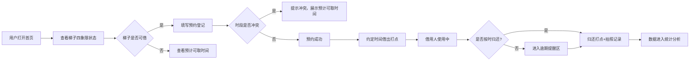

## 1. 产品概述
社区共享梯子预约管理系统，解决邻里间共享梯子"借了不还、去向不明"的痛点。通过线上预约登记、借出归还全流程打点、逾期自动提醒，让梯子的流转透明可追溯。
- 核心目标：实现共享梯子的高效流转，解决"借了不还、无处追问"的社区治理问题
- 目标用户：社区居民（借用人）、社区物业/管理员

## 2. 核心功能

### 2.1 用户角色
| 角色 | 注册方式 | 核心权限 |
|------|----------|----------|
| 社区居民 | 无需注册，填写借用信息即可 | 预约梯子、查看梯子状态、查看预计可取时间 |
| 管理员 | 无需区分角色，所有操作均可执行 | 借出打点、归还打点、查看统计、处理逾期提醒 |

### 2.2 功能模块
1. **首页（看板）：四象限状态展示（可借、已预约、借出中、逾期未还）、逾期提醒区、快速操作入口
2. **预约登记页**：填写姓名、楼栋、借用时段、用途、是否需要搬移协助、联系电话
3. **借出打点**：选择预约单确认借出、记录借出时间
4. **归还打点**：确认归还、拍照记录损坏情况、记录归还时间
5. **统计页**：借用高峰时段、逾期次数排行、最常用用途统计

### 2.3 页面详情
| 页面名称 | 模块名称 | 功能描述 |
|---------|----------|----------|
| 首页看板 | 四象限状态卡 | 分类展示所有梯子的实时状态，可点击查看详情 |
| 首页看板 | 逾期提醒区 | 突出展示逾期未还的借用记录，红色警示 |
| 首页看板 | 快速操作栏 | 快捷入口：新建预约、借出登记、归还登记 |
| 预约登记页 | 借用信息表单 | 姓名、楼栋号、借用开始时间、预计归还时间、用途（下拉选择）、是否需要搬移协助、联系电话 |
| 预约登记页 | 时段冲突检测 | 自动检测所选时段是否与已有预约冲突，冲突时提示并展示预计可取时间 |
| 借出打点弹窗 | 确认借出 | 选择预约人信息展示、确认借出按钮、记录借出时间戳 |
| 归还打点弹窗 | 归还确认 | 展示借用信息、拍照上传/损坏描述、损坏程度选择（无损坏/轻微损坏/严重损坏） |
| 统计页 | 借用高峰图表 | 按小时/按天展示借用频次柱状图 |
| 统计页 | 逾期统计 | 逾期总次数、逾期人员排行榜 |
| 统计页 | 用途统计 | 按借用用途占比饼图/条形图 |

## 3. 核心流程
用户浏览首页看板查看梯子状态 → 选择可用梯子进行预约登记 → 系统检测时段冲突 → 确认预约 → 到约定时间管理员借出打点 → 借用人使用 → 归还时管理员打点并拍照记录 → 逾期自动进入提醒区 → 下一位预约人可在首页查看预计可取时间

## 4. 用户界面设计

### 4.1 设计风格
- **主色调**：温暖的琥珀橙（#F59E0B）作为主色，象征社区温暖；搭配深石板灰（#334155）作为中性色，辅以薄荷绿（#10B981）表示可借/正常状态、警示红（#EF4444）表示逾期状态
- **按钮风格**：圆角胶囊按钮，主按钮使用渐变背景，有悬浮上浮动阴影效果
- **字体**：标题使用"Noto Serif SC"（中文衬线，社区人文感），正文使用"Noto Sans SC"
- **布局风格**：卡片式四象限布局，使用柔和的阴影和圆角，卡片间层次分明
- **图标风格**：使用 lucide-react 线性图标，风格统一简洁

### 4.2 页面设计概览
| 页面名称 | 模块名称 | UI 元素 |
|---------|----------|---------|
| 首页看板 | 四象限卡片 | 2x2 网格布局，每个状态卡配独立配色标识，顶部数字统计，列表展示 |
| 首页看板 | 逾期提醒区 | 顶部通栏红色渐变背景，闪烁红点警示，可展开查看详情 |
| 预约登记页 | 表单区 | 分区表单，输入框带图标，时段选择器用日期时间滚轮，用途芯片选择 |
| 统计页 | 图表区 | 使用自定义 SVG 图表，配色与主题一致，带动画过渡 |

### 4.3 响应式
- 桌面端优先设计，移动端适配；桌面 2x2 四象限，移动端改为上下堆叠纵向滚动
- 触摸交互优化：加大触控区域，滑动切换
