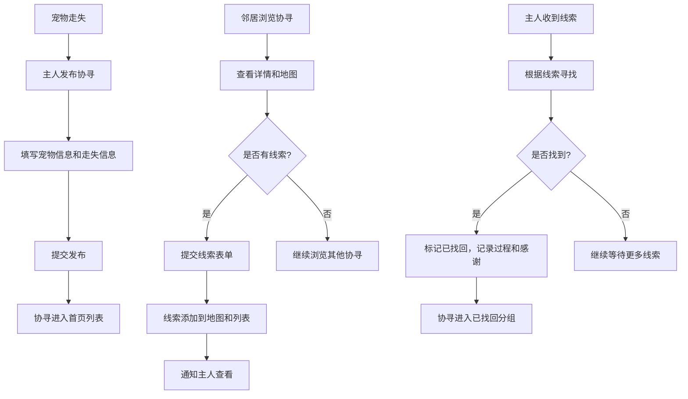

## 1. 产品概述

社区宠物走失协寻平台，帮助宠物主人在猫狗走失后快速发布协寻信息，邻居可以提供线索，通过地图可视化和分组展示提高找回效率，解决目前仅依赖微信群消息传播效率低、信息分散的问题。

## 2. 核心功能

### 2.1 用户角色

| 角色 | 注册方式 | 核心权限 |
|------|----------|----------|
| 宠物主人 | 无需注册，临时使用 | 发布协寻、管理自己的协寻、标记找回、记录感谢 |
| 社区邻居 | 无需注册，临时使用 | 浏览协寻列表、提交线索、查看地图 |

### 2.2 功能模块

1. **首页**：协寻分组展示（刚走失、疑似看到、已找回、重点扩散）、快捷发布入口
2. **发布协寻页**：填写宠物信息、走失信息、照片、联系方式
3. **协寻详情页**：宠物信息展示、地图标记（走失点+线索点）、线索提交表单、安全提醒、找回操作
4. **统计页**：找回率、平均找回时间、线索最多区域
5. **找回记录页**：记录找回过程、发布感谢信息

### 2.3 页面详情

| 页面名称 | 模块名称 | 功能描述 |
|---------|---------|----------|
| 首页 | 分组标签栏 | 按状态切换查看不同分组的协寻列表 |
| 首页 | 协寻卡片列表 | 展示宠物缩略图、走失时间、位置、状态标签 |
| 首页 | 发布按钮 | 悬浮快捷按钮，跳转发布协寻页 |
| 发布协寻页 | 宠物信息表单 | 宠物名、品种、颜色、体型、照片上传 |
| 发布协寻页 | 走失信息表单 | 走失时间、最后出现位置（地图选点）、联系方式 |
| 协寻详情页 | 宠物信息展示 | 完整宠物信息、照片轮播 |
| 协寻详情页 | 地图组件 | 标记走失点和线索点，时间越久颜色越淡 |
| 协寻详情页 | 线索列表 | 展示所有提交的线索，包含位置、时间、照片、可信度 |
| 协寻详情页 | 线索提交表单 | 邻居提交看到的位置、时间、照片、可信度 |
| 协寻详情页 | 安全提醒 | 醒目提示：请勿贸然追赶、先拍照联系主人 |
| 协寻详情页 | 找回操作 | 主人标记已找回，填写找回过程和感谢信息 |
| 统计页 | 数据看板 | 找回率、平均找回时间、线索最多区域Top5 |
| 统计页 | 趋势图表 | 按时间展示协寻数量和找回数量趋势 |

## 3. 核心流程

## 4. 界面设计

### 4.1 设计风格

- **主色调**：温暖橙色 (#FF7A45) - 代表希望和温暖
- **辅助色**：柔和绿色 (#4CAF50) - 代表已找回、安全
- **警示色**：红色 (#F44336) - 用于重点扩散、安全提醒
- **中性色**：深灰 (#2D3748)、中灰 (#718096)、浅灰 (#E2E8F0)
- **按钮风格**：圆角 8px，悬停有轻微上浮和阴影效果
- **字体**：Noto Sans SC（中文）+ 现代无衬线字体
- **布局风格**：卡片式布局，每个协寻为独立卡片，有柔和阴影
- **图标风格**：使用 lucide-react 线性图标，简洁清晰

### 4.2 页面设计概览

| 页面名称 | 模块名称 | UI 元素 |
|---------|---------|---------|
| 首页 | 分组标签栏 | 横向滚动标签，选中状态有橙色下划线，带状态emoji |
| 首页 | 协寻卡片 | 左图右文，宠物照片圆角裁剪，状态标签彩色角标，hover轻微上浮 |
| 首页 | 悬浮发布按钮 | 圆形橙色按钮，带加号图标，固定在右下角 |
| 发布协寻页 | 表单 | 分组卡片式表单，每部分有标题，必填项星号标记，输入框聚焦时橙色边框 |
| 协寻详情页 | 照片轮播 | 顶部大图轮播，支持滑动切换，带指示器 |
| 协寻详情页 | 地图 | 走失点用橙色标记，线索点用蓝色标记，透明度随时间递减 |
| 协寻详情页 | 安全提醒 | 黄色背景警示卡片，带警告图标，固定在页面顶部 |
| 协寻详情页 | 线索列表 | 时间线布局，最新线索在顶部，每条线索带照片缩略图 |
| 统计页 | 数据看板 | 大数字卡片，带趋势箭头，网格布局 |

### 4.3 响应式

- **桌面优先**设计，最大宽度 1200px 居中
- **平板适配**：768px 以下调整为两列布局
- **手机适配**：480px 以下调整为单列布局，底部导航栏
- **触摸优化**：按钮最小高度 44px，点击区域足够大

### 4.4 交互动效

- 页面进入时元素从下往上淡入，错开延迟
- 卡片 hover 时轻微上浮 (translateY(-4px))，阴影加深
- 按钮点击时有缩放反馈
- 分组切换时内容横向滑动过渡
- 地图标记点击时有弹跳动画
