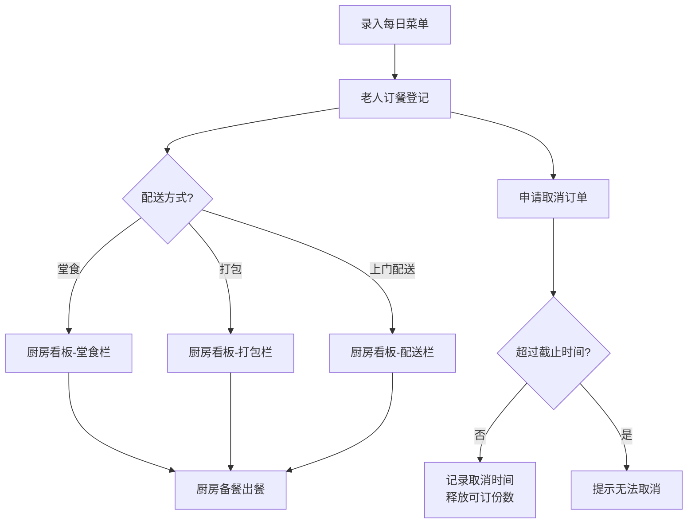

## 1. 产品概述

社区饭堂备餐管理系统，解决老人每日订餐过程中临时取消、忌口登记不规范导致的食物浪费问题。系统服务于社区饭堂工作人员和厨房团队，实现菜单管理、订餐登记、厨房出餐看板及数据统计的全流程数字化。

- **目标用户**：社区饭堂管理员、厨房工作人员
- **核心价值**：减少食材浪费、提升备餐效率、保障老人用餐体验

## 2. 核心功能

### 2.1 用户角色

| 角色 | 说明 | 核心权限 |
|------|------|----------|
| 管理员 | 饭堂运营人员 | 全部功能：菜单维护、订餐登记、取消操作、查看看板、数据统计 |
| 厨房人员 | 后厨工作人员 | 查看厨房看板、更新出餐状态 |

### 2.2 功能模块

1. **菜单管理**：每日菜单维护，含荤素分类、价格、过敏原、可订份数、菜品照片
2. **订餐管理**：老人订餐登记，含姓名、楼栋、餐别、忌口、配送方式、联系电话
3. **厨房看板**：分堂食/打包/上门配送三栏展示，实时出餐进度
4. **取消管理**：取消时间记录，截止时间后禁止取消
5. **数据统计**：每日预订份数、取消率、最受欢迎菜品、上门配送压力分析

### 2.3 页面详情

| 页面名称 | 模块名称 | 功能描述 |
|----------|----------|----------|
| 菜单管理 | 菜单列表 | 按日期展示每日菜品，支持新增/编辑/删除菜品 |
| 菜单管理 | 菜品表单 | 菜品名称、荤素类型、价格、过敏原标签、可订份数上限、照片上传 |
| 订餐管理 | 订餐列表 | 当日所有订单，支持按餐别/状态/配送方式筛选 |
| 订餐管理 | 订餐表单 | 老人姓名、楼栋号、餐别(早餐/午餐/晚餐)、忌口说明、是否送餐上门、联系电话 |
| 订餐管理 | 取消操作 | 记录取消时间，超过当日截止时间则禁止取消并提示 |
| 厨房看板 | 三栏看板 | 左侧堂食、中间打包、右侧上门配送，每栏显示订单卡片 |
| 厨房看板 | 状态流转 | 待备餐 → 制作中 → 已完成，可点击切换状态 |
| 数据统计 | 总览卡片 | 今日预订总数、已取消数、取消率、上门配送数 |
| 数据统计 | 菜品排行 | 柱状图展示各菜品预订数量Top10 |
| 数据统计 | 配送分析 | 按楼栋统计上门配送订单数，展示热力分布 |

## 3. 核心流程

### 3.1 订餐流程
管理员每日提前录入菜单 → 老人前来/电话订餐 → 管理员登记订餐信息（选择菜品、填写老人信息、标注忌口）→ 系统自动分配至堂食/打包/配送栏 → 厨房按看板备餐出餐 → 老人取餐或配送员送餐

### 3.2 取消流程
用户提出取消需求 → 管理员查询该订单 → 系统校验当前时间是否超过取消截止点（如午餐10:00前可取消）→ 未超时则记录取消时间并释放库存 → 已超时则弹窗提示无法取消

## 4. 用户界面设计

### 4.1 设计风格

- **主色调**：暖橙色 (#F97316) - 传递温暖、关怀的社区氛围
- **辅助色**：米杏色 (#FFF7ED) 背景、深棕色 (#78350F) 文字
- **成功色**：翠绿色 (#10B981) - 已完成状态
- **警告色**：珊瑚红 (#EF4444) - 取消/截止状态
- **按钮风格**：圆角8px，微立体阴影，hover有轻微上浮效果
- **字体**：标题使用"Noto Serif SC"衬线体显稳重，正文使用"Noto Sans SC"无衬线体保障可读性
- **布局风格**：卡片式布局，充足留白，信息分区清晰
- **图标风格**：使用 Lucide React 线性图标，搭配emoji增强亲和力（🍚🥬🍲🚚）

### 4.2 页面设计概览

| 页面名称 | 模块名称 | UI元素 |
|----------|----------|--------|
| 菜单管理 | 菜单日历 | 顶部日期选择器切换，日期卡片式导航 |
| 菜单管理 | 菜品卡片 | 网格布局，每张卡含缩略图、名称、荤素标签、价格、过敏原徽章、剩余/总份数进度条 |
| 订餐管理 | 订单表格 | 表头筛选栏，数据行显示老人信息+餐别+忌口+状态+操作列 |
| 订餐管理 | 新建订单弹窗 | 分步表单：选择餐别→选择菜品→填写老人信息→确认提交 |
| 厨房看板 | 三列看板 | 每列标题显示分类名称和数量徽标，卡片垂直排列支持拖拽感 |
| 厨房看板 | 订单卡片 | 显示姓名、菜品清单、忌口（红色高亮）、状态胶囊按钮 |
| 数据统计 | 数据总览 | 四张圆角渐变卡片，大号数字+趋势箭头 |
| 数据统计 | 图表区域 | 左侧菜品预订柱状图，右侧楼栋配送热力表 |

### 4.3 响应式

- **桌面优先**：厨房看板三列并排展示，适配1280px以上宽度
- **平板适配**：看板变为左右两列或单列可滚动
- **触控优化**：所有操作按钮最小44px高度，支持指尖点击
