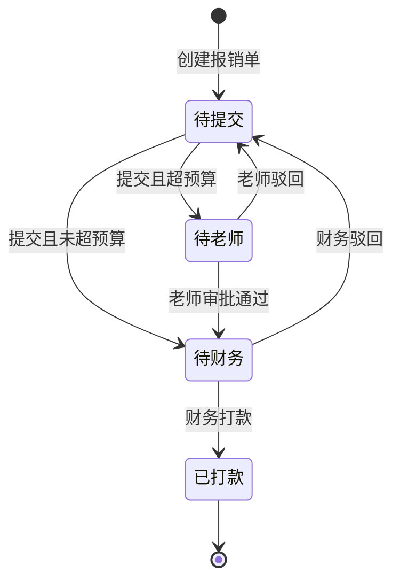

## 1. 产品概述

社团经费报销系统是面向高校社团的经费管理工具，解决学期末发票和垫付款混乱堆积的问题。系统支持活动预算创建、报销单提交与审批、多状态流转以及数据统计分析，帮助社团规范化财务管理流程。

- 目标用户：社团负责人、指导老师、财务人员
- 核心价值：规范化报销流程，透明化预算使用，减少期末对账混乱

## 2. 核心功能

### 2.1 用户角色

| 角色 | 核心权限 |
|------|----------|
| 社团成员 | 创建活动预算、提交报销单、查看个人报销记录 |
| 指导老师 | 审批活动预算、审批超预算报销、查看社团经费情况 |
| 财务人员 | 审核报销单、确认打款、查看全部统计数据 |

### 2.2 功能模块

1. **概览仪表板**：关键指标卡片、待办事项、近期报销动态
2. **活动预算管理**：预算列表、新建预算、预算详情、预算审批
3. **报销单管理**：报销单列表、新建报销、票据上传、多级审批流转
4. **统计分析**：社团剩余额度、超支项目、长期未报销垫付款
5. **基础设置**：社团信息、预算科目配置

### 2.3 页面详情

| 页面名称 | 模块名称 | 功能描述 |
|-----------|-------------|---------------------|
| 仪表板 | 数据概览 | 显示总预算、已使用、剩余额度、待审批数量等关键指标 |
| 仪表板 | 待办事项 | 展示待审批、待提交、待打款等状态的任务列表 |
| 活动预算 | 预算列表 | 按社团/状态筛选，展示所有活动预算的表格视图 |
| 活动预算 | 新建预算 | 表单填写社团、负责人、用途、审批老师、预算科目及金额 |
| 活动预算 | 预算详情 | 展示预算基本信息、已报销明细、剩余额度 |
| 报销单 | 报销单列表 | 多维度筛选（状态、社团、时间），状态标签展示 |
| 报销单 | 新建报销 | 选择活动预算、上传票据照片、填写购买人/金额/品类/付款方式 |
| 报销单 | 报销详情 | 展示报销单完整信息、票据预览、审批记录、操作按钮 |
| 统计分析 | 社团额度 | 各社团预算总额、已使用、剩余额度的对比图表 |
| 统计分析 | 超支项目 | 列出所有超预算的报销项目及超支金额 |
| 统计分析 | 未报销统计 | 按时间维度展示长期未报销的垫付款统计 |

## 3. 核心流程

### 3.1 活动预算创建与审批流程

1. 社团成员创建活动预算，填写社团、负责人、用途、审批老师、预算科目
2. 预算创建后状态为"待老师审批"
3. 指导老师审批通过，预算生效；审批不通过，返回修改
4. 生效后的预算可用于报销

### 3.2 报销单提交与审批流程

1. 社团成员创建报销单，关联活动预算，上传票据照片
2. 填写购买人、金额、品类、付款方式
3. 系统自动校验：无活动预算不能提交，票据照片为必填
4. 系统自动判断是否超预算，未超支直接进入"待财务"状态
5. 超预算的报销单进入"待老师二次确认"状态，需指导老师审批
6. 财务审核通过后进入"已打款"状态，流程结束

### 3.3 状态流转图

## 4. 用户界面设计

### 4.1 设计风格

- **主色调**：深青色 #0D9488（稳重、专业）
- **辅助色**：琥珀色 #F59E0B（提醒、超支警示）
- **强调色**：翠绿色 #10B981（成功、通过）、玫红色 #F43F5E（错误、驳回）
- **中性色**：石板灰系列（文本、背景、边框）
- **按钮风格**：圆角 8px，中等高度 40px，悬停有微妙阴影
- **字体**：Inter 作为正文字体，清晰易读；标题使用半粗体
- **布局风格**：卡片式布局，左侧导航 + 右侧内容区
- **图标风格**：Lucide 线性图标，统一 20px 尺寸

### 4.2 页面设计概述

| 页面名称 | 模块名称 | UI 元素 |
|-----------|-------------|-------------|
| 仪表板 | 数据概览 | 四色数据卡片网格，带图标和趋势指示 |
| 仪表板 | 待办事项 | 分栏式任务列表，带状态徽章和快速操作 |
| 活动预算 | 预算列表 | 表格视图，支持排序筛选，行悬停高亮 |
| 活动预算 | 新建预算 | 分栏表单，左侧分组字段，右侧实时预览 |
| 报销单 | 报销单列表 | 卡片式列表，状态标签醒目，支持搜索过滤 |
| 报销单 | 新建报销 | 分步表单，票据上传区支持拖拽 |
| 统计分析 | 数据图表 | 条形图展示社团额度，列表展示超支和未报销项 |

### 4.3 响应式设计

- 桌面端优先设计，最小支持 1280px 宽度
- 平板端（768px-1280px）：导航收起为图标模式，内容区自适应
- 移动端（<768px）：底部导航栏，卡片单列布局

### 4.4 动效与交互

- 页面切换：淡入淡出过渡，200ms 缓动
- 卡片悬停：轻微上浮 + 阴影加深
- 状态变更：颜色渐变过渡
- 表单提交：加载状态按钮 + 成功提示
