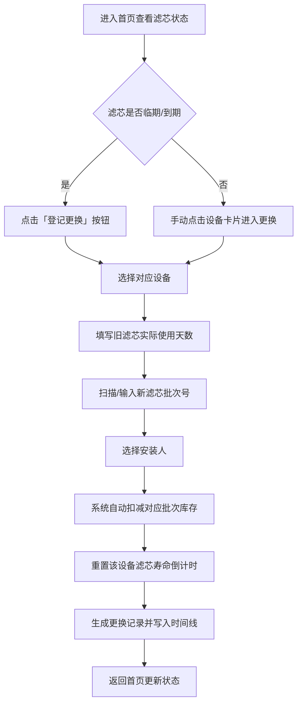
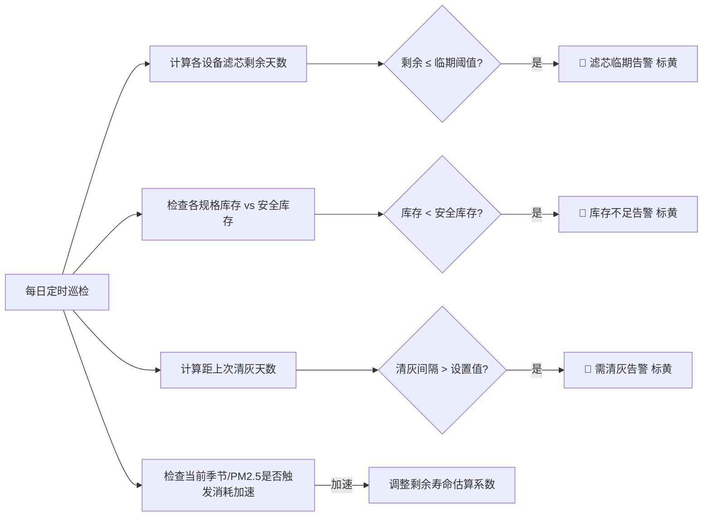

## 1. 产品概述

家用多房间空气净化器滤芯全生命周期管理系统。解决多设备滤芯寿命记忆混乱、库存不足、季节性消耗无预警的核心痛点，让每台净化器始终处于健康运行状态。

- 核心用户：多房间净化器家庭用户、净化器养护负责人
- 核心价值：精准追踪滤芯消耗、自动预警临期/库存、季节因素智能关联、一机一档全生命周期可追溯

## 2. 核心功能

### 2.1 用户角色

| 角色 | 注册方式 | 核心权限 |
|------|----------|----------|
| 家庭管理员 | 本地使用 | 所有设备/记录/库存的增删改查、告警确认 |
| 普通成员 | 本地使用 | 查看状态、登记滤芯更换、标记清灰 |

### 2.2 功能模块

1. **首页仪表盘**：各房间空气状态概览、下次更换倒计时、库存缺口预警、最近异常事件流
2. **设备档案管理**：净化器一机一档（房间、型号、适用面积、滤芯规格、购买日期、照片）
3. **滤芯更换记录**：更换历史（旧滤芯使用天数、新滤芯批次、安装人、剩余库存）
4. **滤芯库存管理**：批次管理、入库/出库、库存不足标黄
5. **消耗提醒引擎**：PM2.5指数、异味、宠物掉毛季、花粉季关联消耗加速
6. **告警中心**：滤芯临期、库存不足、长时间未清灰三类标黄提醒

### 2.3 页面详情

| 页面名称 | 模块名称 | 功能描述 |
|----------|----------|----------|
| 首页仪表盘 | 空气状态卡片组 | 按房间显示当前空气质量等级、PM2.5数值、滤芯剩余百分比、运行状态 |
| 首页仪表盘 | 更换倒计时列表 | 各设备按距离下次更换天数排序，临期标黄 |
| 首页仪表盘 | 库存缺口面板 | 各规格滤芯库存与安全库存对比，缺口标黄 |
| 首页仪表盘 | 最近异常时间线 | 近期更换记录、告警触发、清灰标记按时间倒序 |
| 设备档案页 | 设备卡片列表 | 卡片展示照片+房间+型号+核心参数，支持增删改查 |
| 设备档案页 | 设备详情抽屉 | 完整档案信息、更换历史时间线、清灰记录 |
| 更换记录页 | 更换表单 | 选择设备→填写旧滤芯天数/新滤芯批次/安装人→自动扣减库存 |
| 更换记录页 | 历史记录表格 | 可按设备/时间/安装人筛选，展示完整更换链路 |
| 库存管理页 | 库存看板 | 按滤芯规格分组，显示批次、数量、入库日期，低库存标黄 |
| 库存管理页 | 入库/出库操作 | 新增入库（批次+数量+日期）、手动调整库存 |
| 告警设置页 | 季节提醒配置 | 宠物掉毛季/花粉季时间段设置、PM2.5阈值设置、异味敏感度 |
| 告警设置页 | 告警阈值配置 | 滤芯临期天数阈值、安全库存数量、清灰提醒间隔天数 |

## 3. 核心流程

### 3.1 滤芯更换登记流程

### 3.2 告警生成逻辑

## 4. 用户界面设计

### 4.1 设计风格

- **主色调**：森系青绿 `#2D7A5E`（健康、洁净、自然），搭配天青 `#E8F5F0` 作为大面积背景
- **强调色**：琥珀黄 `#F0A63B`（告警标黄专属，高饱和但不刺眼），警示红 `#E05A47`（仅用于严重告警）
- **信息色**：空气优 `#52C41A` / 良 `#73D13D` / 中 `#FADB14` / 差 `#FF7A45` / 严重 `#F5222D`
- **按钮风格**：圆角 10px，主按钮用渐变 `linear-gradient(135deg, #2D7A5E 0%, #3DA77D 100%)`，带微妙投影
- **字体**：标题用「思源黑体 CN Bold」，正文用「思源黑体 CN Regular」，数字用等宽字体增强可读性
- **布局风格**：卡片式栅格布局，卡片圆角 16px，柔和投影 `0 4px 20px rgba(45,122,94,0.08)`，卡片悬停上浮 2px
- **图标风格**：线性描边图标，统一 1.5px 线宽，告警状态下转为填充琥珀黄

### 4.2 页面设计概览

| 页面名称 | 模块名称 | UI 元素 |
|----------|----------|---------|
| 首页仪表盘 | 空气状态卡片组 | 4列栅格，每张卡片顶部彩色空气质量条带，中间大字显示滤芯剩余%，底部房间名+下次更换倒计时 |
| 首页仪表盘 | 更换倒计时列表 | 左侧进度条（绿→黄渐变），右侧设备名+天数，临期条目整行琥珀黄背景+呼吸动画 |
| 首页仪表盘 | 库存缺口面板 | 横向分组卡片，正常库存显示深绿底+白色数字，缺口显示琥珀黄斜纹底+感叹号图标 |
| 首页仪表盘 | 最近异常时间线 | 竖向时间轴，左侧日期节点用不同颜色区分事件类型（更换=绿/告警=黄/清灰=蓝） |
| 设备档案页 | 设备卡片列表 | 瀑布式卡片，左上角房间标签（圆角胶囊），中部设备照片（圆角裁剪），下方型号+适用面积+滤芯规格 |
| 设备档案页 | 设备详情抽屉 | 从右侧滑出，分三个Tab：基本信息 / 更换历史 / 清灰记录，顶部大图 |
| 更换记录页 | 更换表单 | 分步骤向导（选择设备→填写信息→确认扣减），每步带进度指示条 |
| 库存管理页 | 库存看板 | 规格为大标题，下方批次卡片堆叠，低库存卡片边框琥珀黄+闪烁动画 |
| 告警设置页 | 季节提醒配置 | 时间范围选择器（开始月-结束月），带开关切换，启用时整行淡绿底 |

### 4.3 响应式

- **桌面端优先**：最小设计宽度 1280px，4列栅格为主
- **平板适配（768-1279px）**：空气状态卡片降为 2 列，库存面板改为纵向堆叠
- **移动端（<768px）**：所有卡片单列，详情抽屉改为底部弹出面板，Tab 改为可横向滚动
- **触控优化**：所有可点击区域最小 44×44px，列表项整行可点

### 4.4 动效与微交互

- 页面加载：卡片从上至下依次淡入（stagger 80ms）
- 告警标黄：背景琥珀黄 + 每秒一次柔和呼吸效果（opacity 0.7 ↔ 1.0）
- 滤芯进度条：颜色随剩余百分比渐变（100%-50%绿，50%-20%黄，<20%红）
- 更换登记成功：弹出绿色对勾动画 + 礼花粒子效果
- 抽屉/面板：过渡时长 280ms，cubic-bezier(0.4, 0, 0.2, 1)
