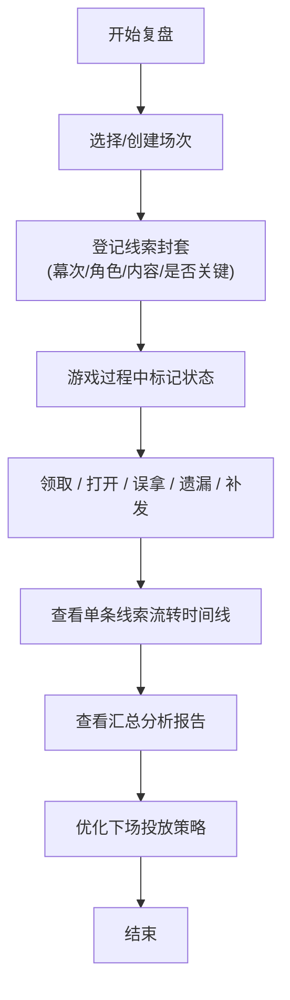

## 1. 产品概述

剧本杀线索封套复盘系统，帮助店长系统记录每场游戏中线索封套的发放、流转和回收情况，通过数据分析优化线索投放策略，提升玩家游戏体验。

- **核心价值**：解决传统复盘仅关注"是否找到"的粗放问题，建立全链路线索生命周期追踪
- **目标用户**：剧本杀门店店长、主持人（DM）

## 2. 核心功能

### 2.1 用户角色

| 角色 | 登录方式 | 核心权限 |
|------|---------|---------|
| 店长/DM | 本地使用（无登录） | 全场次创建、登记、复盘查看、数据分析 |

### 2.2 功能模块

1. **场次管理**：房间选择、剧本选择、场次日期、参与角色
2. **封套登记**：按幕次和角色登记线索封套内容，标记关键证据
3. **流转记录**：玩家领取、打开、误拿、遗漏、主持人补发全状态记录
4. **线索追踪**：单条线索全场流转时间线可视化
5. **汇总分析**：太早暴露的封套、总被错过的关键证据、误拿高频榜

### 2.3 页面详情

| 页面名称 | 模块名称 | 功能描述 |
|---------|---------|----------|
| 复盘主页 | 场次选择面板 | 选择/创建场次，切换房间、剧本、日期筛选 |
| 复盘主页 | 封套登记表 | 按幕次分组显示所有封套，支持状态标记和快速编辑 |
| 复盘主页 | 线索流转追踪 | 点击单条线索展开时间线，查看完整流转链路 |
| 复盘主页 | 汇总分析面板 | 统计图表展示：暴露过早封套、常被遗漏证据、误拿排行 |
| 复盘主页 | 封套登记弹窗 | 新增/编辑封套：名称、内容、所属幕次、角色、是否关键证据 |

## 3. 核心流程

店长打开复盘页 → 创建或选择已有场次 → 按幕次登记所有线索封套 → 游戏过程中实时标记各封套状态 → 结束后查看单条线索流转时间线 → 查看汇总分析报告，优化下场线索投放策略。

## 4. 用户界面设计

### 4.1 设计风格

- **主色调**：深棕 (#3D2B1F) 搭配复古羊皮纸米黄 (#F5E6D3)，营造侦探推理档案氛围
- **辅助色**：暗红 (#8B0000) 标记关键证据，墨绿 (#2F4F2F) 标记正常流转，橙黄 (#D4A017) 标记异常（误拿/遗漏）
- **按钮风格**：复古印章风格，带轻微浮雕质感，圆角 4px
- **字体**：标题用 "Noto Serif SC" 衬线体（侦探档案感），正文用 "Noto Sans SC" 无衬线体
- **布局风格**：三栏式布局 - 左侧场次筛选、中间封套登记表、右侧分析面板
- **图标风格**：复古手绘线条图标，配合蜡封印章效果

### 4.2 页面设计概述

| 页面名称 | 模块名称 | UI元素 |
|---------|---------|--------|
| 复盘主页 | 场次选择面板 | 下拉选择器、日期选择、卡片式场次列表、悬停阴影动效 |
| 复盘主页 | 封套登记表 | 幕次分组折叠面板、状态标签徽章、快速操作按钮、时间戳 |
| 复盘主页 | 线索流转追踪 | 垂直时间线、节点图标、流转状态连线、淡入展开动画 |
| 复盘主页 | 汇总分析面板 | 横向条形图、数据卡片、排行榜、颜色编码状态 |
| 复盘主页 | 封套登记弹窗 | 表单输入、幕次/角色下拉、关键证据复选框、确认取消按钮 |

### 4.3 响应式

桌面端优先（≥1280px）三栏布局，平板端（768-1279px）双栏（筛选+登记表叠加，分析面板底部展开），移动端（<768px）单栏竖排。

### 4.4 动效设计

- 页面加载：卡片依次淡入（staggered fade-in）
- 状态变更：标签徽章弹跳动效（scale 0.9→1.1→1）
- 时间线展开：节点从上到下依次滑入
- 悬停反馈：轻微上浮 + 阴影加深
