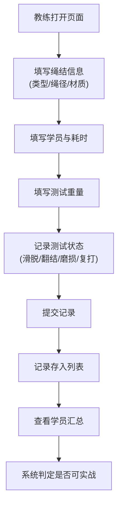

## 1. 产品概述

绳结拉力练习管理系统，为户外社团教练提供绳结训练记录与评估工具。通过记录每位学员的打结过程与拉力测试结果，自动汇总分析哪些绳结尚未达到实战标准，帮助教练精准掌握学员进度。

- 目标用户：户外社团教练与学员
- 核心价值：系统化记录绳结练习数据，量化评估学员技能水平

## 2. 核心功能

### 2.1 用户角色
| 角色 | 使用方式 | 核心权限 |
|------|----------|----------|
| 教练 | 直接使用 | 登记绳结信息、录入测试数据、查看汇总报告 |

### 2.2 功能模块
1. **记录登记区**：绳结类型、绳径、材质、学员、打结耗时、测试重量录入
2. **测试状态记录**：滑脱、翻结、绳皮磨损、复打次数四项指标
3. **记录列表**：所有练习记录的展示与管理
4. **学员汇总报告**：按学员维度汇总绳结掌握情况，标记未达标绳结

### 2.3 页面详情
| 页面名称 | 模块名称 | 功能描述 |
|---------|----------|----------|
| 主页 | 记录登记表单 | 录入绳结基本信息与测试数据，支持快速新增 |
| 主页 | 记录列表 | 展示所有练习记录，可按学员/绳结筛选 |
| 主页 | 学员汇总面板 | 按学员统计各绳结的测试结果，标注不可实战的绳结 |

## 3. 核心流程

教练进入页面后，在登记表单中填写本次练习的绳结类型、绳索参数、学员姓名、打结耗时和测试重量，同时勾选本次测试出现的问题（滑脱/翻结/绳皮磨损）并填写复打次数。提交后记录出现在列表中。切换到汇总视图可查看每位学员在各种绳结上的表现，系统自动判断哪些绳结因失败次数过多或问题严重而暂不能用于真实场景。

## 4. 用户界面设计

### 4.1 设计风格
- **主色调**：深橄榄绿 (#3D5A45) 搭配土棕色 (#8B6914)，体现户外与绳索的自然质感
- **辅助色**：警示橙 (#D97706) 用于标记问题，成功绿 (#059669) 用于标记达标
- **按钮风格**：圆角矩形，带有轻微阴影，悬停时有上浮效果
- **字体**：标题使用粗犷有力量感的衬线字体，正文使用清晰易读的无衬线字体
- **布局风格**：卡片式布局，三栏结构（登记表单 + 记录列表 + 汇总面板）
- **装饰元素**：绳索纹理背景、绳结图标、磨损质感的边框

### 4.2 页面设计概览
| 页面名称 | 模块名称 | UI 元素 |
|---------|----------|---------|
| 主页 | 顶部导航 | 标题、绳索装饰线、当前日期显示 |
| 主页 | 登记表单 | 分组字段、下拉选择、数值输入、状态复选框、提交按钮 |
| 主页 | 记录列表 | 表格视图、学员筛选、绳结筛选、状态标签 |
| 主页 | 汇总面板 | 学员卡片、绳结进度条、达标/未达标标识、风险提示 |

### 4.3 响应式
- 桌面端优先设计，三栏并排布局
- 平板端自动调整为两栏布局
- 移动端堆叠为单列，表单与列表可通过标签切换

### 4.4 动效与交互
- 表单提交后记录项有滑入动画
- 状态标签带有脉冲效果提示问题项
- 悬停卡片有微妙的提升与阴影加深
- 汇总数据有数字递增动画
