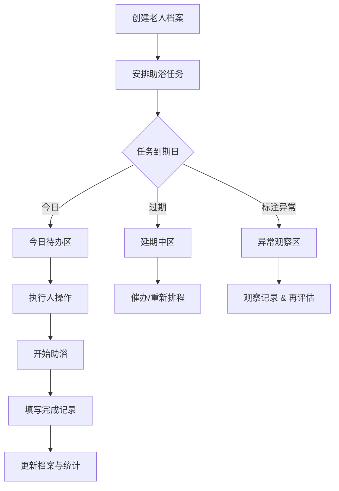

## 1. 产品概述

老人助浴管理系统是一款面向家庭的助浴全流程记录与协调工具，解决老人助浴过程中"凭记忆、无标准、难追溯"的痛点，通过建档、排程、记录、分析四个环节，确保每位老人安全、舒适、有计划地完成助浴。

- 目标用户：与老人同住的家庭成员、居家养老照护者
- 核心价值：将助浴从"家务事"升级为"有记录的照护行为"，降低风险、明确分工、持续追踪

## 2. 核心功能

### 2.1 功能模块

1. **老人档案管理**：每位老人独立档案，包含行动能力、禁忌事项、常用洗护品、合适时段、紧急联系人
2. **助浴任务看板**：卡片式任务列表，今日任务置顶、延期与异常观察单独分区
3. **完成记录表单**：助浴后补录血压、皮肤情况、疲劳程度、备注，实现完整留痕
4. **家庭分担统计**：助浴间隔预警、延期卡点分析、成员负责量排行，促进家庭合理分工

### 2.2 页面详情

| 页面名称 | 模块名称 | 功能描述 |
|---------|---------|---------|
| 首页（综合看板） | 顶部导航栏 | Logo、系统名称、当前日期 |
| 首页（综合看板） | 老人档案区 | 横向滚动档案卡，可点击查看/编辑详情，支持新增 |
| 首页（综合看板） | 助浴任务看板 | 分三栏：今日待办 / 延期中 / 异常观察；卡片展示负责人、浴室、防滑垫、换洗衣物、预计时长 |
| 首页（综合看板） | 完成记录弹窗 | 任务完成后弹出，录入血压、皮肤、疲劳、备注 |
| 首页（综合看板） | 家庭分担视图 | 底部固定区域：间隔预警、延期卡点、成员贡献排行榜 |

## 3. 核心流程

**流程说明：**
1. 家庭成员先为每位老人建立完整档案，确保禁忌、洗护品等基础信息准确
2. 根据档案中的"合适时间"安排助浴任务，指派负责人、准备物资
3. 系统自动按日期将任务分流到今日/延期/异常三个看板
4. 助浴完成后，执行人必须填写生理指标和观察记录，确保留痕
5. 家庭分担视图持续监控间隔是否合理、延期卡在哪位成员、谁承担最多

## 4. 用户界面设计

### 4.1 设计风格

- **主色调**：暖米色 `#FAF6F0`（安全感、居家感）+ 深青蓝 `#2E5E5E`（专业、稳重）+ 珊瑚橙 `#E07A5F`（警示、关怀）
- **辅助色**：鼠尾草绿 `#81B29A`（正常）、琥珀黄 `#F2CC8F`（提醒）
- **按钮风格**：微圆角（8px）、轻阴影、悬停上浮 2px，次要按钮使用描边
- **字体**：标题用 Lora（衬线、温柔庄重），正文用 Noto Sans SC（清晰易读）
- **布局风格**：杂志式分区 + 卡片网格，充足留白，卡片使用柔和阴影和 12px 圆角
- **图标/emoji**：使用线条图标 + 实体 emoji 组合，如 👤🛁📋❤️，增添温度

### 4.2 页面设计概览

| 页面模块 | 设计细节 |
|---------|---------|
| 顶部导航栏 | 暖米色背景，左侧 Logo "安心浴" + 图标，右侧显示今日日期和"新增任务"按钮 |
| 老人档案区 | 横向滚动卡片，每张卡有老人头像占位、姓名、年龄、行动能力标签；点击展开编辑抽屉 |
| 助浴看板 | 三列看板布局，每列有标题+计数徽章；任务卡白底+左边框色（青=今日/橙=延期/红=异常）；卡片底部悬浮"完成"按钮 |
| 完成记录弹窗 | 半透明遮罩，居中卡片式表单，四象限布局：左上血压、右上皮肤、左下疲劳、右下备注，底部"提交记录"主按钮 |
| 家庭分担视图 | 浅青蓝渐变背景，三栏统计卡：①间隔预警（列表+天数）②延期卡点（条形进度条）③成员排行（头像+计数+进度条） |

### 4.3 响应式

采用桌面优先设计，1440px 基准：
- 大屏（≥1280px）：三列看板并排，档案区横向滚动
- 中屏（768-1279px）：看板改为两列 + 一栏堆叠，卡片宽度自适应
- 小屏（<768px）：看板单列堆叠，档案区纵向排列，弹窗改为全屏底部抽屉
- 所有交互区最小 44×44px，适配触摸操作

### 4.4 动效与细节

- 页面加载：顶部导航先显现，然后档案区渐入下滑，看板三列错位渐入（delay 100ms/200ms/300ms），统计区最后上浮
- 任务卡：hover 时轻微上浮（translateY -3px）+ 阴影加深；完成按钮 hover 时背景色加深
- 弹窗：缩放 + 淡入（scale 0.9→1，opacity 0→1，200ms ease-out）
- 看板卡片拖动/切换：使用 300ms 缓动过渡
- 数据变化：统计数字使用 600ms 数字滚动动画
