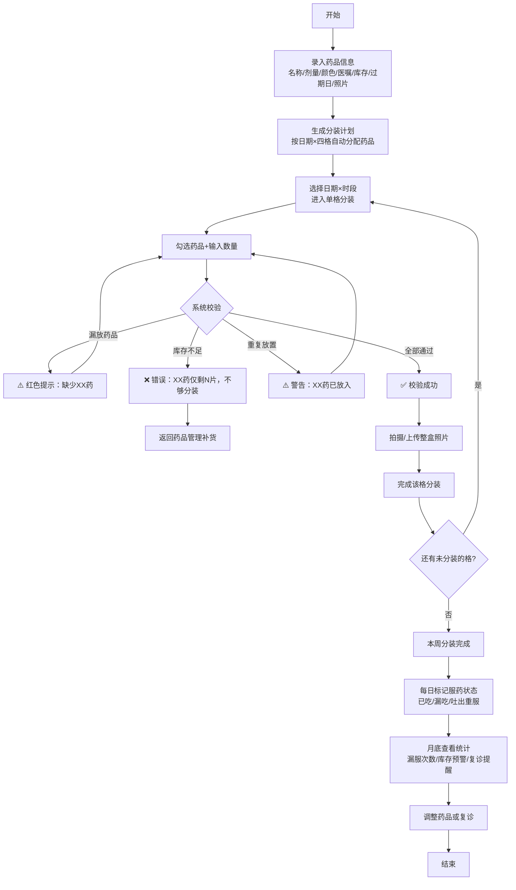

## 1. 产品概述

老人一周药盒分装管理系统，专注解决老人用药安全问题。通过药盒分装闭环流程，防止漏放、错放药品，追踪服药情况，降低用药风险。
- 主要解决：家属为老人分装一周药品时漏放一格、放错降压药与降糖药、库存不足未及时补货、漏服未发现等痛点
- 目标用户：照顾老人的家属（主要操作者）、老人本人（简单查看）

## 2. 核心功能

### 2.1 用户角色

| 角色 | 登录方式 | 核心权限 |
|------|----------|----------|
| 家属用户 | 本地存储无需登录 | 全部功能：药品管理、分装计划、分装操作、服药记录、月度统计 |

### 2.2 功能模块

1. **药品管理页面**：药品列表、新增/编辑/删除药品、药品详情
2. **分装计划页面**：周视图日期选择、每日四格（早/中/晚/睡前）展示、分装状态
3. **分装操作页面**：单格分装弹窗、药品勾选、数量输入、库存校验、拍照上传、错误提示
4. **服药记录页面**：服药状态标记（已吃/漏吃/吐出重服）、时间记录
5. **月度统计页面**：漏服次数统计、快过期药品清单、库存不足清单、复诊提醒清单

### 2.3 页面详情

| 页面名称 | 模块名称 | 功能描述 |
|-----------|-------------|---------------------|
| 药品管理 | 药品卡片列表 | 展示名称、剂量、颜色形状、剩余片数、过期日、照片缩略图 |
| 药品管理 | 新增/编辑表单 | 输入名称、剂量、颜色形状、医嘱时间、初始库存、过期日、上传照片 |
| 分装计划 | 周日期导航条 | 左右切换周、显示当前日期、高亮今天 |
| 分装计划 | 四格时间卡片 | 早/中/晚/睡前四格，每格显示计划药品、分装状态、服药状态 |
| 分装操作 | 单格分装弹窗 | 列出该时段医嘱药品，勾选+数量输入，实时校验库存、漏放、重复放 |
| 分装操作 | 校验错误提示 | 红色醒目提示具体错误：漏放药品名称、库存不足数量、重复放警告 |
| 分装操作 | 整盒拍照上传 | 支持调用相机/上传图片，保存分装后照片凭证 |
| 服药记录 | 状态快捷按钮 | 三态切换：已吃（绿色）、漏吃（红色）、吐出重服（黄色） |
| 月度统计 | 漏服统计卡片 | 本月漏服总次数、按周分布柱状图、漏服药品排名 |
| 月度统计 | 库存预警清单 | 剩余片数＜7天用量的药品列表，补货提醒 |
| 月度统计 | 过期预警清单 | 30天内过期的药品列表，标红提醒 |
| 月度统计 | 复诊调整清单 | 医嘱建议复诊日期临近、或服药异常需调整的药品 |

## 3. 核心流程

家属操作流程：首先维护药品库（录入所有老人正在服用的药品及库存）→ 生成分装计划（系统按医嘱时间自动将药品分配到每日四格）→ 逐格分装（勾选药品、确认数量、拍照留证、系统实时校验）→ 老人或家属每日标记服药状态 → 月底查看统计报告并调整。

## 4. 用户界面设计

### 4.1 设计风格
- **主色**：温暖的医护绿色 `#22A06B`（代表健康、安心）
- **辅色**：警示橙 `#F59E0B`、错误红 `#EF4444`、温柔蓝 `#3B82F6`
- **背景**：柔和米白 `#FFFBEB`，配合浅绿渐变分区
- **按钮风格**：圆角胶囊型，大号点击区域（适合老人家属操作），带微阴影和按压动效
- **字体**：标题使用「Noto Serif SC」衬线体增加人文温度，正文使用「Noto Sans SC」无衬线体保证清晰可读
- **字号**：基础字号16px起，重要信息18-24px，老人易读
- **布局**：顶部导航栏 + 卡片式内容区，圆角卡片大间距，宽松不拥挤
- **图标**：Lucide 图标库，配合 Emoji 增强视觉识别（💊💉⏰📅✅❌⚠️）

### 4.2 页面设计概述

| 页面名称 | 模块名称 | UI元素 |
|-----------|-------------|-------------|
| 药品管理 | 药品卡片 | 大圆角卡片，左侧药品照片圆形裁切，右侧名称+剂量大字，颜色形状色块标识，底部剩余数量进度条+过期日标签 |
| 分装计划 | 四格时间卡 | 2×2网格布局，每格时间emoji+时段名称大号显示，格内药品小卡片列表，状态角标（未分装/已分装/已服药） |
| 分装操作 | 弹窗表单 | 全屏弹窗，药品列表带复选框+数量输入框，校验错误条置顶显示红色，底部固定操作栏：拍照按钮+确认分装 |
| 服药记录 | 状态切换 | 三个大号胶囊按钮并排：绿色"已吃"、红色"漏吃"、黄色"吐出重服"，选中态加粗放大边框 |
| 月度统计 | 数据卡片 | 顶部漏服次数大号数字+环比箭头，下方三栏卡片式列表：库存预警（橙色边框）、过期预警（红色边框）、复诊提醒（蓝色边框） |

### 4.3 响应式
- 桌面端优先，水平布局内容居中最大宽度1200px
- 移动端自动适配，四格从2×2改为1×4垂直排列
- 所有按钮最小高度48px，满足触摸友好
- 分装弹窗在移动端改为全屏幕显示

### 4.4 动效设计
- 页面加载：卡片逐个渐入上浮（stagger 60ms）
- 状态切换：按钮填充色过渡+轻微弹性缩放
- 校验错误：顶部错误条滑入+轻微震动提示
- 分装完成：绿色对勾圆形成功动画+彩带粒子效果
