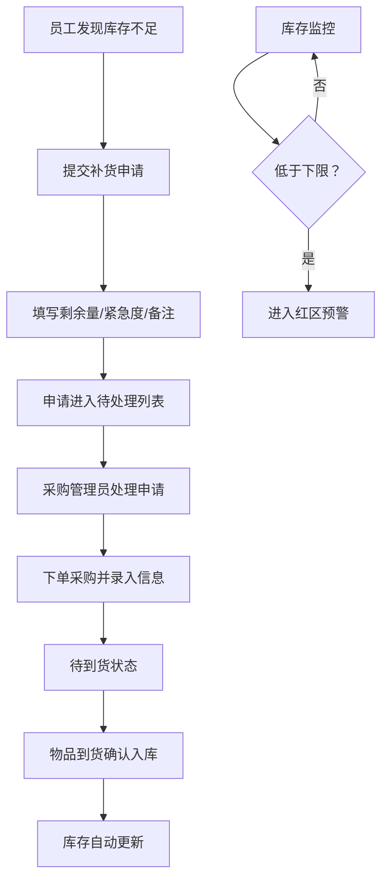

## 1. 产品概述

茶水间补给看板系统，用于管理公司茶水间日常消耗品（咖啡豆、纸杯、糖包等）的库存、补货申请和采购流程。解决物品用完才发现、采购信息不透明、补货记录混乱等问题。

- 目标用户：公司全体员工（查看与申请）、行政/采购人员（采购与管理）
- 核心价值：库存透明化、流程规范化、数据可追溯

## 2. 核心功能

### 2.1 用户角色

| 角色 | 说明 | 核心权限 |
|------|------|----------|
| 普通员工 | 公司所有员工 | 查看库存看板、提交补货申请 |
| 采购管理员 | 行政/采购人员 | 物品档案管理、处理补货申请、记录采购、查看统计 |

### 2.2 功能模块

1. **首页看板**：库存总览卡片、红区预警列表、待到货列表、快速补货入口
2. **物品档案**：物品列表、新增/编辑物品、搜索筛选
3. **补货申请**：申请列表、新建申请、申请详情
4. **采购处理**：待处理申请、采购记录、入库确认
5. **统计分析**：消耗排行、采购花费趋势、断货统计

### 2.3 页面详情

| 页面名称 | 模块名称 | 功能描述 |
|----------|----------|----------|
| 首页看板 | 库存状态卡片 | 显示物品总数、红区数量、待到货数量、本月采购金额 |
| 首页看板 | 红区预警列表 | 库存低于下限的物品，红色高亮显示，可快速发起补货 |
| 首页看板 | 待到货列表 | 已下单未到货的采购记录，显示预计到货时间 |
| 首页看板 | 快捷操作区 | 新建补货申请、新增物品档案入口 |
| 物品档案 | 物品列表 | 卡片/表格视图展示所有物品，支持按柜位/分类筛选 |
| 物品档案 | 新增/编辑物品 | 填写名称、规格、库存下限、存放柜、供应商、单价、上传照片 |
| 物品档案 | 物品详情 | 展示完整信息、库存历史、补货记录 |
| 补货申请 | 申请列表 | 按状态（待处理/处理中/已完成）筛选申请 |
| 补货申请 | 新建申请 | 选择物品、填写当前剩余量、选择紧急程度、添加备注 |
| 采购处理 | 待处理列表 | 展示待采购的申请，按紧急程度排序 |
| 采购处理 | 采购录入 | 填写采购数量、预计到货日期、实付金额、上传入库照片 |
| 统计分析 | 消耗排行榜 | 按月统计消耗数量最多的 TOP 物品 |
| 统计分析 | 采购花费 | 月度采购金额趋势图、分类占比 |
| 统计分析 | 断货统计 | 物品进入红区次数排行、平均补货响应时长 |

## 3. 核心流程

员工发现物品快用完时，在系统中提交补货申请（填写当前剩余量和紧急程度）。采购管理员看到待处理申请后进行采购，录入采购信息（数量、预计到货、金额等）。物品到货后确认入库，库存自动更新。库存低于下限时自动进入红区预警。

## 4. 用户界面设计

### 4.1 设计风格

- **主色调**：暖绿色系 (#10B981 祖母绿) 传递补给、充足的感觉
- **辅助色**：橙红色 (#EF4444) 用于红区预警，琥珀色 (#F59E0B) 用于待到货提醒
- **中性色**：石板灰 (#1E293B) 文字，浅灰 (#F8FAFC) 背景
- **按钮风格**：圆角 10px，带微妙阴影，hover 有轻微上浮效果
- **字体**：标题使用 DM Serif Display 衬线体提升质感，正文使用 Inter 无衬线体保证可读性
- **布局风格**：卡片式布局，顶部导航 + 侧边栏，数据区域网格化
- **图标风格**：Lucide 线性图标，配合少量 Emoji 增加亲和力

### 4.2 页面设计概览

| 页面名称 | 模块名称 | UI 元素 |
|----------|----------|---------|
| 首页看板 | 库存状态卡片 | 4 个大卡片网格，每个带图标、数值、趋势箭头 |
| 首页看板 | 红区预警列表 | 带红色警示条的卡片，闪烁动画提示紧急 |
| 首页看板 | 待到货列表 | 琥珀色边框卡片，显示倒计时天数 |
| 物品档案 | 物品卡片 | 左侧缩略图，右侧名称/规格/库存条，状态角标 |
| 补货申请 | 申请表单 | 分步表单，紧急程度用大按钮选择 |
| 统计分析 | 数据图表 | 条形图 + 折线图，渐变色填充 |

### 4.3 响应式

- 桌面端优先设计（>1024px），侧边栏展开显示完整菜单
- 平板端（768-1024px）侧边栏折叠为图标
- 移动端（<768px）顶部汉堡菜单，卡片单列布局，触控目标 ≥44px
