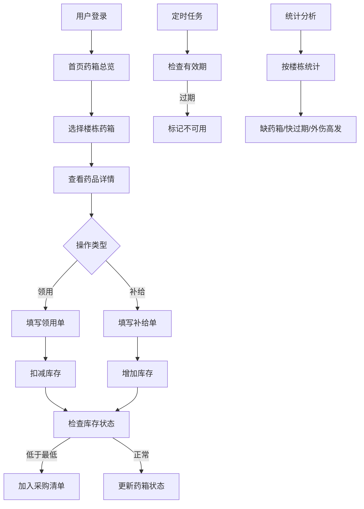

# 产品需求文档 - 学校医务室药箱管理系统

## 1. 产品概述

学校医务室在运动场、实验楼、宿舍各放置了小药箱，但创可贴和碘伏等常用药品常常在用完后才被发现。本系统围绕药箱位置进行管理，实现药品库存监控、领用补给记录、过期提醒和统计分析，帮助医务室及时掌握各药箱状态，确保应急药品供应。

- **主要目的**：实现分布式药箱的精细化管理，避免药品断供和过期风险
- **目标用户**：学校医务室老师、行政管理人员
- **核心价值**：及时发现药品短缺，追踪过期药品，统计外伤高发位置，提升校园医疗保障效率

## 2. 核心功能

### 2.1 用户角色

| 角色 | 注册方式 | 核心权限 |
|------|----------|----------|
| 医务室老师 | 系统登录 | 药箱管理、领用/补给操作、查看统计 |
| 管理员 | 系统登录 | 全部权限、数据管理 |

### 2.2 功能模块

1. **首页 - 药箱总览**：楼栋药箱列表、状态概览、快速入口
2. **药箱详情页**：药品清单、规格批号、有效期、库存状态、箱内照片
3. **领用登记**：用途、学生姓名、数量、家长回访需求
4. **补给登记**：来源、入箱数量、补给人
5. **采购清单**：低于最低数量的药品汇总
6. **统计分析**：缺药箱统计、快过期药品、外伤高发位置

### 2.3 页面详情

| 页面名称 | 模块名称 | 功能描述 |
|---------|----------|----------|
| 首页 | 楼栋导航 | 运动场、实验楼、宿舍三大区域入口，显示药箱状态（正常/警告/缺药） |
| 首页 | 状态概览 | 药品总数、过期药品数、缺药品类数、本周领用量统计卡片 |
| 首页 | 采购清单 | 低于最低库存的药品列表，显示药箱位置和缺口数量 |
| 药箱详情页 | 药品列表 | 显示药品名称、规格、批号、有效期、当前数量、最低数量、最近补给人 |
| 药箱详情页 | 药品状态 | 库存充足/偏低/不足标签，过期红色高亮 |
| 药箱详情页 | 箱内照片 | 药箱内部照片展示，支持多张 |
| 药箱详情页 | 操作按钮 | 领用、补给快捷操作 |
| 领用登记页 | 领用表单 | 选择药品、填写用途、学生姓名（可选）、数量、是否需要家长回访 |
| 补给登记页 | 补给表单 | 选择药品、填写来源、入箱数量 |
| 统计分析页 | 缺药箱统计 | 按楼栋显示缺药箱数量和具体缺药信息 |
| 统计分析页 | 快过期药品 | 30天内即将过期的药品列表，按楼栋分类 |
| 统计分析页 | 外伤高发位置 | 最近一周外伤领用记录统计，热力图展示 |

## 3. 核心流程

### 3.1 主要用户流程

**领用流程**：用户选择药箱 → 查看药品列表 → 点击领用按钮 → 选择药品并填写领用信息 → 提交后扣减库存 → 系统判断是否需要补充采购

**补给流程**：用户选择药箱 → 查看药品列表 → 点击补给按钮 → 选择药品并填写补给信息 → 提交后增加库存 → 记录补给人和来源

**过期处理**：系统自动检查药品有效期 → 过期药品标记为不可用 → 统计页面显示过期提醒 → 用户手动处理过期药品

**采购预警**：系统实时监控库存 → 低于最低数量时自动进入采购清单 → 首页和统计页高亮显示

## 4. 用户界面设计

### 4.1 设计风格

- **主色调**：医疗蓝 `#1E88E5` 作为主色，传递专业、可信赖的感觉
- **辅助色**：健康绿 `#4CAF50` 表示正常，警告橙 `#FF9800` 表示偏低，危险红 `#F44336` 表示过期或缺药
- **按钮风格**：圆角8px，扁平化设计，hover时轻微上浮效果
- **字体**：标题使用 "Noto Sans SC"，正文使用系统无衬线字体，注重可读性
- **布局风格**：卡片式布局，顶部导航+侧边楼栋选择+主内容区
- **图标风格**：使用医疗相关的线性图标，简洁清晰

### 4.2 页面设计概述

| 页面名称 | 模块名称 | UI元素 |
|---------|----------|--------|
| 首页 | 楼栋导航 | 三张大卡片分别代表运动场、实验楼、宿舍，配有图标和状态徽章 |
| 首页 | 状态概览 | 四个统计卡片，带数字动画效果 |
| 首页 | 采购清单 | 表格形式，红色高亮行显示紧急采购项 |
| 药箱详情页 | 药品列表 | 每行一个药品，左侧状态色条，右侧操作按钮 |
| 药箱详情页 | 药品状态 | 徽章标签：充足(绿)、偏低(橙)、不足(红)、过期(红斜纹) |
| 领用/补给页 | 表单 | 模态框形式，分步表单，提交后有成功动画 |
| 统计分析页 | 图表 | 柱状图展示各楼栋缺药情况，热力图展示外伤位置 |

### 4.3 响应式设计

- 桌面端为主设计，适配1280px及以上分辨率
- 平板端：侧边栏收起为图标模式
- 移动端：底部导航，卡片堆叠布局，表格转卡片列表
- 触摸优化：按钮最小44x44px，表单元素间距充足

### 4.4 视觉动效

- 页面加载：卡片依次淡入，错开0.1s
- 状态变化：库存更新时数字滚动动画
- 告警提示：过期/缺药项目有呼吸灯效果
- 表单提交：成功时绿色勾选动画
- 导航切换：平滑过渡，内容区淡入淡出

## 5. 非功能性需求

### 5.1 性能要求
- 页面首屏加载时间 < 2秒
- 药品列表查询响应时间 < 500ms
- 支持离线缓存基础数据

### 5.2 数据安全
- 所有操作记录留痕，不可删除
- 药品批次信息完整追溯
- 本地数据加密存储

### 5.3 易用性
- 关键操作不超过3步完成
- 状态信息一目了然，无需深入查找
- 移动端扫码快速访问药箱

## 6. 验收标准

1. 能够正确管理3个楼栋的药箱及药品信息
2. 领用和补给操作后库存实时更新
3. 过期药品自动标记，不再显示为可用
4. 低于最低库存的药品自动进入采购清单
5. 统计分析能够按楼栋展示缺药箱、快过期药品和外伤高发位置
6. 界面美观，操作流畅，符合医疗系统专业感
