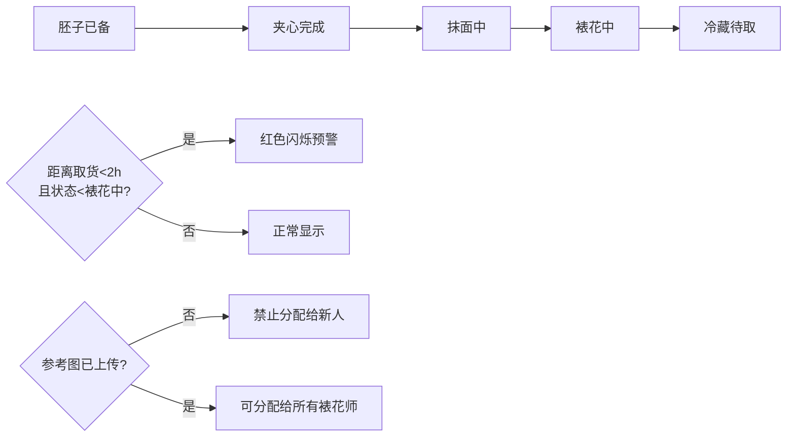

## 1. 产品概述

蛋糕店后厨排单白板系统，解决定制蛋糕订单在多工序间的流转可视化问题，帮助裱花师高效协作、老板实时把控产能瓶颈。

- 目标用户：裱花师、蛋糕店老板/店长
- 核心价值：将抽象的订单流转转化为可视化白板，提前预警风险订单，优化产能调度

## 2. 核心 Features

### 2.1 用户角色

| 角色 | 登录方式 | 核心权限 |
|------|----------|----------|
| 裱花师 | 无需登录 | 查看订单、更新自己负责订单的状态 |
| 老板/店长 | 无需登录 | 全部操作权限 + 底部产能统计面板 |

### 2.2 Feature Module

1. **排单白板页**：订单卡片瀑布流、状态流转操作、临近取货预警、新人保护规则
2. **老板统计面板**：裱花师产能统计、拥堵时段预测、风险订单预警

### 2.3 Page Details

| 页面名称 | 模块名称 | Feature 描述 |
|----------|----------|--------------|
| 排单白板页 | 顶部导航栏 | 日期选择、今日订单总数、刷新按钮 |
| 排单白板页 | 订单卡片列表 | 按取货时间升序排列，每张卡片显示尺寸/口味/主题/裱花师/复杂度/备注/参考图/尾款状态 |
| 排单白板页 | 状态流转条 | 5个状态节点（胚子已备→夹心完成→抹面中→裱花中→冷藏待取），点击切换 |
| 排单白板页 | 临近取货预警 | 距离取货<2小时且未进入"裱花中"状态的订单，卡片边框/背景变红闪烁 |
| 排单白板页 | 新人保护机制 | 无参考图的订单，分配下拉列表中禁用新人裱花师选项 |
| 老板统计面板 | 裱花师产能卡片 | 每人今日已完成/待完成单数、当前进度、预计下班时间 |
| 老板统计面板 | 拥堵时段预测 | 按半小时粒度展示待处理订单堆积热力条，红色标记拥堵时段 |
| 老板统计面板 | 风险订单列表 | 需要提前沟通改款的订单（复杂度高+临近取货+未完成裱花） |

## 3. 核心流程

### 3.1 订单流转流程

订单创建后从"胚子已备"开始，裱花师每完成一个工序点击对应状态节点，状态不可逆向前推进。当订单距离取货时间不足2小时且尚未进入"裱花中"状态时，系统自动标红预警。老板可在底部面板实时查看每位裱花师的负载情况，必要时进行订单改派或与顾客沟通改款。

## 4. User Interface Design

### 4.1 Design Style

- **主色调**：暖米色背景 (#FFF8F0)、深咖色文字 (#3D2914)、奶油白卡片 (#FFFBF5)
- **预警色**：朱红 (#E53935) 用于临近取货预警、橙黄 (#FB8C00) 用于中度风险
- **成功色**：抹茶绿 (#689F38) 用于已完成状态
- **按钮风格**：圆角胶囊按钮，状态节点使用描边圆点，激活时填充
- **字体**：标题用 "Noto Serif SC" 衬线体体现烘焙店质感，正文用 "Noto Sans SC" 易读
- **布局风格**：后厨白板式网格布局，卡片错落有致，带有轻微纸张纹理
- **图标风格**：手绘风 Emoji + 线性图标混合，贴合烘焙行业氛围

### 4.2 Page Design Overview

| 页面名称 | 模块名称 | UI Elements |
|----------|----------|-------------|
| 排单白板页 | 顶部导航 | 大号日期标题、今日订单计数徽章、右上刷新按钮 |
| 排单白板页 | 订单卡片 | 白色圆角卡片带阴影，顶部取货时间大字显示，状态节点横向排列，底部参考图缩略图 |
| 排单白板页 | 预警订单 | 红色渐变边框 + 轻微呼吸动画，取货时间区域红底白字 |
| 老板统计面板 | 裱花师卡片 | 横向排列，头像+姓名+进度环+待完成数 |
| 老板统计面板 | 拥堵热力条 | 时间轴横向展开，每半小时一格，颜色从浅黄→橙→红表示拥堵程度 |

### 4.3 Responsiveness

- Desktop-first 设计，1280px 起步
- 订单卡片网格：桌面端 3 列，平板端 2 列，移动端 1 列
- 老板统计面板固定在页面底部，移动端可折叠
- 触摸优化：状态节点点击区域 ≥ 44px
