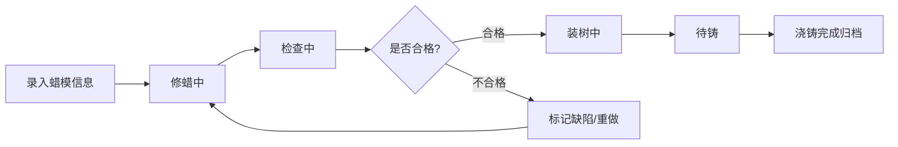

## 1. 产品概述

珠宝工作室蜡模编号管理系统，为工匠提供戒指蜡模全流程追踪管理。解决戒圈尺寸与镶口编号混淆、浇铸后难以追溯的核心痛点。

- 目标用户：珠宝工作室工匠、质量检验员
- 产品价值：建立蜡模身份档案，实现从修蜡到浇铸的全程可追溯，降低因编号混乱导致的返工率

## 2. 核心功能

### 2.1 用户角色
| 角色 | 核心权限 |
|------|----------|
| 工匠 | 录入蜡模信息、更新状态、标记问题、查看蜡模列表 |

### 2.2 功能模块
1. **蜡模录入表单**：录入客户单号、戒圈号、蜡模重量、镶口形状、主石尺寸、支撑杆位置
2. **蜡模卡片看板**：以小卡片形式展示所有蜡模，按状态分区显示
3. **状态流转系统**：修蜡 → 检查 → 装树 → 待铸，四阶段流转
4. **问题标记系统**：标记裂纹、变形、编号不清等缺陷，记录重做原因

### 2.3 页面详情
| 页面名称 | 模块名称 | 功能描述 |
|----------|----------|----------|
| 蜡模管理页 | 顶部导航栏 | 标题、统计概览（各状态数量）、新增按钮 |
| 蜡模管理页 | 录入表单区 | 弹出式表单，录入蜡模基础信息，含下拉选择和数字输入 |
| 蜡模管理页 | 看板分区 | 四个状态列：修蜡中、检查中、装树中、待铸，每列展示对应卡片 |
| 蜡模管理页 | 蜡模卡片 | 展示编号、客户单号、戒圈号、重量、镶口信息，支持状态流转和问题标记 |
| 蜡模管理页 | 问题标记弹窗 | 多选缺陷类型（裂纹/变形/编号不清）+ 重做原因备注 |
| 蜡模管理页 | 搜索筛选 | 按客户单号、戒圈号搜索，按问题状态筛选 |

## 3. 核心流程

工匠录入蜡模基础信息，系统自动生成唯一编号 → 蜡模进入「修蜡中」状态 → 修蜡完成流转至「检查中」 → 检查员标记问题或通过 → 问题蜡模标记缺陷并记录原因，可返回修蜡或重做 → 通过的蜡模进入「装树中」→ 装树完成后进入「待铸」队列，等待浇铸工序

## 4. 用户界面设计

### 4.1 设计风格
- **主色调**：深炭灰 (#1c1917) 背景 + 暖金 (#d97706) 点缀 + 象牙白 (#fafaf9) 文字
- **辅助色**：翡翠绿 (#059669) 正常状态，琥珀橙 (#d97706) 警告，石榴红 (#dc2626) 缺陷
- **按钮风格**：圆润方形 (rounded-lg)，金属质感渐变边框，悬停时有微妙光晕
- **字体**：标题用 Noto Serif SC 衬线体体现珠宝精致感，正文用 JetBrains Mono 等宽字体保证编号可读性
- **布局风格**：看板型四列布局，卡片采用深色玻璃拟态 (dark glassmorphism)，细微金色边框，柔和投影
- **图标**：Lucide 线性图标，统一细线条风格，搭配金属色

### 4.2 页面设计概览
| 页面名称 | 模块名称 | UI 元素 |
|----------|----------|---------|
| 蜡模管理页 | 顶部导航 | 深灰背景、金色分割线、衬线体大标题、状态统计胶囊、金属质感新增按钮 |
| 蜡模管理页 | 录入表单 | 毛玻璃弹窗、表单标签用小字衬线体、输入框金色焦点边框、下拉选择带图标 |
| 蜡模管理页 | 看板分区 | 四列等宽、每列顶部有状态标题+计数胶囊、列间细微金色竖线分隔 |
| 蜡模管理页 | 蜡模卡片 | 圆角卡片、顶部编号标签（金色）、信息网格布局（等宽字体）、状态流转按钮、问题角标 |
| 蜡模管理页 | 问题弹窗 | 深色背景、缺陷类型复选框（带图标）、重做原因文本框、提交/取消按钮 |
| 蜡模管理页 | 搜索筛选 | 顶部横条、搜索框带放大镜图标、筛选下拉带筛选图标 |

### 4.3 响应式
- 桌面优先设计（≥ 1440px 四列看板完整展示）
- 平板端（1024px）变为两列，允许横向滚动
- 移动端（< 768px）变为单列堆叠，看板切换为 Tab 切换
- 所有卡片支持触摸滑动操作流转状态

### 4.4 动效设计
- 页面加载：卡片从上到下依次渐入，错开 80ms 延迟
- 状态流转：卡片从原列滑出，带 300ms 缓动，目标列有脉冲高亮
- 问题标记：缺陷角标有红色呼吸灯动画
- 悬停效果：卡片上移 2px，金色边框加强，投影加深
