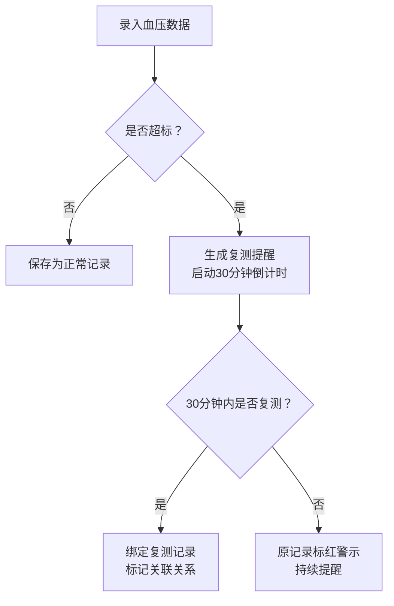

## 1. 产品概述

血压复测记录台是一款专为家庭设计的老年人血压健康管理工具，解决家人记不清老人是否复测血压的痛点，通过智能提醒、复测绑定和趋势分析，帮助家人全面掌握老人的血压状况。

- 核心价值：确保异常血压数据得到及时复测，避免遗漏潜在健康风险
- 目标用户：老年高血压患者及其家属（子女/护理人员）

## 2. 核心功能

### 2.1 功能模块
1. **老人档案管理**：个人信息、健康参数、紧急联系人
2. **血压记录中心**：测量录入、复测提醒、记录关联
3. **趋势分析页**：周异常统计、复测完成率、时段分布

### 2.2 页面详情
| 页面名称 | 模块名称 | 功能描述 |
|-----------|-------------|---------------------|
| 仪表盘首页 | 概览卡片 | 今日测量情况、待复测提醒、快速记录入口 |
| 仪表盘首页 | 最近记录列表 | 显示最近5条测量记录，异常和待复测状态高亮 |
| 老人档案页 | 档案卡片列表 | 展示所有老人头像和基本信息，支持新增/编辑/删除 |
| 老人档案页 | 档案表单 | 姓名、年龄、头像、常用药、目标范围、紧急联系人 |
| 血压记录页 | 记录时间线 | 按时间倒序展示所有测量记录，复测记录与原记录关联显示 |
| 血压记录页 | 新增记录表单 | 高压、低压、心率、测量时间、身体感受、照片上传 |
| 血压记录页 | 复测提醒组件 | 超过阈值自动标记，30分钟未补测标红闪烁 |
| 趋势分析页 | 周异常次数图表 | 柱状图展示近7天每日异常测量次数 |
| 趋势分析页 | 复测完成率指标 | 环形图展示复测完成百分比 |
| 趋势分析页 | 时段分布图 | 热力图展示哪个时间段最容易出现高血压 |

## 3. 核心流程

### 3.1 血压测量与复测流程
用户录入血压数据 → 系统判断是否超过目标范围 → 若超标自动生成复测提醒（30分钟倒计时）→ 用户点击"立即复测"录入新数据 → 复测结果与原记录绑定显示 → 超过30分钟未复测标红警示

## 4. 用户界面设计

### 4.1 设计风格
- **主色调**：温暖的医疗蓝 `#2563EB` 作为主色，传递专业可靠感；柔和的珊瑚红 `#EF4444` 用于异常警示；绿色 `#10B981` 表示正常状态
- **辅色调**：浅灰蓝背景 `#F0F4F8`，白色卡片，柔和阴影营造层次感
- **按钮风格**：圆角 12px，主按钮采用渐变蓝，悬停有微放大效果
- **字体**：标题使用思源宋体 SC（庄重有温度），正文使用思源黑体 SC（清晰易读），字号偏大适配老年人使用
- **布局风格**：卡片式布局，充足留白，顶部导航 + 侧边栏双栏结构
- **图标风格**：线性图标，圆润线条，大号触摸区域

### 4.2 页面设计概述
| 页面名称 | 模块名称 | UI 元素 |
|-----------|-------------|-------------|
| 仪表盘首页 | 概览卡片 | 大字号数据展示，渐变色块背景，左侧图标右侧数字 |
| 仪表盘首页 | 待复测提醒 | 顶部横幅式提醒，红色脉动动画，倒计时数字闪烁 |
| 老人档案页 | 档案卡片 | 圆形头像，姓名年龄，标签式常用药展示，悬浮上浮效果 |
| 血压记录页 | 记录时间线 | 竖向时间轴，原记录与复测记录用连线关联，异常卡片红色边框 |
| 趋势分析页 | 图表区域 | 圆角卡片容器，图表配色与主题一致，交互有悬浮提示 |

### 4.3 响应式
- 桌面端优先设计（1280px+），双栏布局（侧边栏 + 主内容区）
- 平板端（768px）：侧边栏收起为汉堡菜单
- 移动端：单列布局，底部导航栏，所有触摸区域 ≥ 44px
