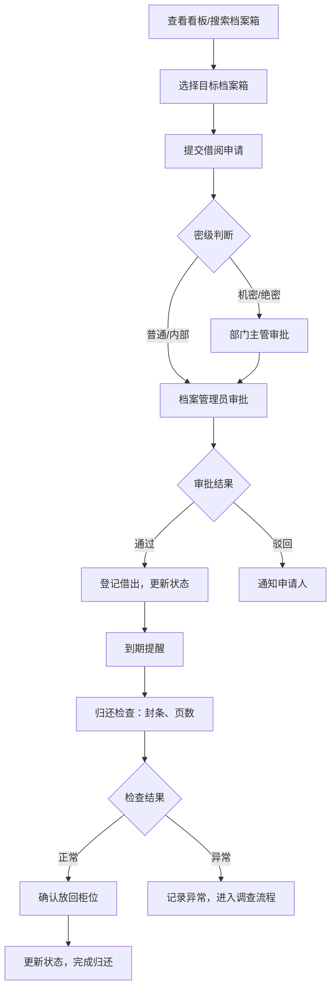

## 1. 产品概述

行政档案箱定位和借阅管理系统，解决档案箱借出后位置追踪困难、审计时无法快速定位的问题。
- 主要面向企业行政、档案管理和审计部门，实现档案箱全生命周期的数字化管理
- 通过规范借阅流程、强化归还检查、提供实时看板，提升档案管理效率与合规性

## 2. 核心功能

### 2.1 用户角色
| 角色 | 注册方式 | 核心权限 |
|------|----------|----------|
| 普通员工 | 企业账号登录 | 浏览档案箱、提交借阅申请 |
| 档案管理员 | 企业账号登录 | 管理档案箱信息、审核借阅、处理归还、配置系统 |
| 部门主管 | 企业账号登录 | 审批高密级档案借阅申请 |
| 审计人员 | 企业账号登录 | 查看所有档案箱状态、审计看板、借阅历史 |

### 2.2 功能模块
1. **看板首页**：逾期未还、封条异常、近期审计、部门借阅量统计
2. **档案箱管理**：档案箱列表、新增/编辑档案箱、详情查看、照片管理
3. **借阅管理**：借阅申请、审批流程、借出登记、归还检查
4. **搜索与定位**：多条件搜索、柜位导航、状态筛选

### 2.3 页面详情
| 页面名称 | 模块名称 | 功能描述 |
|----------|----------|----------|
| 看板首页 | 逾期未还卡片 | 展示所有超过预计归还日期的档案箱，可快速定位 |
| 看板首页 | 封条异常卡片 | 标记归还时封条不一致或缺失的档案箱 |
| 看板首页 | 近期审计提醒 | 展示未来30天内审计计划需要用到的档案箱 |
| 看板首页 | 部门借阅量统计 | 柱状图展示各部门当月/当季借阅数量 |
| 档案箱列表 | 搜索栏 | 支持按合同号、客户名、年份、柜位、密级筛选 |
| 档案箱列表 | 档案箱卡片 | 显示编号、柜位、状态、密级、保管人等核心信息 |
| 档案箱详情 | 基本信息 | 编号、柜位、年份、部门、密级、保管人、封条号 |
| 档案箱详情 | 照片展示 | 档案箱外观照片、封条特写 |
| 档案箱详情 | 借阅历史 | 完整的借出、归还记录时间线 |
| 借阅申请 | 申请表单 | 用途、借出人、预计归还日期、是否允许带出办公室 |
| 借阅审批 | 审批列表 | 待审批申请，高密级需主管二次确认 |
| 归还检查 | 归还表单 | 封条检查、文件页数核对、缺页登记、放回柜位确认 |

## 3. 核心流程

用户在看板查看档案箱状态，通过搜索找到目标档案箱，提交借阅申请。普通密级由档案管理员直接审批，高密级需部门主管确认后生效。借出时登记状态，归还时需核对封条号、文件页数，确认无误后放回柜位并更新状态。所有操作留痕，审计人员可随时调阅历史记录。

## 4. 用户界面设计

### 4.1 设计风格
- **主色调**：深海军蓝 #1e3a5f 作为主色，体现专业稳重；辅色为暖金色 #d4a853，强调重要操作与状态
- **背景色**：浅灰 #f5f6f8 搭配白色卡片，营造干净整洁的档案管理氛围
- **按钮风格**：圆角矩形（6px），主按钮填充深海军蓝，悬停时有微妙的光影变化
- **字体**：标题使用思源宋体（Source Han Serif SC）增强正式感，正文使用思源黑体（Source Han Sans SC）保证可读性
- **布局风格**：左侧导航 + 顶部工具栏 + 主内容区的经典后台布局，卡片式信息展示
- **图标风格**：线性风格图标，统一2px描边，配合档案、锁、日历等元素

### 4.2 页面设计概述
| 页面名称 | 模块名称 | UI元素 |
|----------|----------|--------|
| 看板首页 | 统计卡片 | 4色卡片横向排列，含图标、数值、环比箭头，入场时淡入上移 |
| 看板首页 | 图表区域 | 部门借阅量柱状图，渐变色柱体，悬停显示详情 |
| 看板首页 | 提醒列表 | 逾期/异常项带红色标签，时间轴样式展示 |
| 档案箱列表 | 搜索栏 | 多条件横向排列，筛选条件以标签形式回显 |
| 档案箱列表 | 卡片网格 | 每卡含编号、状态徽章、柜位标签、密级色块 |
| 档案箱详情 | 信息分区 | 基本信息、照片、借阅历史三栏垂直排列，分隔线区分 |
| 借阅申请 | 表单布局 | 左右两列，必填项红星标记，提交按钮固定底部 |

### 4.3 响应式
- 桌面端优先设计（1440px基准）
- 平板端（1024px）：统计卡片变为2x2网格，侧边栏可折叠
- 移动端（768px以下）：底部Tab导航替代侧边栏，卡片单列布局，表单纵向排列
- 所有交互元素最小点击区域44x44px

