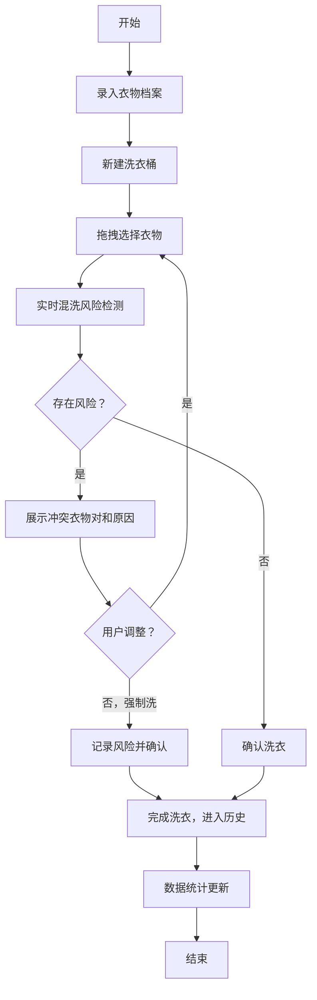

## 1. 产品概述

衣物混洗风险检测系统，帮助家庭用户在洗衣前智能识别衣物混洗风险，避免染色、材质损坏等问题。
- 解决问题：白衣服被深色袜子染色、羊毛被普通水洗坏、内衣外衣混洗不卫生等洗衣常见痛点
- 目标用户：有洗衣需求的家庭用户，尤其是对衣物护理有要求的用户
- 产品价值：通过智能化的衣物档案管理和实时风险检测，减少洗衣失误，保护衣物

## 2. 核心功能

### 2.1 用户角色

| 角色 | 注册方式 | 核心权限 |
|------|----------|----------|
| 家庭用户 | 本地使用（无需注册） | 衣物管理、洗衣桶创建、历史查看、数据统计 |

### 2.2 功能模块

1. **衣物档案管理**：录入衣物信息（颜色、材质、掉色风险、建议水温、所属人、照片）
2. **新建洗衣桶**：拖拽添加衣物，实时检测混洗风险
3. **混洗风险检测**：深浅色冲突、羊毛/精细面料、毛巾、内衣混洗检测，明确指出冲突衣物
4. **洗衣历史**：记录已完成的洗衣桶
5. **数据统计小结**：一周洗衣桶数、最常混错类型、各成员衣物占比

### 2.3 页面详情

| 页面名称 | 模块名称 | 功能描述 |
|----------|----------|----------|
| 衣物档案 | 衣物列表 | 展示所有已录入衣物卡片，支持筛选和搜索 |
| 衣物档案 | 新增/编辑衣物 | 录入颜色、材质、掉色风险、建议水温、所属人、照片 |
| 新建洗衣桶 | 衣物选择区 | 展示可选衣物，支持拖拽或点击添加 |
| 新建洗衣桶 | 洗衣桶区域 | 展示当前桶内衣物，支持移除 |
| 新建洗衣桶 | 风险提示面板 | 实时检测并展示冲突衣物对，说明冲突原因 |
| 洗衣历史 | 历史列表 | 展示已完成的洗衣桶，含时间、衣物、风险记录 |
| 数据小结 | 统计卡片 | 一周桶数、最常混错类型、衣物占比图表 |

## 3. 核心流程

用户打开应用 → 录入衣物档案（颜色、材质、掉色、水温、所属人、照片）→ 新建洗衣桶，拖拽选择要洗的衣物 → 系统实时判断深浅色、羊毛、毛巾、内衣是否可混洗，明确指出冲突衣物对 → 确认无风险后完成洗衣 → 洗衣桶进入历史记录 → 数据小结区展示统计信息

## 4. 用户界面设计

### 4.1 设计风格
- **主色调**：清爽水蓝色系（#4FC3F7 主色，#0288D1 深色，#B3E5FC 浅色），传递清洁、信任的感觉
- **辅助色**：风险警示用珊瑚红（#EF5350），安全通过用薄荷绿（#66BB6A）
- **按钮风格**：圆角胶囊形按钮，轻微阴影，悬停有微妙的上浮效果
- **字体**：展示字体用 Playfair Display（优雅衬线），正文字体用 Noto Sans SC（现代无衬线）
- **布局风格**：卡片式布局，柔和圆角，细腻阴影，大量留白
- **图标风格**：线性简洁图标，搭配衣物相关的emoji（🧺👕🧦🧥）

### 4.2 页面设计概览

| 页面名称 | 模块名称 | UI元素 |
|----------|----------|--------|
| 衣物档案 | 衣物列表 | 网格卡片布局，卡片显示衣物照片+颜色标签+材质标签，悬停放大效果 |
| 衣物档案 | 新增衣物表单 | 左右分栏，左侧表单输入，右侧实时预览卡片 |
| 新建洗衣桶 | 主操作区 | 三栏布局：左侧可选衣物、中间洗衣桶（洗衣机滚筒视觉隐喻）、右侧风险面板 |
| 新建洗衣桶 | 风险提示 | 红色边框警示卡片，明确列出冲突衣物对（A衣物 vs B衣物）及原因 |
| 洗衣历史 | 时间线列表 | 纵向时间线，每桶显示衣物缩略图、完成时间、风险标记 |
| 数据小结 | 统计区 | 顶部数字卡片 + 下方环形图/柱状图组合 |

### 4.3 响应式
- Desktop-first 设计，桌面端三栏布局
- 平板端折叠为两栏（衣物选择+洗衣桶/风险）
- 移动端单栏流式布局，洗衣桶固定在底部抽屉

### 4.4 动效设计
- 衣物拖入洗衣桶时有落入滚筒的旋转动画
- 风险检测时红色警示卡片有脉冲呼吸效果
- 页面加载时衣物卡片错落淡入（staggered reveal）
- 统计数据变化时有数字滚动动画
