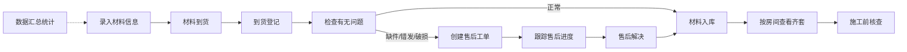

## 1. 产品概述

装修材料到货管理系统，帮助装修业主和施工团队高效管理瓷砖、灯具、五金等多批次到货的装修材料。解决材料到货信息混乱、售后问题难追踪、施工前材料齐套检查繁琐等痛点。

- 目标用户：装修业主、项目经理、施工师傅
- 核心价值：材料信息一目了然、售后问题规范跟踪、施工前快速核查齐套

## 2. 核心功能

### 2.1 用户角色

| 角色 | 注册方式 | 核心权限 |
|------|----------|----------|
| 普通用户 | 无需注册，本地使用 | 材料管理、到货登记、售后跟踪、数据统计 |

### 2.2 功能模块

1. **材料看板**：材料卡片列表、筛选搜索、新增/编辑/删除材料
2. **到货登记**：实收数量、破损数量、存放房间、签收人、到货照片
3. **售后管理**：缺件/错发/破损问题登记、状态跟踪、处理记录
4. **房间视图**：按房间分组查看材料、齐套状态一目了然
5. **数据汇总**：延期供应商排名、破损率统计、未处理售后清单

### 2.3 页面详情

| 页面名称 | 模块名称 | 功能描述 |
|----------|----------|----------|
| 材料看板 | 顶部导航 | 页面切换、全局搜索、新增按钮 |
| 材料看板 | 筛选栏 | 按供应商/房间/状态筛选 |
| 材料看板 | 材料卡片网格 | 展示品名、品牌、规格、订购量、预计到货日、照片、状态标签 |
| 材料看板 | 材料详情抽屉 | 完整信息展示、到货记录、售后记录 |
| 到货登记 | 到货表单 | 实收数量、破损数量、存放房间、签收人、备注 |
| 售后管理 | 售后列表 | 问题类型、严重程度、状态、关联材料 |
| 售后管理 | 售后详情 | 问题描述、处理进展、跟进记录 |
| 房间视图 | 房间卡片 | 每个房间的材料清单、齐套进度条 |
| 数据汇总 | 统计卡片 | 总材料数、已到货数、售后数、破损率 |
| 数据汇总 | 供应商排名 | 按延期天数排序的供应商列表 |
| 数据汇总 | 售后概览 | 未处理/处理中/已解决分类统计 |

## 3. 核心流程

### 3.1 主要用户流程

用户进入系统后，首先在材料看板录入所有待采购/已采购的装修材料信息。材料到货后，用户进行到货登记，填写实收数量和破损情况。如果发现缺件、错发或破损问题，创建售后工单并跟踪处理进度。施工前，用户切换到房间视图，快速查看每个房间的材料是否齐套。通过数据汇总页面，用户可以了解哪些供应商经常延期、哪些材料破损率高，以及还有多少售后问题未解决。

## 4. 用户界面设计

### 4.1 设计风格

- **主色调**：深青色（#0D9488）作为主色，代表工程管理的专业感
- **辅助色**：琥珀色（#F59E0B）用于警告状态，红色（#EF4444）用于售后问题，绿色（#10B981）用于已完成
- **中性色**：浅灰背景、深灰文字，营造清爽的工具感
- **按钮风格**：圆角中等（8px），主按钮实色填充，次按钮描边
- **字体**：系统无衬线字体，清晰易读
- **布局风格**：卡片式布局，顶部导航栏 + 内容区 + 侧边抽屉
- **图标风格**：线性简约图标，20px 为主

### 4.2 页面设计概览

| 页面名称 | 模块名称 | UI 元素 |
|----------|----------|--------|
| 材料看板 | 顶部导航 | 品牌标识、主导航标签、搜索框、新增按钮 |
| 材料看板 | 筛选栏 | 标签式筛选、下拉选择器 |
| 材料看板 | 卡片网格 | 等宽瀑布流卡片，带照片缩略图、状态标签、数量进度 |
| 材料看板 | 详情抽屉 | 右侧滑入，分 Tab 展示基本信息/到货记录/售后记录 |
| 到货登记 | 表单弹窗 | 居中模态框，分组表单字段 |
| 售后管理 | 列表视图 | 表格+卡片混合，带状态色标签 |
| 房间视图 | 房间卡片 | 大卡片，顶部进度条，下方材料列表 |
| 数据汇总 | 统计卡片 | 4个大数字卡片，带趋势指示 |
| 数据汇总 | 排名列表 | 带条形图的排名列表 |

### 4.3 响应式

- Desktop-first 设计，桌面端优先
- 平板端：卡片网格从 3 列变为 2 列
- 移动端：卡片网格变为单列，导航变为底部 Tab 栏
- 触控优化：按钮最小 44px 点击区域

### 4.4 动效设计

- 页面切换：淡入 + 轻微上移动画
- 卡片悬停：轻微上浮 + 阴影加深
- 抽屉滑入：右侧平滑滑入，背景遮罩淡入
- 状态变化：颜色过渡动画，数字跳动效果
- 表单提交：按钮 loading 状态 + 成功提示 toast
