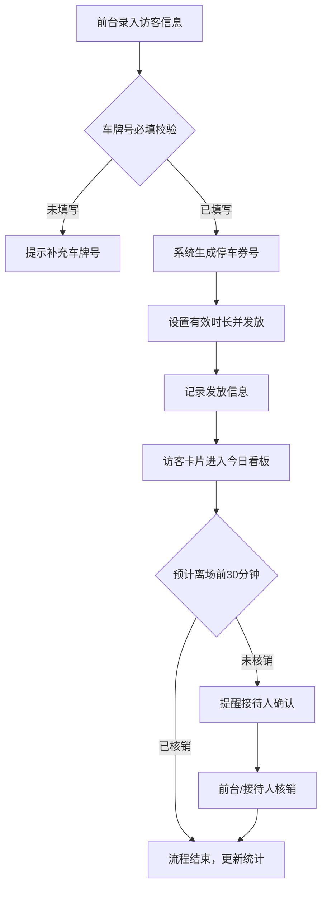

## 1. 产品概述

访客停车券管理系统，解决前台忘记提前预留停车券、访客离场时临时找行政的效率问题。面向公司前台、行政人员和部门接待人，实现访客预约、停车券发放、核销提醒一体化管理。

- 核心目标：规范访客停车券管理流程，减少行政协调成本，提升访客体验
- 价值定位：看板化数据可视化 + 智能提醒机制 + 部门用量统计

## 2. 核心功能

### 2.1 用户角色

| 角色 | 使用场景 | 核心权限 |
|------|---------|---------|
| 前台/行政 | 日常操作入口 | 访客预约录入、发放停车券、核销管理、查看全部数据 |
| 部门接待人 | 接收提醒、确认核销 | 查看所接待访客信息、接收未核销提醒、确认核销状态 |

### 2.2 功能模块

1. **访客预约模块**：录入访客基本信息（姓名、公司、车牌、到访部门、会议室、预计到离时间、接待人）
2. **停车券管理模块**：券号生成、有效时长设置、发放记录、核销状态跟踪
3. **看板展示模块**：按今天/明天/已超时分组展示，多维度数据统计
4. **提醒模块**：离场前未核销自动提醒接待人
5. **统计分析模块**：部门用券量、未核销车辆、平均停车时长、剩余券库存

### 2.3 页面详情

| 页面名称 | 模块名称 | 功能描述 |
|---------|---------|-----------|
| 主看板页 | 顶部导航栏 | 系统名称、当前日期、剩余券库存提示、快捷发券按钮 |
| 主看板页 | 统计概览卡片 | 4个核心指标卡片：今日用券量、未核销车辆、平均停车时长、剩余库存 |
| 主看板页 | 部门用券统计 | 各部门用券数量横向条形图/进度条对比 |
| 主看板页 | 访客分组看板 | 三列布局：今日到访、明日到访、已超时，每列卡片列表展示访客信息 |
| 访客预约弹窗 | 预约表单 | 姓名、公司、车牌号（必填校验）、到访部门（下拉）、会议室、预计到达时间、预计离开时间、接待人（下拉） |
| 访客详情弹窗 | 停车券信息 | 券号、有效时长、发放人、发放时间、核销状态、核销操作按钮 |
| 访客卡片 | 快捷操作 | 查看详情、发放/查看停车券、标记核销、快速编辑 |
| 提醒组件 | 未核销提醒 | 离场前30分钟弹出提醒，显示接待人姓名和联系方式，支持一键通知 |

## 3. 核心流程

### 访客预约与发券流程
前台录入访客信息 → 校验车牌号是否填写 → 系统自动生成券号 → 设置有效时长 → 发放停车券 → 记录发放人和时间 → 卡片展示

### 离场核销流程
访客预计离场前30分钟 → 系统检查核销状态 → 未核销则弹框提醒接待人 → 接待人/前台确认核销 → 更新券状态 → 更新停车时长统计

### 数据看板流程
系统加载 → 按日期分类访客 → 计算各部门用券量 → 统计未核销数量 → 计算平均停车时长 → 检查库存阈值 → 渲染看板

## 4. 用户界面设计

### 4.1 设计风格
- **主色调**：深靛蓝 #1E3A5F 作为主色（专业、稳重），搭配活力橙 #FF7A45 作为强调色（提醒、操作），辅色薄荷绿 #36CFC9 表示正常/已完成状态
- **按钮风格**：圆角 8px，主按钮使用深靛蓝填充 + 白色文字，悬停时微上浮 + 阴影加深；危险/提醒按钮使用活力橙
- **字体**：标题使用"思源黑体 CN Bold"，正文使用"思源黑体 CN Regular"，数字使用等宽字体"JetBrains Mono"增强数据辨识度
- **布局风格**：卡片式布局，顶部统计条 + 中部部门统计区 + 下方三列看板区，信息层级分明
- **视觉元素**：使用柔和阴影（0 4px 20px rgba(30,58,95,0.08)），卡片圆角 12px，细边框 1px solid rgba(30,58,95,0.08)

### 4.2 页面设计概览

| 页面区域 | 模块名称 | UI 元素与风格 |
|---------|---------|--------------|
| 顶部区域 | 导航栏 | 左侧系统 Logo + 名称，右侧当前日期 + 库存徽章 + 快捷发券按钮（橙底白字） |
| 顶部区域 | 统计概览 | 4 个等宽卡片，左侧图标圆形背景，右侧大号数字 + 标签，今日用券/未核销/平均时长/剩余库存，不同颜色区分 |
| 中部区域 | 部门统计 | 横向条形进度条，部门名称 + 数量 + 占比条，鼠标悬停高亮，最多展示 Top 8 部门 |
| 下方区域 | 三列看板 | 列标题带计数徽章，今日（蓝边）/ 明天（灰边）/ 已超时（红边 + 警告图标） |
| 卡片组件 | 访客卡片 | 访客姓名（大字）+ 公司（小字灰色），右侧标签：车牌（深色底白字）、部门、会议室；底部接待人 + 时间；状态角标（已核销/待核销/已超时） |
| 弹窗组件 | 表单弹窗 | 遮罩 + 居中卡片，表单两列布局，标签左对齐，输入框圆角 8px，聚焦时主色描边 |

### 4.3 响应式
- 桌面端优先设计（1280px 以上），三列看板并排展示
- 1024px ~ 1280px：部门统计与看板上下堆叠，三列变为两列，已超时单独一行
- 768px ~ 1024px：统计卡片两行两列，看板改为可切换的 Tab 形式
- 768px 以下：统计卡片单列堆叠，看板 Tab 切换，弹窗自适应全屏

### 4.4 交互动效
- 页面加载：统计数字从 0 计数到目标值（动画 800ms，ease-out）
- 卡片入场：依次淡入上移（stagger 50ms）
- 悬停效果：卡片 Y 轴上移 2px + 阴影加深
- 提醒弹出：未核销提醒从右侧滑入（slide-in-right 300ms），带呼吸动画的橙点标记
- 核销操作：点击后卡片角标从橙色"待核销"绿色过渡为"已核销"（500ms 颜色渐变动画）
