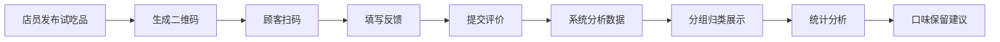

## 1. 产品概述

试吃反馈板是一款面向餐饮门店的新品试吃管理工具，解决新口味上架前收集顾客反馈散乱的问题。店员可以发布试吃品，顾客扫码提交反馈，系统自动分析数据，帮助门店快速判断哪些口味值得保留。

- 目标用户：门店店员（发布管理）、熟客（提交反馈）
- 核心价值：集中收集反馈、智能分析口味表现、加速新品决策

## 2. 核心功能

### 2.1 用户角色

| 角色 | 使用方式 | 核心权限 |
|------|----------|----------|
| 店员 | 网页端登录 | 发布试吃品、查看反馈、查看统计、管理状态 |
| 顾客 | 扫码进入 | 查看试吃品、提交反馈、查看评分 |

### 2.2 功能模块

1. **首页**：试吃品分组展示（收集中、好评高、争议大、准备上架）、搜索筛选、快速入口
2. **发布页**：创建试吃品表单、照片上传、生成二维码
3. **详情页**：试吃品信息、反馈列表、关键词云、评分分布
4. **反馈页**：顾客提交反馈表单、多维度评分、文字评价
5. **统计页**：购买意愿分析、平均评分排行、口味保留建议

### 2.3 页面详情

| 页面名称 | 模块名称 | 功能描述 |
|----------|----------|----------|
| 首页 | 顶部导航 | Logo、页面切换、发布按钮 |
| 首页 | 分组标签 | 收集中 / 好评高 / 争议大 / 准备上架 四组切换 |
| 首页 | 试吃品卡片网格 | 展示封面图、名称、口味标签、评分、状态 |
| 首页 | 搜索筛选 | 关键词搜索、口味筛选 |
| 发布页 | 表单区域 | 名称、口味、成本、目标客群、试吃份数、照片、截止日期 |
| 发布页 | 预览区域 | 实时预览卡片效果 |
| 详情页 | 试吃品信息 | 大图、基本信息、进度条 |
| 详情页 | 关键词标签云 | 高频词可视化展示 |
| 详情页 | 反馈列表 | 用户反馈详情、维度评分 |
| 反馈页 | 总体评分 | 星级评分组件 |
| 反馈页 | 维度滑块 | 甜度、咸度、辣度、分量、包装印象 |
| 反馈页 | 购买意愿 | 是/否/犹豫 三选一 |
| 反馈页 | 文字评价 | 文本输入框 |
| 统计页 | 概览卡片 | 总试吃品数、总反馈数、平均评分 |
| 统计页 | 购买意愿图表 | 饼图/环形图展示 |
| 统计页 | 口味排行 | 按综合评分排序的口味列表 |
| 统计页 | 保留建议 | 系统推荐最值得保留的口味 |

## 3. 核心流程

### 店员发布试吃品流程
店员填写试吃品信息 → 上传照片 → 提交发布 → 系统生成二维码 → 打印/展示二维码

### 顾客提交反馈流程
扫码进入反馈页 → 查看试吃品信息 → 填写多维度评分 → 选择购买意愿 → 提交文字评价 → 提交成功

### 数据分析流程
系统收集反馈 → 自动计算平均分 → 关键词提取 → 分组归类 → 生成统计报告

## 4. 用户界面设计

### 4.1 设计风格

**温暖美食风**
- 主色调：暖橙红 (#FF6B35)，代表美食、热情、食欲
- 辅助色：暖黄 (#FFC857)、薄荷绿 (#4ECDC4)
- 中性色：暖米白 (#FFF9F2)、深棕 (#3D2C29)
- 按钮风格：圆角胶囊形，微悬浮阴影
- 字体：展示字体使用圆润有温度的字体，正文使用清晰易读的无衬线字体
- 布局风格：卡片式布局，柔和阴影，温暖渐变背景
- 图标风格：线性图标，统一圆角

### 4.2 页面设计概览

| 页面名称 | 模块名称 | UI元素 |
|----------|----------|--------|
| 首页 | 分组标签 | 横向滚动标签，选中态有下划线和背景色 |
| 首页 | 试吃品卡片 | 圆角卡片、悬浮放大效果、渐变色标签 |
| 详情页 | 关键词云 | 不同大小和颜色的标签，热门词更醒目 |
| 反馈页 | 滑块评分 | 彩色渐变滑块，表情图标反馈 |
| 统计页 | 数据卡片 | 大数字展示，渐变背景，微动效 |

### 4.3 响应式设计

- 桌面端：多列网格布局，侧边导航
- 平板端：两列布局，顶部导航
- 手机端：单列布局，底部标签栏，触控优化
- 顾客反馈页：专门针对手机端优化，大按钮、大输入框

### 4.4 动效设计

- 页面切换：淡入淡出 + 轻微位移
- 卡片悬浮：上移 4px + 阴影加深
- 滑块交互：实时颜色渐变反馈
- 数据加载：骨架屏脉冲动画
- 提交成功：庆祝动效（彩带/星星）
