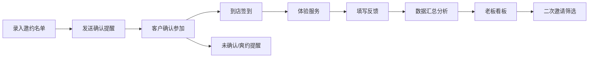

## 1. 产品概述

试营业邀约系统是一款专为新店试营业设计的客户邀约与反馈管理工具，帮助店主高效管理试吃试用邀请名单、追踪到店情况、收集客户反馈，并通过数据看板辅助经营决策。

- 核心问题：微信邀约答应的人多，真正到店和反馈分散，缺乏系统化管理
- 目标用户：新店店主、店长、市场运营人员
- 产品价值：提升邀约转化率、系统化收集反馈、数据驱动优化试营业效果

## 2. 核心功能

### 2.1 用户角色

| 角色 | 登录方式 | 核心权限 |
|------|----------|----------|
| 店主/管理员 | 本地账号 | 全部功能：名单管理、签到、反馈查看、看板、提醒配置 |
| 员工 | 本地账号 | 签到操作、名单查看、反馈录入 |

### 2.2 功能模块

1. **名单管理页**：邀约名单列表、添加/编辑/删除、按场次筛选、批量导入
2. **签到管理页**：当天场次签到、快速签到、签到状态统计
3. **反馈收集页**：反馈表单、反馈列表、照片上传、反馈详情
4. **提醒中心**：未确认提醒、临时爽约标记、重点客户回访提醒
5. **老板看板**：场次统计、到店率、满意点分析、问题高频词、二次邀请名单

### 2.3 页面详情

| 页面名称 | 模块名称 | 功能描述 |
|-----------|-------------|---------------------|
| 名单管理页 | 名单列表 | 展示姓名、来源、关系、场次、人数、忌口、联系方式、确认状态，支持搜索和筛选 |
| 名单管理页 | 添加/编辑表单 | 录入邀约人信息，支持新增和编辑 |
| 名单管理页 | 场次筛选 | 按邀约场次快速过滤名单 |
| 签到管理页 | 签到列表 | 显示当天场次人员，支持签到/签退操作 |
| 签到管理页 | 快速签到 | 通过姓名搜索快速完成签到 |
| 签到管理页 | 签到统计 | 实时显示已签到/未签到人数和比例 |
| 反馈收集页 | 反馈表单 | 口味评分、服务评分、动线评分、价格接受度、照片上传、文字反馈 |
| 反馈收集页 | 反馈列表 | 按场次/人员查看所有反馈 |
| 提醒中心 | 未确认提醒 | 列出未确认参加的人员，支持一键提醒 |
| 提醒中心 | 爽约管理 | 标记临时爽约人员，记录爽约原因 |
| 提醒中心 | 回访提醒 | 重点客户未回访提醒，支持标记已回访 |
| 老板看板 | 场次概览 | 各场次邀约数、到店数、到店率 |
| 老板看板 | 满意点分析 | 统计好评关键词和出现频次 |
| 老板看板 | 问题分析 | 问题高频词词云/列表展示 |
| 老板看板 | 二次邀请 | 筛选出需要二次邀请的优质客户 |

## 3. 核心流程

### 3.1 邀约流程
店主录入邀约人信息 → 系统记录邀约状态 → 发送提醒（未确认人员）→ 客户确认参加

### 3.2 到店流程
客户到店 → 店员查找名单 → 完成签到 → 客户体验 → 离店时/后填写反馈

### 3.3 反馈流程
客户填写反馈表单 → 提交口味/服务/动线/价格评分 → 上传照片 → 提交文字反馈 → 系统汇总分析

### 3.4 看板流程
系统自动统计数据 → 按场次展示到店率 → 分析满意点和问题高频词 → 生成二次邀请名单

## 4. 用户界面设计

### 4.1 设计风格
- **主色调**：暖橙色（#FF7A45）- 代表热情、美食、活力，适合餐饮行业
- **辅助色**：暖米色（#FFF5EB）- 温暖舒适的背景色
- **强调色**：深棕色（#3D2C24）- 稳重的文字和标题色
- **成功色**：绿色（#52C41A）- 签到、确认状态
- **警告色**：红色（#FF4D4F）- 爽约、未确认提醒
- **按钮风格**：圆角矩形按钮，悬停时有轻微上浮和阴影效果
- **字体**：标题使用有衬线字体增强质感，正文使用无衬线字体保证可读性
- **布局风格**：卡片式布局，清晰的模块划分，柔和的阴影
- **图标风格**：线性图标，统一2px描边，暖色调

### 4.2 页面设计概览

| 页面名称 | 模块名称 | UI元素 |
|-----------|-------------|----------|
| 名单管理页 | 顶部导航 | Logo、页面标题、导航菜单、提醒徽章 |
| 名单管理页 | 筛选区 | 场次下拉选择、状态筛选、搜索框、添加按钮 |
| 名单管理页 | 名单列表 | 卡片式列表，头像、姓名、标签、状态徽章、操作按钮 |
| 签到管理页 | 场次选择 | 日期选择器、场次切换 |
| 签到管理页 | 签到统计 | 大数字展示、进度环、到店率 |
| 签到管理页 | 签到列表 | 人员卡片、签到按钮、时间记录 |
| 反馈收集页 | 反馈表单 | 星级评分组件、滑块评分、多选标签、文本域、图片上传区 |
| 老板看板 | 数据概览 | 统计卡片网格、关键指标展示 |
| 老板看板 | 图表区 | 柱状图（场次对比）、词云（高频词） |
| 老板看板 | 名单推荐 | 二次邀请人员列表卡片 |

### 4.3 响应式
- 桌面端优先设计（1440px基准）
- 平板端（768px）：侧边栏收起，内容区自适应
- 移动端（375px）：单列布局，底部导航栏，优化触摸交互

### 4.4 动效设计
- 页面切换：淡入淡出 + 轻微位移
- 卡片悬停：轻微上浮 + 阴影加深
- 按钮交互：按压缩放效果
- 数据加载：骨架屏 + 脉冲动画
- 状态变更：成功/失败状态的过渡动画
