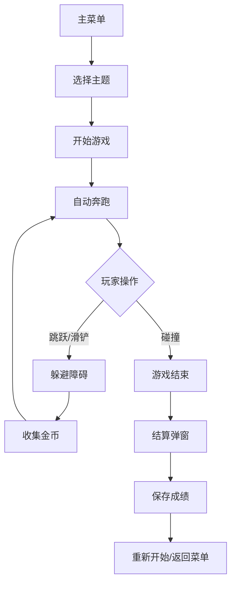

## 1. 产品概述

横版无限跑酷网页游戏，类似神庙逃亡/地铁跑酷。玩家控制角色自动向右奔跑，通过跳跃和滑铲躲避障碍物，收集金币，挑战最远距离。

- 核心玩法：简单易上手的无限跑酷，适合碎片化时间娱乐
- 目标用户：休闲游戏爱好者，全年龄段
- 产品价值：提供沉浸式跑酷体验，多主题地图和换装系统增加可玩性

## 2. 核心功能

### 2.1 功能模块

1. **主菜单页面**：开始游戏、商店、排行榜、设置
2. **游戏页面**：核心跑酷玩法、HUD显示、暂停功能
3. **商店页面**：角色换装、皮肤购买
4. **排行榜页面**：最远距离、最多金币排名
5. **结算弹窗**：本局成绩、历史最佳、重新开始

### 2.2 页面详情

| 页面名称 | 模块名称 | 功能描述 |
|-----------|-------------|---------------------|
| 主菜单 | 标题区域 | 游戏Logo、开始按钮动画 |
| 主菜单 | 功能按钮 | 开始游戏、商店、排行榜、设置入口 |
| 主菜单 | 主题选择 | 火山/雪山/太空三个地图选择 |
| 游戏页面 | 游戏画布 | Canvas渲染跑酷场景 |
| 游戏页面 | HUD界面 | 距离、金币数、暂停按钮 |
| 游戏页面 | 结算弹窗 | 成绩展示、重新开始、返回菜单 |
| 商店页面 | 皮肤列表 | 展示可购买的角色皮肤 |
| 商店页面 | 金币显示 | 当前拥有金币数 |
| 排行榜 | 记录列表 | 最远距离、最多金币Top10 |

## 3. 核心流程

### 3.1 游戏流程
用户进入主菜单 → 选择主题地图 → 开始游戏 → 角色自动奔跑 → 玩家操作跳跃/滑铲躲避障碍 → 收集金币 → 碰撞障碍物游戏结束 → 弹出结算界面 → 保存成绩到排行榜 → 重新开始或返回菜单

### 3.2 商店流程
主菜单 → 进入商店 → 浏览皮肤 → 使用金币购买 → 装备皮肤 → 返回主菜单 → 游戏中使用新皮肤

## 4. 用户界面设计

### 4.1 设计风格
- **整体风格**：动感、现代、像素风与流畅动画结合
- **主色调**：
  - 火山主题：橙红渐变、熔岩特效
  - 雪山主题：冰蓝渐变、雪花特效
  - 太空主题：深紫渐变、星空粒子
- **按钮风格**：3D立体按钮，圆角设计，悬停有弹性动画
- **字体**：使用游戏风格的无衬线字体，数字使用等宽字体
- **布局**：全屏游戏画布，HUD元素悬浮在四角

### 4.2 页面设计概述

| 页面名称 | 模块名称 | UI Elements |
|-----------|-------------|-------------|
| 主菜单 | 标题 | 大型游戏标题，粒子特效背景，呼吸动画 |
| 主菜单 | 按钮组 | 垂直排列的大按钮，点击有缩放反馈 |
| 游戏页面 | HUD | 左上角距离、右上角金币、右上角暂停按钮 |
| 游戏页面 | 角色 | 左1/3位置，跑步动画、跳跃动画、滑铲动画 |
| 结算弹窗 | 内容 | 居中弹窗，成绩数字放大动画，金币飘动效果 |
| 商店 | 卡片 | 皮肤展示卡片，选中态高亮，价格标签 |

### 4.3 响应式
- 桌面端：全屏Canvas，键盘控制（上下键）
- 移动端：全屏Canvas，触屏滑动控制（上滑跳跃，下滑滑铲）
- 适配各种屏幕比例，保持游戏区域正确的宽高比

### 4.4 视觉特效
- 角色跑步时的尘土粒子
- 跳跃时的弹跳挤压动画
- 收集金币的闪光特效
- 碰撞时的屏幕震动效果
- 背景视差滚动（远景慢，近景快）
