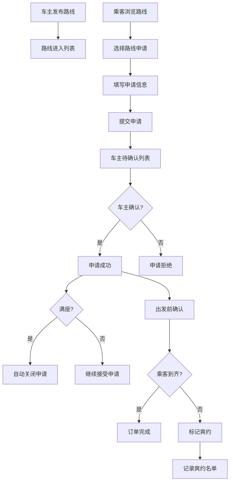

## 1. 产品概述

邻里拼车接送平台是专为小区居民设计的出行共享工具，解决小区内去医院、学校和地铁站的顺路乘车需求，替代微信群刷屏的低效沟通方式。车主可发布顺路路线，乘客可申请拼车，系统自动匹配并管理订单全流程。

### 1.1 核心价值
- 解决小区内顺路拼车信息分散、沟通低效的问题
- 提供结构化的路线发布和申请流程
- 自动匹配路线和时间，满座自动关闭
- 完整的订单管理和信用记录机制

### 1.2 目标用户
- **车主**：小区内有车且愿意顺路搭载邻居的居民
- **乘客**：小区内需要出行的居民（含老人、儿童）

---

## 2. 核心功能

### 2.1 用户角色
| 角色 | 核心权限 |
|------|----------|
| 车主 | 发布路线、查看申请、确认乘客、标记爽约、取消路线 |
| 乘客 | 浏览路线、申请拼车、取消申请、查看申请状态 |

### 2.2 功能模块
1. **首页看板**：今日路线、待确认乘客、常用目的地、爽约名单、儿童座椅需求
2. **路线发布**：车主发布顺路路线信息
3. **路线列表**：展示所有可申请的路线
4. **申请管理**：乘客申请和车主审批流程
5. **订单管理**：确认乘车、取消、爽约记录
6. **数据统计**：常用目的地、历史订单统计

### 2.3 页面详情
| 页面名称 | 模块名称 | 功能描述 |
|-----------|-------------|---------------------|
| 首页看板 | 今日路线卡片 | 展示当天所有出发的路线，包含出发地、目的地、时间、空座数 |
| 首页看板 | 待确认乘客列表 | 显示需要车主确认的乘客申请 |
| 首页看板 | 常用目的地统计 | 柱状图展示高频目的地（医院/学校/地铁站等） |
| 首页看板 | 爽约名单 | 展示有爽约记录的用户及次数 |
| 首页看板 | 儿童座椅需求 | 显示需要儿童座椅的订单提醒 |
| 路线发布页 | 路线表单 | 填写出发地、目的地、出发时间、空座数、儿童座椅、行李空间、车牌尾号 |
| 路线列表页 | 路线卡片列表 | 展示所有可申请路线，支持按时间、目的地筛选 |
| 路线详情页 | 路线信息 | 展示路线详情、已申请乘客、操作按钮 |
| 申请弹窗 | 申请表单 | 填写人数、上车点、联系方式、是否老人小孩、备注 |
| 订单管理页 | 订单列表 | 展示所有订单，支持状态筛选 |

---

## 3. 核心流程

### 3.1 车主发布路线流程
车主进入发布页面 → 填写路线信息（出发地、目的地、时间、空座、儿童座椅、行李空间、车牌尾号）→ 提交发布 → 路线进入可申请列表 → 系统自动管理满座关闭

### 3.2 乘客申请流程
乘客浏览路线列表 → 选择合适路线 → 填写申请信息（人数、上车点、联系方式、老人小孩、备注）→ 提交申请 → 车主收到待确认提醒 → 车主确认/拒绝 → 乘客收到通知

### 3.3 订单确认流程
出发前车主查看乘客列表 → 点击确认乘客到齐 → 订单状态更新为已确认 → 若乘客未到，标记爽约 → 记录到爽约名单

---

## 4. 用户界面设计

### 4.1 设计风格
- **主色调**：暖橙色 `#F97316`，代表邻里温暖、出行便利
- **辅助色**：深青色 `#0D9488`，用于成功状态和重要操作
- **警示色**：红色 `#EF4444`，用于取消和爽约标记
- **中性色**：深灰 `#1F2937`、中灰 `#6B7280`、浅灰 `#F3F4F6`
- **按钮风格**：圆角12px，微立体阴影，hover时轻微上浮
- **字体**：标题使用「思源黑体 Bold」，正文使用「思源黑体 Regular」
- **布局风格**：卡片式布局，柔和阴影，充足留白
- **图标风格**：使用Lucide线性图标，统一24px尺寸

### 4.2 页面设计概述
| 页面名称 | 模块名称 | UI元素 |
|-----------|-------------|-------------|
| 首页看板 | 顶部导航 | Logo、用户头像、发布按钮 |
| 首页看板 | 统计卡片组 | 今日路线数、待确认数、常用目的地Top3 |
| 首页看板 | 今日路线列表 | 卡片式展示，含状态标签、进度条 |
| 首页看板 | 待确认乘客 | 列表展示，含快捷确认按钮 |
| 首页看板 | 爽约名单 | 头像+昵称+爽约次数，红色标记 |
| 路线发布页 | 表单区域 | 分组表单，分步填写，实时验证 |
| 路线列表页 | 筛选栏 | 时间筛选、目的地筛选、座位数筛选 |
| 路线详情页 | 乘客列表 | 头像、申请信息、操作按钮组 |

### 4.3 响应式设计
- **桌面端**（≥1024px）：四列布局，看板分区域展示
- **平板端**（768px-1023px）：两列布局，看板模块上下排列
- **移动端**（<768px）：单列布局，底部Tab导航，卡片占满宽度
- 触摸优化：按钮最小高度44px，表单元素充足间距

---

## 5. 业务规则

### 5.1 路线匹配规则
- 按出发地和目的地关键字模糊匹配
- 出发时间相差30分钟内视为可匹配
- 自动计算空座数，满座后立即关闭申请通道
- 已关闭的路线不再显示在可申请列表中

### 5.2 订单状态流转
- **待确认**：乘客已申请，等待车主确认
- **已确认**：车主已同意申请
- **已关闭**：路线满座或已出发
- **已完成**：乘客已上车，订单结束
- **已取消**：车主或乘客取消订单
- **已爽约**：乘客未按时乘车，车主标记爽约

### 5.3 信用记录规则
- 爽约1次：黄色标记，显示在名单中
- 爽约3次：红色标记，限制申请功能
- 车主可查看乘客爽约记录后决定是否接受申请
