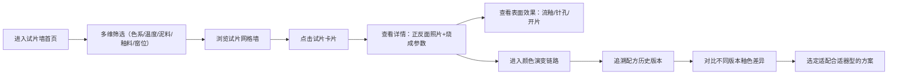

## 1. 产品概述

面向陶艺工作室的釉色试片数字化管理系统，解决釉色记录混乱、试片难查找、配方演变无迹可寻的问题。帮助陶艺师系统化管理每一块试片，追溯釉色变化，快速匹配杯盏、花瓶等器型的表面效果。

## 2. 核心功能

### 2.1 用户角色

| 角色 | 注册方式 | 核心权限 |
|------|----------|----------|
| 陶艺师 | 本地使用，无需注册 | 浏览、筛选、查看试片详情与演变链路 |

### 2.2 功能模块

1. **试片墙首页**：多维筛选（色系/温度/泥料/釉料/窑位）、网格墙展示、搜索
2. **试片详情弹窗**：正反面照片、烧成参数、缺陷记录、配方详情
3. **颜色演变链路**：配方版本关联、可视化演变路径、版本对比

### 2.3 页面详情

| 页面名称 | 模块名称 | 功能描述 |
|----------|----------|----------|
| 试片墙首页 | 顶部筛选栏 | 色系选择、温度区间、泥料类型、釉料配方、窑位筛选、关键词搜索 |
| 试片墙首页 | 试片网格墙 | 按色系自动分组，卡片展示釉色缩略图与核心信息，悬停放大预览 |
| 试片墙首页 | 快速标签 | 常用筛选快捷标签，一键切换 |
| 试片详情弹窗 | 图片展示区 | 正反面双图切换，支持放大查看细节 |
| 试片详情弹窗 | 烧成信息卡 | 温度、气氛（氧化/还原）、泥料、釉料、窑位、烧成日期 |
| 试片详情弹窗 | 表面效果记录 | 流釉程度、针孔情况、开片情况、光泽度、触感描述 |
| 试片详情弹窗 | 配方信息 | 完整配方百分比、备注、上一版/下一版关联入口 |
| 颜色演变链路 | 时间轴可视化 | 横向时间流展示配方迭代，节点点击跳转详情 |
| 颜色演变链路 | 色卡对比 | 相邻版本釉色并排对比，色差直观呈现 |
| 颜色演变链路 | 配方差异高亮 | 不同版本配方变化成分标红突出 |

## 3. 核心流程

陶艺师进入试片墙 → 通过色系/温度/泥料等条件筛选 → 在网格中发现目标试片 → 点击查看详情（正反面、烧成参数、缺陷） → 进入演变链路查看该配方的历史迭代 → 选定适合当前器型（杯子/花瓶）的釉色方案

## 4. 用户界面设计

### 4.1 设计风格

- **整体基调**：手作陶艺工作室美学——温润、沉静、有机感，模拟素坯墙面的哑光肌理
- **主色调**：素坯米灰（#E8E1D5）、深陶土褐（#3A2E25）、釉色青（#5B8A72）
- **辅助色**：铁红（#A34B3B）、钴蓝（#3B5A8A）、暖黄（#D4A853）——分别对应三大色系
- **字体**：展示字体采用「方正清刻本悦宋」或「思源宋体」（类衬线的人文感），正文采用「思源黑体」，信息密度舒适
- **按钮风格**：圆角化的素坯触感，微浮雕阴影，按下时有压入凹陷感
- **布局风格**：不规则的「试片悬挂墙」式网格，卡片大小错落有致，非严格对齐的有机排列
- **视觉细节**：背景叠加纸张纹理噪点，卡片模拟陶片边缘微破损效果，悬停时有轻微倾斜浮动

### 4.2 页面设计概述

| 页面名称 | 模块名称 | UI元素 |
|----------|----------|--------|
| 试片墙首页 | 顶部筛选栏 | 素坯底色条、下拉选择器、色系圆点、搜索框带陶土色边框 |
| 试片墙首页 | 试片网格墙 | 瀑布流布局、卡片带不规则阴影、悬停放大+微旋转、釉色圆形色卡 |
| 试片详情弹窗 | 图片展示区 | 大圆角素坯框、正反面切换Tab、放大镜图标 |
| 试片详情弹窗 | 信息区 | 标签式分类、参数用图标+数值展示、流釉/针孔/开片用可视化等级条 |
| 颜色演变链路 | 时间轴 | 横向卷轴、节点为圆形釉色色卡、连接线带渐变、当前版本高亮 |
| 颜色演变链路 | 对比区 | 双栏并排、差异配方背景微泛红 |

### 4.3 响应性

桌面优先设计，平板横屏适配；移动端单列堆叠，筛选栏折叠为抽屉。所有交互支持触屏点击与悬停双模式。

### 4.4 动效设计

- 页面加载：卡片依次淡入+上浮，错落延迟模拟试片逐块挂上墙
- 悬停：卡片微倾斜（X/Y各2deg）+ 阴影加深 + 釉色色卡光晕扩散
- 弹窗：从卡片位置缩放展开，背景磨砂模糊
- 演变链路：节点连线从左至右依次绘制动画
