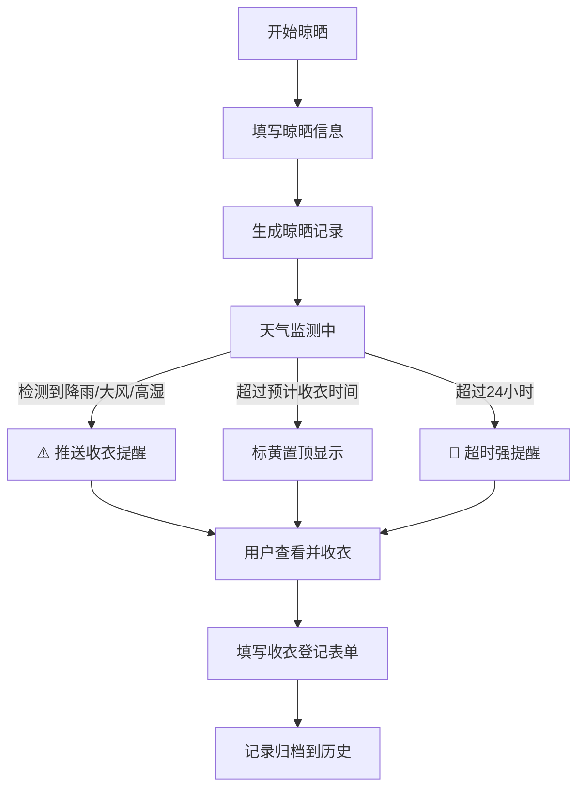

## 1. 产品概述
阳台晾衣防雨提醒系统，解决家庭晾晒衣物时遇到突发天气无法及时收衣、多人晾晒管理混乱、收衣状态无记录等问题。面向有阳台的家庭用户，实现晾晒全流程数字化管理，自动提醒，降低衣物被淋湿风险。

- 核心价值：天气智能预警 + 晾晒责任到人 + 状态可视化追踪
- 目标用户：多成员家庭、合租用户、对晾晒品质有要求的家庭

## 2. 核心功能

### 2.1 用户角色
| 角色 | 说明 | 核心权限 |
|------|------|----------|
| 家庭成员 | 家庭中的任意成员 | 新增晾晒、查看记录、登记收衣、编辑阳台档案 |

### 2.2 功能模块
1. **首页仪表盘**：当前晾晒概览、天气风险预警、待收衣提醒、家庭成员分工统计
2. **晾晒记录管理**：新增晾晒记录、编辑、查看详情、24小时超时标黄
3. **阳台档案管理**：朝向、封窗状态、晾衣杆数量、遮雨情况、通风条件
4. **天气预警系统**：降雨、大风、高湿度自动提醒收衣
5. **收衣登记系统**：记录干透状态、返潮情况、是否需重洗

### 2.3 页面详情
| 页面名称 | 模块名称 | 功能描述 |
|----------|----------|----------|
| 首页仪表盘 | 天气风险卡片 | 显示当前温度、湿度、风速、降雨概率，高风险时红色闪烁提醒 |
| 首页仪表盘 | 当前晾晒列表 | 显示正在晾晒的衣物卡片，超24小时标黄，点击可快速收衣 |
| 首页仪表盘 | 待收衣提醒 | 按预计收衣时间排序，临近超时置顶显示 |
| 首页仪表盘 | 成员分工统计 | 饼图/条形图展示各成员晾晒次数、收衣次数 |
| 晾晒记录页 | 新增晾晒表单 | 衣物类型、数量、位置、开始时间、预计收衣、负责人、照片上传 |
| 晾晒记录页 | 晾晒历史列表 | 全部晾晒记录，状态筛选（晾晒中/已收衣/需重洗） |
| 晾晒记录页 | 收衣弹窗 | 干透状态、返潮情况、是否重洗三项登记 |
| 阳台档案页 | 档案信息卡 | 朝向、封窗、晾衣杆数量、遮雨、通风五项基础信息 |
| 阳台档案页 | 编辑档案 | 弹窗表单编辑阳台各项参数 |

## 3. 核心流程
用户新增晾晒记录 → 系统开始计时并监测天气 → 天气异常（雨/大风/高湿）触发提醒 → 达到预计收衣时间或超24小时标黄提醒 → 成员登记收衣（填写干透/返潮/重洗状态）→ 记录归档到历史。

## 4. 用户界面设计

### 4.1 设计风格
- **主色调**：清新晴空蓝 (#4A90D9) + 暖阳橙 (#FF9F43)，呼应天气与晾晒主题
- **辅助色**：预警红 (#EE5253)、超时黄 (#FECA57)、完成绿 (#1DD1A1)
- **背景**：浅蓝渐变底 + 微妙云朵纹理，营造天空氛围
- **按钮风格**：圆角胶囊按钮，带轻量阴影，悬停有微妙上浮动画
- **字体**：标题用 "ZCOOL XiaoWei" 文艺手写体，正文用 "PingFang SC" 简洁现代
- **布局**：卡片式栅格布局，顶部固定导航，信息分区清晰
- **图标**：emoji + 线性图标混合风格，直观识别度高

### 4.2 页面设计概览
| 页面名称 | 模块名称 | UI 元素 |
|----------|----------|----------|
| 首页仪表盘 | 天气卡片 | 大温度数字 + 天气emoji + 风险等级条（绿/黄/红渐变） |
| 首页仪表盘 | 晾晒卡片 | 衣物照片缩略图 + 衣物类型标签 + 负责人头像 + 剩余时间进度条 |
| 首页仪表盘 | 分工统计 | 彩色条形图，不同成员对应不同颜色 |
| 晾晒记录页 | 新增表单 | 分区表单，必填项标红星，照片上传支持拖拽 |
| 晾晒记录页 | 收衣弹窗 | 三开关式选项（干透/返潮/重洗），带状态说明 |
| 阳台档案页 | 信息展示 | 图标 + 文字两行布局，编辑按钮悬浮右下角 |

### 4.3 响应式
桌面端为主设计，3列栅格展示晾晒卡片；移动端自动降为单列，导航改为底部Tab；触控目标 ≥ 44px × 44px。

### 4.4 动画细节
- 天气预警：风险卡片脉冲式呼吸动画
- 超时卡片：背景色从浅黄渐变到深黄的循环闪烁
- 新增记录：卡片从右侧滑入 + 淡入
- 收衣完成：勾选对勾放大缩放手绘动画
