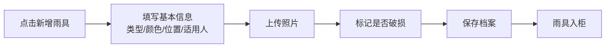
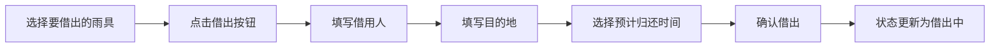
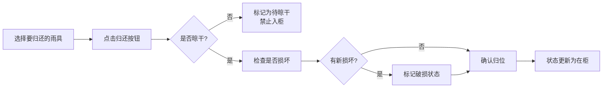
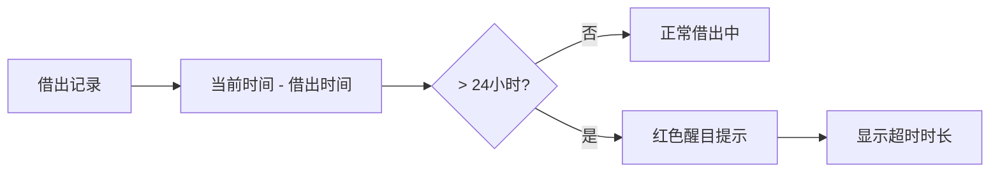

## 1. 产品概述

雨具归位管理系统是一款帮助家庭有序管理雨伞、雨衣、鞋套等雨具的实用工具。解决下雨时找不到雨具、湿雨具乱堆乱放、雨具损坏无人维修等痛点。

- 核心目标：让每一件雨具都有自己的"家"，用时能快速找到，用完能及时归位
- 目标用户：有老人、孩子的多口之家，合租室友，办公室行政管理人员
- 产品价值：减少雨天出门找雨具的焦虑，延长雨具使用寿命，培养良好的收纳习惯

## 2. 核心功能

### 2.1 用户角色

| 角色 | 注册方式 | 核心权限 |
|------|----------|----------|
| 普通用户 | 无需注册，本地使用 | 雨具档案管理、借出归还操作、查看统计、接收提醒 |

### 2.2 功能模块

1. **雨具档案管理**：雨具列表展示、新增/编辑/删除雨具、照片上传、状态标记
2. **借出登记**：选择雨具、填写借用人、目的地、预计归还时间
3. **归还登记**：标记是否晾干、检查是否有新增损坏、确认归位
4. **智能提醒**：超时未归提醒、湿雨具待晾干提醒、损坏待维修提醒
5. **统计汇总**：借出频率排行、损坏待修清单、备用雨具缺口分析

### 2.3 页面详情

| 页面名称 | 模块名称 | 功能描述 |
|-----------|-------------|---------------------|
| 首页仪表盘 | 概览卡片 | 展示在柜数量、借出数量、待晾干、待维修、超时未归 |
| 首页仪表盘 | 快捷操作 | 快速借出、快速归还、新增雨具按钮 |
| 首页仪表盘 | 超时提醒 | 超过24小时未归还的雨具列表，红色醒目提示 |
| 雨具档案页 | 筛选搜索 | 按类型、颜色、状态、适用人筛选 |
| 雨具档案页 | 雨具卡片 | 展示照片、类型、颜色、存放位置、当前状态 |
| 雨具档案页 | 表单弹窗 | 新增/编辑雨具信息，包含照片上传 |
| 借出归还页 | 借出表单 | 选择雨具、借用人、目的地、预计归还时间 |
| 借出归还页 | 归还表单 | 是否晾干、损坏检查、备注 |
| 统计分析页 | 借出排行 | 柱状图展示各雨具借出次数排行 |
| 统计分析页 | 损坏清单 | 列出所有标记为破损的雨具 |
| 统计分析页 | 备用缺口 | 分析门口备用雨具数量，提示是否需要补充 |

## 3. 核心流程

### 3.1 雨具入库流程

### 3.2 借出流程

### 3.3 归还流程

### 3.4 超时提醒流程

## 4. 用户界面设计

### 4.1 设计风格
- **设计主题**：清新实用主义，结合雨天元素的蓝灰色调
- **主色调**：雨蓝色 `#2563eb` - 代表雨天、信任、专业
- **辅助色**：
  - 警告红 `#dc2626` - 超时提醒、损坏标记
  - 晾干橙 `#f97316` - 待晾干状态
  - 成功绿 `#16a34a` - 在柜、正常状态
  - 借出紫 `#9333ea` - 借出中状态
- **中性色**：石板灰系列 `slate-50 ~ slate-900`
- **字体**：
  - 标题：`"Noto Sans SC"` - 清晰现代的中文无衬线字体
  - 正文：`"Inter"` - 优秀的屏幕阅读体验
- **按钮风格**：圆角8px，微立体阴影，hover时有轻微上浮和阴影加深效果
- **卡片风格**：圆角12px，柔和阴影，hover时有轻微缩放效果
- **布局风格**：顶部导航 + 左侧菜单（桌面端），底部导航（移动端）
- **图标风格**：使用 lucide-react 线性图标，16px/20px/24px 三种尺寸
- **背景纹理**： subtle 的雨滴图案纹理作为页面背景装饰

### 4.2 页面设计概述

| 页面名称 | 模块名称 | UI Elements |
|-----------|-------------|-------------|
| 首页仪表盘 | 概览卡片 | 5个彩色状态卡片并排，数字醒目，图标动画 |
| 首页仪表盘 | 快捷操作 | 3个大按钮，图标+文字，渐变色背景 |
| 首页仪表盘 | 超时提醒 | 红色背景卡片，闪烁动画，显示超时小时数 |
| 雨具档案页 | 雨具卡片 | 网格布局，左侧照片，右侧信息，底部状态标签 |
| 雨具档案页 | 筛选栏 | 横向滚动标签，选中状态高亮 |
| 借出归还页 | 表单 | 分组布局，必填项红星标记，下拉选择器 |
| 统计分析页 | 借出排行 | 横向柱状图，从高到低排序，颜色渐变 |
| 统计分析页 | 损坏清单 | 带修复建议的列表项 |
| 统计分析页 | 备用缺口 | 进度条显示，缺口用红色高亮 |

### 4.3 微交互动效
- **页面加载**：卡片依次淡入，stagger 延迟 100ms
- **状态变化**：借出/归还成功时，卡片有颜色过渡动画
- **提醒闪烁**：超时提醒卡片每2秒呼吸闪烁一次
- **按钮点击**：scale(0.95) 点击反馈
- **滚动效果**：卡片视差滚动，导航栏毛玻璃效果

### 4.4 响应式设计
- **桌面优先**，断点设为 768px（平板）和 480px（手机）
- **桌面端**（>1024px）：侧边栏导航 + 主内容区，雨具卡片4列
- **平板端**（768px-1024px）：顶部导航 + 主内容区，雨具卡片2-3列
- **移动端**（<768px）：底部Tab导航，雨具卡片1列，按钮全屏宽度
- **触摸优化**：按钮最小高度 44px，卡片点击区域扩大

## 5. 业务规则约束

1. **湿雨具规则**：归还时若标记"未晾干"，状态自动设为"待晾干"，禁止标记为"在柜"
2. **超时规则**：借出时间超过24小时自动标记为"超时"，在首页红色醒目显示
3. **破损规则**：归还时若发现新损坏，自动更新雨具的"破损"状态
4. **备用缺口计算**：根据历史30天最大同时借出数量，计算门口备用雨具缺口
5. **借出频率统计**：按借出次数降序排列，标注"高频使用"标签
