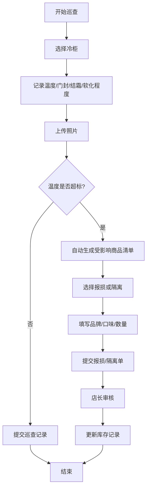
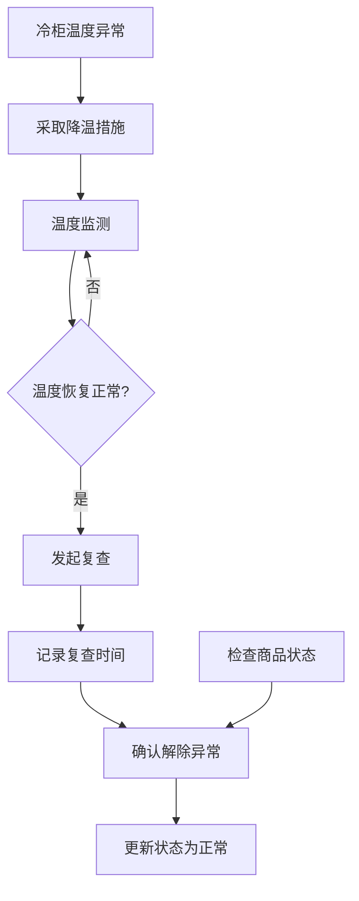

# 雪糕化冻报损系统 产品需求文档

## 1. 产品概述

便利店冷柜门没关严导致雪糕软化再冻回，顾客购买后容易投诉。本系统通过冷柜档案管理、巡查记录、温度超标自动预警、报损/隔离流程和统计分析，实现雪糕化冻全流程管控，降低投诉率和商品损耗。

### 产品价值
- 减少因雪糕化冻导致的顾客投诉
- 规范报损流程，避免人为疏漏
- 统计异常数据，辅助管理决策
- 明确责任班次，提升门店管理水平

## 2. 核心功能

### 2.1 用户角色

| 角色 | 登录方式 | 核心权限 |
|------|----------|----------|
| 门店员工 | 工号登录 | 巡查记录、查看冷柜档案、提交报损申请 |
| 门店店长 | 工号登录 | 全部权限、审核报损、查看统计报表、管理冷柜档案 |
| 区域经理 | 工号登录 | 查看多门店统计报表、异常监控 |

### 2.2 功能模块

1. **仪表盘首页**：异常概览、今日巡查、待处理报损、统计卡片
2. **冷柜档案**：冷柜列表、新增/编辑冷柜、商品分区管理、温度计照片
3. **巡查记录**：巡查列表、新增巡查、温度记录、门封/结霜状态、照片上传
4. **报损管理**：报损单列表、自动生成受影响商品、报损审核、隔离商品管理
5. **统计分析**：异常次数统计、报损金额统计、受影响品类分析、责任班次统计

### 2.3 页面详情

| 页面名称 | 模块名称 | 功能描述 |
|----------|----------|----------|
| 仪表盘 | 异常概览卡片 | 展示异常冷柜数量、待处理报损数、今日巡查完成率 |
| 仪表盘 | 最近巡查记录 | 列表展示最近5条巡查记录及状态 |
| 仪表盘 | 待处理报损 | 展示待审核的报损单快捷入口 |
| 冷柜档案 | 冷柜列表 | 卡片式展示所有冷柜，支持筛选和搜索 |
| 冷柜档案 | 冷柜详情 | 位置、温度范围、负责人、商品分区、温度计照片 |
| 冷柜档案 | 冷柜表单 | 新增/编辑冷柜信息，支持商品分区配置 |
| 巡查记录 | 巡查列表 | 时间线展示所有巡查记录，支持按冷柜/日期筛选 |
| 巡查记录 | 新增巡查 | 选择冷柜、记录温度、门封状态、结霜情况、软化程度、上传照片 |
| 报损管理 | 报损单列表 | 展示所有报损单，支持状态筛选和搜索 |
| 报损管理 | 报损单详情 | 受影响商品清单、品牌/口味/数量明细、审核操作 |
| 报损管理 | 自动生成受影响商品 | 根据温度超标时长和商品分区自动计算受影响商品 |
| 统计分析 | 异常次数统计 | 按冷柜统计异常次数，柱状图展示 |
| 统计分析 | 报损金额统计 | 按月/周统计报损金额，折线图展示 |
| 统计分析 | 受影响品类分析 | 按品类统计报损数量，饼图展示 |
| 统计分析 | 责任班次统计 | 按班次统计异常次数，表格展示 |

## 3. 核心流程

### 3.1 巡查与异常处理流程

店员进行冷柜巡查时，记录当前温度、门封状态、结霜情况和商品软化程度。若温度超标，系统自动根据商品分区生成受影响商品清单，店员可选择报损或隔离处理。

### 3.2 复查流程

当冷柜温度恢复正常后，需进行复查确认，记录复查时间和复查人。

## 4. 用户界面设计

### 4.1 设计风格

- **主色调**：冷蓝色系 (#0EA5E9 / #0284C7)，体现冷链冷藏专业感
- **辅助色**：警示红 (#EF4444)、成功绿 (#10B981)、警告橙 (#F59E0B)
- **按钮风格**：圆角矩形，悬停有阴影和缩放微交互
- **字体**：现代无衬线字体，清晰易读
- **布局风格**：左侧导航 + 右侧内容区，卡片式布局
- **图标风格**：线性图标 (Lucide)，简洁现代

### 4.2 页面设计概述

| 页面名称 | 模块名称 | UI元素 |
|----------|----------|--------|
| 仪表盘 | 统计卡片 | 渐变色背景、图标、数据数字、趋势箭头 |
| 仪表盘 | 异常列表 | 状态标签、时间、冷柜名称、快捷操作 |
| 冷柜档案 | 冷柜卡片 | 图片、名称、位置、状态指示灯、负责人 |
| 巡查记录 | 时间线 | 左侧时间轴、右侧内容卡片、状态色标 |
| 报损管理 | 商品清单 | 表格展示、可编辑数量、合计金额 |
| 统计分析 | 图表区 | 柱状图/折线图/饼图、图例、数据切换 |

### 4.3 响应式设计

- 桌面端优先设计 (1280px+)
- 平板端 (768px-1279px)：导航折叠为侧边抽屉，卡片自适应
- 移动端 (<768px)：底部导航栏，单列布局，表格横向滚动

### 4.4 动效与交互

- 页面加载：元素渐入 + 轻微上移动画
- 卡片悬停：阴影加深 + 轻微上浮
- 状态切换：颜色平滑过渡
- 按钮点击：缩放反馈
- 数据加载：骨架屏占位

## 5. 数据模型概要

### 5.1 核心实体

- **冷柜 (Freezer)**：id、位置、温度范围、负责人、温度计照片、状态
- **商品分区 (Zone)**：id、冷柜id、分区名称、包含品类
- **商品 (Product)**：id、品牌、口味、品类、成本价、零售价
- **巡查记录 (Inspection)**：id、冷柜id、温度、门封状态、结霜情况、软化程度、照片、巡查人、时间
- **报损单 (LossReport)**：id、冷柜id、巡查id、状态、类型(报损/隔离)、总金额、提交人、审核人、时间
- **报损商品 (LossItem)**：id、报损单id、商品id、品牌、口味、数量、单价、小计
- **复查记录 (Recheck)**：id、冷柜id、异常记录id、复查时间、复查人、商品状态、备注
