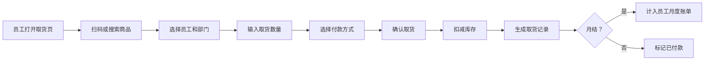
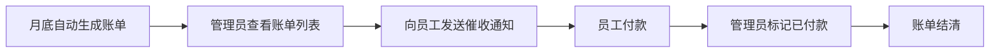
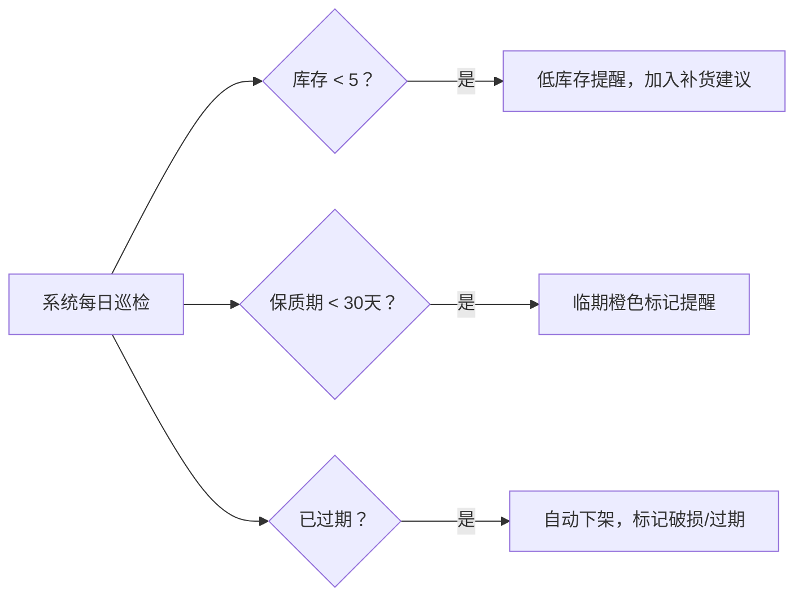

## 1. 产品概述

办公室零食柜自助结算系统，解决员工自取零食后月底对账混乱的问题。员工扫码或搜索商品记录取用，系统自动管理库存、临期提醒、生成账单和统计分析。

- **核心问题**：人工记账易出错，欠款核对困难，库存和保质期管理混乱
- **目标用户**：办公室员工、行政管理人员
- **产品价值**：实现零食柜数字化管理，自动结算，减少对账纠纷，优化库存管理

## 2. 核心功能

### 2.1 用户角色

| 角色 | 登记方式 | 核心权限 |
|------|----------|----------|
| 普通员工 | 管理员录入 | 扫码/搜索取货，查看个人账单，确认付款 |
| 管理员 | 系统预设 | 商品管理、库存管理、账单管理、统计查看、员工管理 |

### 2.2 功能模块

1. **取货结算页**：扫码/搜索商品，选择员工和部门，记录数量，支持即时付款或月结
2. **商品管理页**：商品档案录入（名称、规格、口味、进货价、售价、保质期、柜格、照片），库存管理，上下架
3. **账单管理页**：员工月度账单，标记已付款/待催收/免单，备注记录
4. **统计分析页**：热销排行、部门消费、毛利分析、欠款排行、补货建议
5. **预警中心**：低库存提醒、临期提醒、破损/过期自动下架

### 2.3 页面详情

| 页面名称 | 模块名称 | 功能描述 |
|-----------|-------------|---------------------|
| 取货结算 | 商品搜索/扫码 | 输入条码或关键词搜索商品，支持扫码枪输入 |
| 取货结算 | 取货表单 | 选择员工、部门，输入数量，选择付款方式（即时/月结） |
| 取货结算 | 取货记录 | 显示本次取货商品清单和总价，确认提交 |
| 商品管理 | 商品列表 | 展示所有商品，支持筛选（分类、库存状态、保质期状态） |
| 商品管理 | 商品表单 | 录入/编辑商品档案，上传照片，设置柜格位置 |
| 商品管理 | 库存预警 | 低库存（<5件）红色标记，临期（<30天）橙色标记，过期自动下架 |
| 账单管理 | 账单列表 | 按月份、员工筛选账单，显示应付/已付/欠款金额 |
| 账单管理 | 账单详情 | 查看账单明细，标记付款状态，添加免单/催收备注 |
| 统计分析 | 热销排行 | 按销量/销售额排序的商品TOP10 |
| 统计分析 | 部门消费 | 各部门月度消费对比图表 |
| 统计分析 | 毛利分析 | 销售收入 vs 进货成本，利润率计算 |
| 统计分析 | 欠款排行 | 员工欠款金额从高到低排行 |
| 统计分析 | 补货建议 | 基于销量和库存自动生成补货清单 |

## 3. 核心流程

### 3.1 取货流程

### 3.2 月底结账流程

### 3.3 库存预警流程

## 4. 用户界面设计

### 4.1 设计风格

- **主色调**：暖橙色 `#FF7A00`（活力、食欲感），辅助色：薄荷绿 `#36B37E`（新鲜）、珊瑚红 `#FF5630`（预警）
- **按钮风格**：圆角 12px，微阴影，hover 时轻微上浮
- **字体**：标题使用 `ZCOOL KuaiLe`（活泼可爱），正文使用 `Noto Sans SC`（清晰易读）
- **布局风格**：卡片式布局，顶部导航+侧边菜单，内容区留白充足
- **图标风格**：使用 lucide-react 线性图标，配色与主题一致

### 4.2 页面设计概述

| 页面名称 | 模块名称 | UI 元素 |
|-----------|-------------|-------------|
| 取货结算 | 搜索区 | 大搜索框，扫码图标，橙色搜索按钮 |
| 取货结算 | 商品卡片 | 商品照片、名称、口味、售价、库存状态标签 |
| 取货结算 | 购物车 | 右侧悬浮面板，商品列表、数量加减、总价、确认按钮 |
| 商品管理 | 列表 | 表格展示，支持排序筛选，状态标签（正常/低库存/临期/下架） |
| 商品管理 | 表单 | 模态框表单，照片预览，柜格选择下拉 |
| 账单管理 | 列表 | 月度卡片，进度条显示收款比例，状态徽章（已付/待催收/免单） |
| 统计分析 | 图表区 | ECharts 柱状图/饼图，配色统一，动画加载效果 |

### 4.3 响应式设计

- 桌面端（>1024px）：侧边菜单展开，内容区双列或三列布局
- 平板端（768px-1024px）：侧边菜单可折叠，内容区双列布局
- 移动端（<768px）：底部导航栏，单列布局，卡片堆叠

### 4.4 交互与动效

- 页面加载：骨架屏渐入，内容块依次上滑出现
- 取货确认：成功弹窗配合彩屑动画
- 预警提醒：顶部通知条滑入，轻微抖动效果
- 悬停效果：卡片轻微上浮，阴影加深
- 状态切换：平滑过渡动画，数据变化时数字滚动效果
