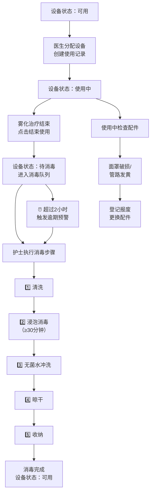

## 1. 产品概述

雾化器消毒管理系统是面向小诊所的医疗设备全生命周期管理平台，解决雾化器和面罩多人轮换使用时消毒记录缺失、难以追责的问题。

- 核心目标：实现设备档案电子化、使用流程可追溯、消毒步骤强制化、异常状态预警化
- 目标用户：诊所医生、护士、设备管理员、诊所负责人
- 核心价值：杜绝交叉感染风险、落实消毒责任制、提升设备利用率、满足卫生监管要求

## 2. 核心功能

### 2.1 用户角色

| 角色 | 注册方式 | 核心权限 |
|------|----------|----------|
| 管理员 | 系统预置 | 全部功能：设备管理、用户管理、数据统计、系统配置 |
| 医生 | 管理员创建 | 创建使用记录、查看设备状态、执行消毒流程 |
| 护士 | 管理员创建 | 执行消毒流程、查看设备状态、录入使用记录 |
| 设备管理员 | 管理员创建 | 设备档案管理、库存管理、报废处理、数据导出 |

### 2.2 功能模块

1. **数据看板**：设备状态总览、待消毒提醒、逾期预警、诊室使用量统计、配件库存预警
2. **设备档案**：设备列表、设备详情、新增/编辑设备、设备照片上传、报废管理
3. **使用记录**：使用列表、新建使用记录（绑定患者/医生/药液/面罩）、使用详情
4. **消毒管理**：待消毒队列、消毒步骤执行（清洗→浸泡→冲洗→晾干→收纳）、消毒记录查询
5. **库存管理**：配件列表、入库/出库记录、库存预警、面罩/管路报废

### 2.3 页面详情

| 页面名称 | 模块名称 | 功能描述 |
|----------|----------|----------|
| 数据看板 | 统计卡片 | 显示设备总数、可用设备数、待消毒数、逾期未处理数、今日使用次数 |
| 数据看板 | 设备状态分布 | 环形图展示各状态设备占比（可用/使用中/待消毒/消毒中/已报废） |
| 数据看板 | 诊室使用量 | 柱状图展示今日各诊室雾化器使用次数 |
| 数据看板 | 待消毒列表 | 卡片式展示需立即处理的消毒任务，显示等待时长 |
| 数据看板 | 逾期预警 | 红色警示卡片展示超过2小时未消毒的设备 |
| 数据看板 | 库存预警 | 低库存配件列表（面罩、管路、药液等） |
| 设备档案 | 设备列表 | 表格展示所有设备，支持按状态/诊室筛选，搜索编号/品牌 |
| 设备档案 | 设备卡片 | 显示设备照片、编号、品牌、状态标签、所在诊室 |
| 设备档案 | 新增/编辑设备 | 表单：编号、品牌、型号、适用年龄、配件清单（多选）、所在诊室、照片上传 |
| 设备档案 | 设备详情 | 设备基本信息、使用历史、消毒历史、配件更换记录、状态时间线 |
| 使用记录 | 记录列表 | 表格展示使用记录，支持按日期/设备/患者/医生筛选 |
| 使用记录 | 新建使用记录 | 设备选择（仅可选可用状态）、患者姓名、患者年龄、医生、药液名称、药液剂量、面罩类型（成人/儿童/婴幼儿）、预计时长 |
| 使用记录 | 结束使用 | 记录实际结束时间，自动将设备状态转为"待消毒" |
| 消毒管理 | 待消毒队列 | 卡片列表，按等待时长排序，显示设备编号、使用结束时间、等待时长 |
| 消毒管理 | 消毒步骤执行 | 5步骤进度条：清洗→浸泡消毒→冲洗→晾干→收纳，每步确认负责人和完成时间 |
| 消毒管理 | 消毒记录 | 历史消毒记录查询，支持按设备/日期/负责人筛选 |
| 库存管理 | 配件列表 | 配件名称、当前库存、安全库存、库存状态（正常/预警/不足）、最近入库时间 |
| 库存管理 | 报废登记 | 面罩/管路报废登记：类型、数量、报废原因（破损/发黄/老化）、关联设备、负责人 |
| 库存管理 | 出入库记录 | 出入库历史流水，支持按配件/类型/时间筛选 |

## 3. 核心流程

### 3.1 设备使用与消毒主流程

### 3.2 状态流转规则

| 当前状态 | 允许操作 | 目标状态 | 前置条件 |
|----------|----------|----------|----------|
| 可用 | 分配使用 | 使用中 | 无 |
| 使用中 | 结束使用 | 待消毒 | 已创建使用记录 |
| 待消毒 | 开始消毒 | 消毒中 | 等待时长任意 |
| 消毒中 | 完成收纳 | 可用 | 5个步骤全部完成 |
| 任意状态 | 申请报废 | 已报废 | 管理员审批 |

## 4. 用户界面设计

### 4.1 设计风格

**整体定位：医疗专业感 + 清新洁净感**

- **主色调**：医用级青绿色 `#0D9488`（teal-600）—— 传达清洁、专业、信任感
- **辅助色**：
  - 警示红 `#DC2626`（red-600）—— 逾期预警、报废状态
  - 提醒橙 `#EA580C`（orange-600）—— 待消毒、库存预警
  - 成功绿 `#16A34A`（green-600）—— 可用状态、消毒完成
  - 信息蓝 `#2563EB`（blue-600）—— 使用中状态
- **中性色**：slate 色系（slate-50 背景、slate-100 卡片底、slate-700 主文字、slate-400 辅助文字）
- **按钮风格**：圆角 10px，无描边，hover 时轻微上浮（translateY(-1px) + shadow-md）
- **字体**：
  - 标题：Noto Sans SC Medium，字号 18-24px
  - 正文：Noto Sans SC Regular，字号 13-14px
  - 辅助：Noto Sans SC Light，字号 11-12px
- **布局风格**：
  - 左侧固定侧边栏导航（240px 宽）
  - 顶部状态栏（面包屑 + 用户信息）
  - 主体内容区卡片式布局，卡片圆角 14px，阴影柔和（shadow-sm → hover:shadow-md）
- **图标风格**：lucide-react 线性图标，18-20px，与文字间距 6px
- **状态标签**：圆角 6px 胶囊标签，8px 左右内边距，4px 上下内边距

### 4.2 页面设计概述

| 页面名称 | 模块名称 | UI 元素 |
|----------|----------|----------|
| 数据看板 | 统计卡片 | 4列网格，每卡含图标、数值、环比小箭头、底部小字说明；渐变色左竖条装饰 |
| 数据看板 | 状态分布 | 环形图居中，右侧图例，悬停显示详情 tooltip |
| 数据看板 | 诊室使用量 | 横向柱状图，X轴诊室名称，Y轴次数，柱子hover变深色 |
| 数据看板 | 待消毒列表 | 卡片网格，倒计时数字大号显示，橙/红色渐变边框表示紧急程度 |
| 设备档案 | 列表筛选栏 | 搜索框 + 状态筛选下拉 + 诊室筛选下拉 + 新增按钮 |
| 设备档案 | 表格行 | 设备缩略图（40×40圆角8px）+ 编号 + 品牌型号 + 标签组 + 操作按钮 |
| 设备档案 | 新增弹窗 | 居中 Modal，800px宽，2列表单，底部固定取消/提交按钮 |
| 设备档案 | 详情页 | 左侧设备大图，右侧基本信息；下方Tab切换（使用记录/消毒记录/配件历史） |
| 使用记录 | 新建表单 | 分步骤填写：①选设备→②填患者信息→③填治疗信息→④确认提交 |
| 消毒管理 | 步骤条 | 5步水平步骤条，当前步高亮，已完成步打勾图标 |
| 消毒管理 | 步骤内容 | 每步含操作说明卡片 + 负责人选择 + 完成确认按钮 |
| 库存管理 | 库存卡片 | 进度条式库存显示，安全库存线标记，颜色随库存变化 |

### 4.3 响应式设计

- **设计原则**：Desktop-first，最小支持宽度 1280px
- **侧边栏**：1280px 以下折叠为 64px 图标模式，hover 展开完整菜单
- **卡片网格**：1440px 以上 4列，1280-1440px 3列，平板模式 2列
- **表格**：1280px 以下非关键列隐藏，行点击展开详情抽屉
- **移动端**：不做专门适配，确保 1024px 以上可用

### 4.4 动画与微交互

- 页面加载：内容区淡入（opacity 0→1，200ms），卡片依次上滑（stagger 50ms）
- 状态变更：数字计数器动画（countUp），状态标签颜色渐变过渡
- 消毒步骤：步骤切换时内容区左右滑动过渡
- 按钮点击：按下时 scale(0.97)，释放回弹
- 逾期设备：红色外呼吸灯效果（box-shadow pulse 2s infinite）
