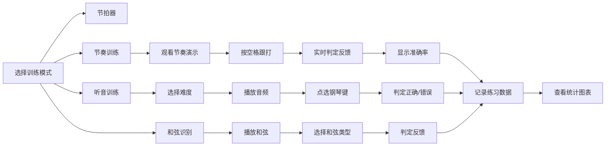

## 1. 产品概述

面向学生党的音乐练耳训练工具，整合节拍训练、听音训练、和弦识别三大核心功能，帮助用户系统提升音乐节奏感与音准能力。通过科学的训练模式和数据统计，让音乐学习更加高效有趣。

## 2. 核心功能

### 2.1 用户角色
| 角色 | 注册方式 | 核心权限 |
|------|----------|----------|
| 普通用户 | 无需注册，本地存储 | 使用所有训练功能，查看个人练习数据 |

### 2.2 功能模块
1. **节拍器模式**: BPM 调节、节拍选择、重音突出显示
2. **节奏训练模式**: 显示节奏型、用户跟打、实时判定、准确率统计
3. **听音训练模式**: 五级难度（单音/双音/和弦/三和弦/七和弦）、虚拟钢琴键盘
4. **和弦识别模式**: 分辨大三/小三/减/增和弦、选项卡选择
5. **进度统计**: 每日练习时长、准确率折线图、历史记录

### 2.3 页面详情
| 页面名称 | 模块名称 | 功能描述 |
|----------|----------|----------|
| 首页/导航 | 模式切换 | Tab 切换四种功能模式：节拍器、节奏训练、听音训练、和弦识别 |
| 节拍器 | 控制面板 | BPM 滑块 (30-300)、节拍选择 (2/4、3/4、4/4、6/8)、播放/暂停按钮 |
| 节拍器 | 视觉指示 | 节拍脉冲动画、重音颜色高亮显示 |
| 节奏训练 | 节奏显示 | 可视化节奏型（半八八四八四等）、节拍播放演示 |
| 节奏训练 | 跟打判定 | 空格键跟打、实时判定每拍早晚偏差、最终准确率统计 |
| 听音训练 | 难度选择 | 五级难度切换：单音、双音、和弦、三和弦、七和弦 |
| 听音训练 | 虚拟钢琴 | 可点击的钢琴键盘、播放音频、答案判定反馈 |
| 和弦识别 | 和弦播放 | 随机播放和弦音频、重复播放功能 |
| 和弦识别 | 选项卡 | 四个选项：大三、小三、减、增和弦，选择后判定 |
| 统计页面 | 数据展示 | 每日练习时长统计、准确率折线图、历史记录列表 |

## 3. 核心流程

### 用户训练主流程

## 4. 用户界面设计

### 4.1 设计风格
- **主色调**: 深靛蓝 (#1e3a8a) 搭配霓虹紫 (#8b5cf6) 作为强调色
- **辅助色**: 成功绿 (#10b981)、错误红 (#ef4444)、警告黄 (#f59e0b)
- **背景**: 深色主题，深灰 (#0f172a) 基底，搭配微妙的渐变和光晕效果
- **按钮风格**: 圆角中等 (8px)，悬停时有微缩放和光晕效果
- **字体**: 现代无衬线字体，标题使用更有设计感的字体
- **布局风格**: 卡片式布局，玻璃拟态效果，深色背景下的层次感
- **图标风格**: Lucide 线性图标，简洁现代

### 4.2 页面设计概览
| 页面名称 | 模块名称 | UI 元素 |
|----------|----------|---------|
| 全局导航 | Tab 切换 | 图标+文字的底部/顶部导航栏，选中态高亮发光 |
| 节拍器 | 控制面板 | 大号 BPM 数字显示、圆形滑块、节拍选择器、播放/暂停大按钮 |
| 节奏训练 | 节奏条 | 横向节奏可视化条，每个节拍位置用不同大小的圆点表示 |
| 听音训练 | 虚拟钢琴 | 黑白键钢琴，按下时有颜色反馈和动画 |
| 统计页面 | 折线图 | 平滑曲线图，带渐变填充区域，悬停显示详细数据 |

### 4.3 响应式
- 桌面端优先设计，支持平板和移动端适配
- 钢琴键盘在小屏幕上自动缩放或横向滚动
- 触摸操作优化，按钮最小 44px 点击区域

### 4.4 动效设计
- 节拍脉冲：当前节拍位置有波纹扩散动画
- 按键反馈：钢琴键按下有下陷和颜色变化动画
- 页面切换：淡入淡出 + 轻微滑动过渡
- 判定反馈：正确时绿色闪光，错误时红色抖动
