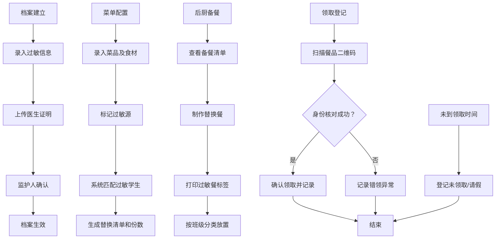

## 1. 产品概述

本系统是面向学校食堂的过敏餐全流程管理平台，旨在解决过敏学生用餐安全问题，覆盖从档案建立、菜单规划、后厨备餐到领取确认的完整链路。

- 核心目标：确保过敏学生用餐安全，防止错领、漏领，简化后厨与老师的管理工作
- 目标用户：学校后勤管理人员、食堂后厨人员、班主任老师、过敏学生及其家长

## 2. 核心功能

### 2.1 用户角色

| 角色 | 使用场景 | 核心权限 |
|------|----------|----------|
| 后勤管理员 | 系统配置、数据统计 | 学生档案管理、菜单配置、数据统计、权限管理 |
| 食堂后厨 | 备餐、标签打印 | 查看当日过敏餐需求、生成标签、标记备餐完成 |
| 班主任老师 | 协助领取、异常上报 | 班级过敏学生列表、扫码确认领取、异常记录 |
| 学生 | 自助领取 | 个人过敏信息查看、扫码领取 |

### 2.2 功能模块

1. **工作台（首页）**：今日概览、快捷入口、预警提醒
2. **学生过敏档案**：档案列表、新增/编辑档案、批量导入、照片与证明上传
3. **每日菜单管理**：菜单配置、过敏源标记、菜品替换规则、过敏餐份数计算
4. **后厨备餐中心**：过敏餐清单、标签生成与打印、备餐进度
5. **领取登记**：扫码领取、人工确认、异常记录（未领/错领/请假）
6. **数据统计**：周替换次数统计、漏领名单、过敏源排行、异常趋势分析

### 2.3 页面详情

| 页面名称 | 模块名称 | 功能描述 |
|----------|----------|----------|
| 工作台 | 数据概览卡片 | 今日过敏餐总数、已领取数、待领取数、异常数 |
| 工作台 | 预警提醒栏 | 高风险过敏源提醒、未处理异常提示 |
| 工作台 | 快捷操作 | 快速进入各核心功能模块 |
| 学生档案 | 档案列表 | 按班级筛选、过敏源筛选、搜索、分页 |
| 学生档案 | 档案详情/表单 | 基本信息、班级、过敏源标签、监护人确认、医生证明上传、照片上传 |
| 菜单管理 | 菜单日历 | 按日期查看/编辑每日菜单 |
| 菜单管理 | 菜品配置 | 菜品名称、食材组成、过敏源标记、替换菜品 |
| 菜单管理 | 过敏餐计算 | 根据学生档案自动计算需替换份数 |
| 后厨备餐 | 备餐清单 | 按班级/过敏源分组显示待备餐列表 |
| 后厨备餐 | 标签打印 | 生成含学生信息、过敏源、二维码的餐品标签 |
| 领取登记 | 扫码领取 | 扫描二维码快速确认领取 |
| 领取登记 | 领取记录 | 当日领取状态列表、批量操作 |
| 领取登记 | 异常处理 | 未领取登记、错领记录、临时请假登记 |
| 数据统计 | 周报表 | 每周替换次数趋势图 |
| 数据统计 | 漏领分析 | 按班级/学生统计漏领名单 |
| 数据统计 | 过敏源排行 | 最常见过敏源TOP10柱状图 |

## 3. 核心流程

### 3.1 主要业务流程描述

1. **档案建档流程**：后勤管理员录入学生过敏信息 → 上传医生证明和照片 → 监护人确认签字 → 档案生效
2. **菜单配置流程**：录入每日菜单菜品 → 标记各菜品含有的过敏源 → 系统自动匹配过敏学生 → 生成替换菜品清单和备餐数量
3. **备餐出餐流程**：后厨查看当日过敏餐清单 → 按要求制作替换餐 → 打印过敏餐标签（含醒目过敏源标识）→ 按班级分类放置
4. **领取确认流程**：学生或老师扫描餐品二维码 → 系统核对领取人身份 → 确认领取并记录时间 → 异常情况（错领/未领/请假）即时记录

### 3.2 业务流程图

## 4. 用户界面设计

### 4.1 设计风格

- **主色调**：医疗安全绿（#10B981）为主色，搭配警示红（#EF4444）用于高风险过敏源提醒
- **辅助色**：温暖橙（#F59E0B）用于中度提醒，信息蓝（#3B82F6）用于数据展示
- **中性色**：暖灰系（slate），从50到900共9个层级
- **按钮风格**：圆角中等（rounded-lg），主按钮实心带阴影，次按钮描边，危险按钮红色系
- **字体**：标题使用 Noto Sans SC 粗体，正文使用思源黑体常规，数字使用等宽字体
- **布局风格**：左侧导航 + 顶部面包屑 + 主内容卡片式布局，数据密集区采用表格+卡片混合
- **图标**：使用 lucide-react 线性图标，高风险过敏源使用填充式图标配合红色背景徽标

### 4.2 页面设计概览

| 页面名称 | 模块名称 | UI元素 |
|----------|----------|--------|
| 工作台 | 数据概览 | 4张彩色统计卡片（绿/蓝/橙/红），大数字+趋势小箭头 |
| 工作台 | 预警提醒 | 红色/橙色警示条带，脉冲动画吸引注意力 |
| 学生档案 | 档案列表 | 数据表格，过敏源标签彩色徽章，头像缩略图 |
| 学生档案 | 档案表单 | 分步表单，过敏源多选标签组，图片上传区 |
| 菜单管理 | 菜单日历 | 周视图日历卡片，高亮今日，过敏日标红点 |
| 菜单管理 | 菜品配置 | 菜品卡片网格，过敏源徽标，替换菜品下拉选择 |
| 后厨备餐 | 备餐清单 | 可折叠分组列表，进度条，打印按钮 |
| 后厨备餐 | 标签预览 | A4纸比例预览，大号过敏源图标醒目显示 |
| 领取登记 | 扫码区域 | 大号扫码框占位，实时识别状态提示 |
| 领取登记 | 领取列表 | 状态标签（已领/未领/请假/错领），操作按钮 |
| 数据统计 | 图表区 | 折线图+柱状图组合，图例交互高亮 |
| 数据统计 | 排行榜 | TOP10带序号胶囊徽章的排名列表 |

### 4.3 响应式设计

- 桌面端优先设计，最小支持1280px宽度
- 平板端（768px-1279px）：侧边栏折叠为图标导航，表格改为横向滚动
- 移动端（<768px）：底部Tab导航，卡片列表替代表格，扫码区全屏显示

### 4.4 特殊视觉元素

- **高风险过敏源警示**：坚果🌰、乳制品🥛、海鲜🦐三类过敏源在所有出现位置使用特殊的红底白字+图标徽章，并带有轻微脉冲动画
- **餐品标签设计**：标签顶部3cm红色警示条，中间大号过敏源图标，底部二维码和学生信息
- **状态过渡动画**：领取状态变更时卡片有0.3s缩放+颜色渐变过渡
