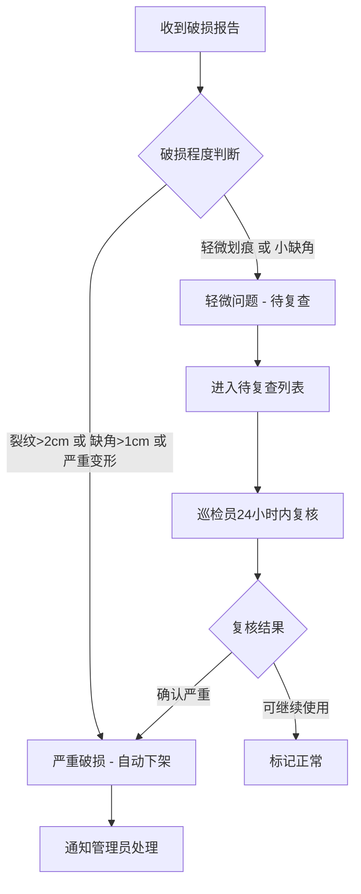

## 1. 产品概述

校园食堂餐盘破损报修系统，解决学生排队取餐时才发现餐盘有裂口或缺角的卫生与安全问题。通过餐具档案管理、工作人员巡检、学生扫码报修三端联动，实现破损餐具的快速发现、自动分级处理和数据化管理。

- **核心目标**：降低破损餐具使用率，提升用餐卫生安全，优化餐具采购与库存管理
- **目标用户**：食堂管理人员、巡检工作人员、就餐学生

## 2. 核心功能

### 2.1 用户角色

| 角色 | 使用方式 | 核心权限 |
|------|----------|----------|
| 食堂管理员 | 后台登录 | 餐具档案管理、查看看板、巡检审核、采购建议 |
| 巡检工作人员 | 后台登录 / 移动端 | 录入巡检记录、标记破损状态、执行下架操作 |
| 学生用户 | 扫码进入H5 | 提交破损照片、选择取餐窗口、查看报修进度 |

### 2.2 功能模块

1. **数据看板页面**：待处理餐具统计、各窗口破损率、报废数量、消毒异常、补采购规格
2. **餐具档案管理**：餐具类型、批次、材质、数量、投用日期、存放窗口、照片管理
3. **巡检记录页面**：按批次记录裂纹、缺角、变形、油污残留、消毒状态
4. **学生报修页面**：扫码提交破损照片、选择取餐窗口、提交备注
5. **报修处理流程**：严重破损自动下架、轻微问题进入待复查

### 2.3 页面详情

| 页面名称 | 模块名称 | 功能描述 |
|-----------|-------------|---------------------|
| 数据看板 | 统计卡片 | 待处理数、破损率、报废数、消毒异常、待采购数 |
| 数据看板 | 窗口破损率图表 | 各窗口破损率柱状图/趋势图 |
| 数据看板 | 破损类型分布 | 裂纹、缺角、变形、油污占比饼图 |
| 数据看板 | 待处理列表 | 最新待处理的报修/巡检记录 |
| 餐具档案 | 餐具列表 | 分页展示餐具档案，支持筛选搜索 |
| 餐具档案 | 新增/编辑 | 类型、批次、材质、数量、投用日期、存放窗口、照片 |
| 餐具档案 | 批次详情 | 查看批次下所有餐具状态和历史记录 |
| 巡检记录 | 巡检列表 | 按时间/批次/窗口筛选巡检记录 |
| 巡检记录 | 新建巡检 | 选择批次，记录裂纹、缺角、变形、油污、消毒状态 |
| 学生报修 | 报修表单 | 上传破损照片、选择取餐窗口、填写备注、提交 |
| 学生报修 | 提交成功 | 展示报修编号、预计处理时间 |

## 3. 核心流程

### 3.1 学生报修流程

学生扫码 → 进入报修页 → 上传破损照片 → 选择取餐窗口 → 填写备注 → 提交 → 系统自动分级 → 严重→自动下架 / 轻微→待复查 → 管理员审核处理

### 3.2 工作人员巡检流程

选择批次 → 检查餐具状态 → 记录裂纹/缺角/变形/油污/消毒情况 → 提交巡检记录 → 系统更新餐具状态 → 生成统计数据

### 3.3 破损自动分级流程

## 4. 用户界面设计

### 4.1 设计风格

- **主色调**：深青色 `#0D9488`（代表卫生、安全、专业）
- **辅助色**：暖橙色 `#F97316`（告警提示）、红色 `#EF4444`（严重问题）、绿色 `#22C55E`（正常状态）
- **背景色**：浅灰 `#F8FAFC`、白色卡片 `#FFFFFF`
- **字体**：系统无衬线字体，标题加粗，正文清晰易读
- **按钮风格**：圆角 8px，悬停有阴影和色阶变化
- **布局风格**：顶部导航 + 侧边栏 + 卡片式内容区，信息密度适中
- **图标风格**：线性图标（Lucide），简洁现代

### 4.2 页面设计概述

| 页面名称 | 模块名称 | UI元素 |
|-----------|-------------|-------------|
| 数据看板 | 统计卡片 | 渐变色卡片、图标、数字、趋势箭头 |
| 数据看板 | 图表区域 | 柱状图、饼图、数据标签 |
| 数据看板 | 待处理列表 | 列表卡片、状态标签、操作按钮 |
| 餐具档案 | 餐具列表 | 表格、搜索框、筛选器、分页 |
| 餐具档案 | 表单弹窗 | 表单控件、图片上传、保存/取消 |
| 巡检记录 | 巡检列表 | 时间线式列表、状态标签 |
| 学生报修 | 报修表单 | 大按钮上传、窗口选择、备注输入 |
| 学生报修 | 成功页 | 成功动画、报修编号、返回提示 |

### 4.3 响应式设计

- 桌面端优先设计（>1024px）
- 平板端（768-1024px）：侧边栏收起为图标模式
- 移动端（<768px）：顶部导航折叠，卡片单列布局，学生报修页优化触控体验
- 所有表单和按钮支持触控操作，最小点击区域 44px

### 4.4 动效设计

- 页面加载：卡片淡入上移动画，错峰出现
- 数据更新：数字滚动动画，平滑过渡
- 状态变化：状态标签颜色渐变过渡
- 表单提交：按钮加载态，成功反馈动画
- 悬停效果：卡片轻微上浮，阴影加深
