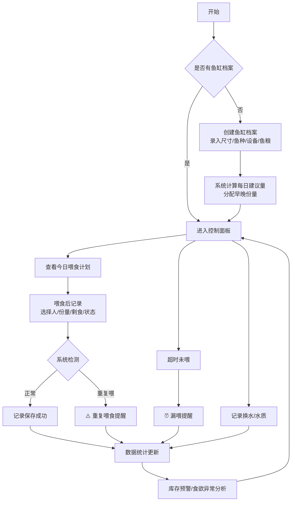

## 1. 产品概述

一个家庭水族箱智能管理系统，解决多人轮流喂食时容易喂多坏水、喂少饿着的问题。通过档案管理、智能喂食计划、详细记录和数据统计，帮助家庭成员科学喂养观赏鱼。

- 主要用途：鱼缸档案管理、喂食计划与记录、换水水质记录、数据统计分析
- 目标用户：养鱼家庭用户、水族爱好者
- 产品价值：避免重复喂食/漏喂，科学控制份量，延长鱼的寿命，保持水质健康

## 2. 核心功能

### 2.1 用户角色

| 角色 | 说明 | 核心权限 |
|------|------|----------|
| 家庭成员 | 无需注册，本地使用 | 所有功能读写权限 |

### 2.2 功能模块

1. **首页/控制面板**：今日提醒、快捷喂食、鱼缸概览卡片、异常预警
2. **鱼缸档案**：鱼缸基本信息管理、鱼种配置、鱼粮配置、照片上传
3. **喂食记录**：每日计划生成、喂食录入、历史记录查询
4. **换水水质**：换水记录、水质检测记录
5. **数据统计**：周用粮量、食欲异常分析、遗忘时段、库存预警
6. **提醒中心**：重复喂食提醒、漏喂提醒、连续剩食提醒

### 2.3 页面详情

| 页面名称 | 模块名称 | 功能描述 |
|-----------|-------------|---------------------|
| 控制面板 | 今日概览 | 显示各鱼缸今日喂食状态、下次喂食倒计时 |
| 控制面板 | 快捷操作 | 一键记录喂食、快速换水登记 |
| 控制面板 | 预警横幅 | 展示重复喂/漏喂/剩食/库存不足等提醒 |
| 鱼缸档案 | 鱼缸列表 | 所有鱼缸卡片式展示，支持新增/编辑/删除 |
| 鱼缸档案 | 鱼缸详情 | 尺寸、水温、过滤设备、鱼种数量明细、照片轮播 |
| 鱼缸档案 | 鱼种配置 | 每种鱼的日食量建议系数、早晚分配比例 |
| 喂食记录 | 每日计划 | 按早晚自动计算各鱼缸建议克数 |
| 喂食记录 | 喂食录入 | 选择喂食人、实际份量、剩食程度、鱼只状态 |
| 喂食记录 | 历史列表 | 按日期筛选，展示全部喂食历史 |
| 换水水质 | 换水记录 | 换水量、换水日期、备注 |
| 换水水质 | 水质检测 | pH、氨氮、亚硝酸盐、硝酸盐等参数录入 |
| 数据统计 | 用粮统计 | 周/月用粮趋势图、各鱼缸消耗对比 |
| 数据统计 | 食欲分析 | 连续剩食次数、食欲异常记录、异常时段 |
| 数据统计 | 遗忘统计 | 最容易漏喂的时间段统计排名 |
| 数据统计 | 库存预警 | 当前鱼粮库存、日均消耗、还能维持天数 |

## 3. 核心流程

### 3.1 主要用户流程

用户首次使用时创建鱼缸档案（录入尺寸、鱼种数量、鱼粮类型等），系统根据鱼种和数量自动计算每日建议喂食量并分配到早晚两个时段。每次喂食前，用户在控制面板查看今日计划，喂食后点击快捷记录录入实际份量和观察结果。系统实时检测：同一天同一时段重复记录则提醒；超过预定时间未记录则发出漏喂提醒；连续多次出现剩食则建议减量。换水和水质检测可在对应模块独立记录，也会自动关联到当天的活动日志。数据统计页面自动聚合周/月数据，用图表直观展示。

## 4. 用户界面设计

### 4.1 设计风格

- **主色调**：深海蓝 `#0c4a6e` + 水绿 `#0f766e`，模拟水族箱自然色调
- **辅助色**：警告橙 `#ea580c`、危险红 `#dc2626`、成功绿 `#16a34a`
- **背景**：从浅青色 `#e0f2fe` 渐变到淡蓝 `#eff6ff`，带微妙波纹纹理
- **按钮风格**：圆角 12px，悬停上浮 2px + 阴影加深，按压下沉效果
- **字体**：标题用"Noto Serif SC"衬线体体现自然质感，正文用"Noto Sans SC"保障可读性
- **布局**：顶部导航栏 + 侧边功能栏 + 主内容卡片式网格
- **图标风格**：使用 Lucide 图标，搭配鱼、水滴等主题 Emoji 增加趣味性
- **动效**：卡片入场错位渐显、数字滚动计数、进度条液态填充动画

### 4.2 页面设计概述

| 页面名称 | 模块名称 | UI 元素 |
|-----------|-------------|-------------|
| 控制面板 | 顶部横幅 | 渐变蓝绿背景 + 当前日期问候语 + 24小时圆形时钟 |
| 控制面板 | 鱼缸概览 | 每张鱼缸卡片含圆形照片、水温指示圈、今日喂食进度条 |
| 控制面板 | 预警区 | 横向滚动卡片，不同类型不同色调，带脉冲动画 |
| 控制面板 | 快捷操作 | 4个大按钮(喂食/换水/测水质/加库存)，网格布局 |
| 鱼缸档案 | 列表 | 瀑布流卡片，鼠标悬停显示编辑删除浮层 |
| 鱼缸档案 | 表单 | 双列栅格，标签左对齐，输入框带图标前缀 |
| 喂食记录 | 日历 | 月历视图，已喂食日期打绿色对勾，漏喂标橙点 |
| 喂食记录 | 录入弹窗 | 渐入遮罩 + 缩放动画，表单分步式 |
| 数据统计 | 图表 | 区域图用渐变填充，柱状图圆角顶，饼图带图例 |

### 4.3 响应式设计

- 采用桌面优先设计，主内容区最大宽度 1440px
- 断点：<1024px 隐藏侧边栏改为底部 Tab 栏；<640px 栅格变单列、卡片全屏宽
- 移动端触控：按钮最小高度 48px，输入框大号尺寸，避免精确点击

### 4.4 细节氛围

- 整体添加柔和的水面波纹动态背景（SVG 动画，性能友好）
- 数据卡片使用毛玻璃效果（backdrop-blur）
- 喂食成功时发射气泡上升粒子动效
- 关键数字变化时使用滚动数字动画
