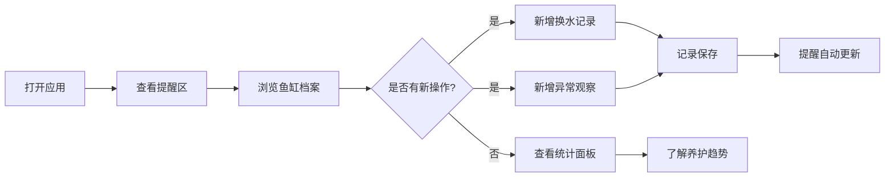

# 鱼缸护理页面产品需求文档 (PRD)

## 1. 产品概述
鱼缸护理管理工具，帮助养鱼爱好者系统化记录换水、用药、观察鱼只状态，通过提醒和统计功能降低养护门槛，减少因遗忘或疏忽导致的鱼只伤亡。
- 核心用户：家庭水族箱养护者、小型观赏鱼店
- 核心价值：让"记不住"变成"看得见"，用数据驱动养鱼

## 2. 核心特性

### 2.1 用户角色
| 角色 | 注册方式 | 核心权限 |
|------|----------|----------|
| 普通用户 | 本地使用无需注册 | 查看和管理鱼缸档案、换水记录、异常观察、提醒与统计 |

### 2.2 功能模块
1. **鱼缸档案**：容量、过滤类型、水温范围、养鱼清单、设备照片、负责人
2. **换水记录**：换水比例、水温、PH、是否加药、清洗滤棉、现场照片
3. **异常观察**：关联到具体鱼或设备，记录白点、趴缸、过滤异响等
4. **提醒区**：超期未换水、温度异常、连续异常观察
5. **统计面板**：每月换水次数、水质波动、最常出问题的鱼

### 2.3 页面详情
| 页面名称 | 模块名称 | 功能描述 |
|----------|----------|----------|
| 主页面 | 顶部标题栏 | 应用标题、当前日期、主题切换 |
| 主页面 | 鱼缸档案卡片 | 展示鱼缸基本信息、设备照片、养鱼列表、负责人 |
| 主页面 | 换水记录区 | 时间线形式展示换水历史，可新增记录 |
| 主页面 | 异常观察区 | 列表展示异常，可关联鱼/设备，标记状态 |
| 主页面 | 提醒区 | 红色高亮展示超期和异常提醒事项 |
| 主页面 | 统计面板 | 图表展示换水次数、水质波动、问题鱼排名 |

## 3. 核心流程
用户打开应用 → 查看顶部提醒区是否有紧急事项 → 浏览鱼缸档案了解当前状态 → 如刚换水则添加换水记录 → 如发现异常则新增异常观察 → 定期查看统计了解趋势

## 4. 用户界面设计

### 4.1 设计风格
- **主色调**：深水蓝 (#0C4A6E) → 水蓝 (#0EA5E9) → 浅天蓝 (#E0F2FE)，呈现水的层次感
- **辅助色**：珊瑚橙 (#F97316) 用于提醒和高亮，水草绿 (#10B981) 用于健康状态
- **按钮风格**：圆角胶囊按钮，微悬浮阴影，点击有缩放反馈
- **字体**：标题使用 Noto Serif SC（宋体衬线，优雅温润），正文使用 Noto Sans SC（清晰易读）
- **布局风格**：卡片式布局，毛玻璃效果背景，左右两栏（左主内容+右提醒统计）
- **图标/emoji**：使用 🐠 🫧 🪸 等水族相关 emoji 点缀，搭配线性图标

### 4.2 页面设计概览
| 页面名称 | 模块名称 | UI 元素 |
|----------|----------|---------|
| 主页面 | 鱼缸档案 | 大卡片、设备照片轮播、鱼只标签、信息网格 |
| 主页面 | 换水记录 | 时间线竖线、日期气泡、数据指标胶囊、照片缩略图 |
| 主页面 | 异常观察 | 可展开卡片、关联鱼/设备标签、状态徽章（待处理/已恢复） |
| 主页面 | 提醒区 | 红色/橙色渐变背景、闪烁小圆点、倒计时天数 |
| 主页面 | 统计面板 | 条形图、折线图、排名列表、数字动画 |

### 4.3 响应式
- 桌面端：两栏布局，左侧主内容 70%，右侧提醒+统计 30%
- 平板端：单栏堆叠，提醒区置顶
- 移动端：卡片堆叠，横向滑动查看统计图表

### 4.4 动效与细节
- 页面加载：卡片依次淡入上浮（stagger 动画）
- 提醒区：紧急提醒有轻微呼吸动效
- 数据变化：数字滚动动画
- 悬停：卡片轻微上浮 + 阴影加深
- 背景：渐变水纹底色 + 细微噪点纹理
