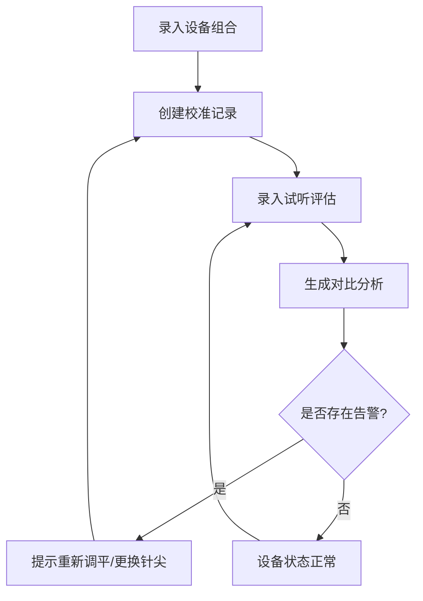

## 1. 产品概述
黑胶试听室针压校准台账系统，用于管理唱机/唱臂/唱头组合的针压校准记录和试听效果跟踪。
- 主要目的：标准化针压校准流程，记录每台设备的参数历史，通过试听数据对比分析识别需要维护的设备
- 目标用户：黑胶试听室管理员、音响工程师
- 产品价值：减少因针压不当导致的唱针磨损和唱片损伤，提升黑胶播放音质

## 2. 核心功能

### 2.1 用户角色
| 角色 | 注册方式 | 核心权限 |
|------|----------|----------|
| 管理员 | 默认登录 | 设备管理、校准录入、试听记录、数据查看与分析 |

### 2.2 功能模块
1. **设备台账页**：唱机/唱臂/唱头组合管理，目标针压范围配置
2. **校准记录页**：每次校准的目标针压、实测针压、防滑刻度记录
3. **试听记录页**：跳针、齿音、左右声道偏移的试听评估
4. **数据分析页**：设备对比图、告警提示、维护建议

### 2.3 页面详情
| 页面名称 | 模块名称 | 功能描述 |
|-----------|----------|----------|
| 设备台账 | 设备列表 | 展示所有设备组合，搜索筛选，状态标签 |
| 设备台账 | 新增/编辑设备 | 录入唱机型号、唱臂型号、唱头型号、目标针压范围 |
| 校准记录 | 校准列表 | 按设备筛选，时间排序，显示校准参数 |
| 校准记录 | 新增校准 | 选择设备，录入目标针压、实测针压、防滑刻度、校准人、备注 |
| 试听记录 | 试听列表 | 关联校准记录，展示试听评估数据 |
| 试听记录 | 新增试听 | 选择设备和校准，录入跳针等级、齿音等级、左右声道dB值、备注 |
| 数据分析 | 告警面板 | 高亮显示需要重新调平或更换针尖的设备 |
| 数据分析 | 对比图表 | 针压偏差趋势图、试听评分对比图 |

## 3. 核心流程
用户登录→录入设备台账→定期校准并记录→每次试听后录入评估→查看分析报告识别问题设备→执行维护操作

## 4. 用户界面设计

### 4.1 设计风格
- **主色调**：深橡木色 (#3E2723) + 黄铜色 (#B8860B) + 墨绿点缀 (#2E7D32)
- **辅助色**：琥珀警示 (#FF8F00)、危险红 (#D32F2F)
- **按钮风格**：圆角边框，3D微阴影效果
- **字体**：标题用衬线字体（Playfair Display），正文用无衬线（Noto Sans SC）
- **布局风格**：卡片式布局，顶部导航 + 侧边标签切换
- **图标风格**：线性图标，唱片、音符、警示灯等音乐相关元素

### 4.2 页面设计概览
| 页面名称 | 模块名称 | UI元素 |
|-----------|----------|----------|
| 数据分析 | 告警面板 | 醒目警示卡片，不同严重程度颜色区分，图标动画 |
| 数据分析 | 对比图表 | 渐变色条形图，悬停详情 |
| 设备台账 | 设备卡片 | 木纹背景纹理，黄铜色边框 |
| 校准/试听表单 | 表单控件 | 深色输入框，聚焦时黄铜光晕 |

### 4.3 响应式
桌面端优先，平板自适应宽度调整，移动端单列堆叠布局