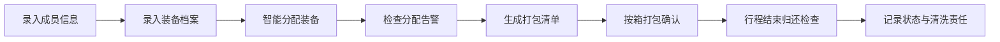

## 1. 产品概述

潜水装备分配清单是一款为团队海岛旅行设计的装备管理工具，解决多人共用潜水装备时分配混乱、遗漏和归还责任不清的问题。

- 核心价值：装备智能匹配、分配透明可追溯、打包归还全流程管理
- 目标用户：结伴去海岛浮潜/深潜的朋友、家庭、小型旅行团

## 2. 核心功能

### 2.1 用户角色
无需注册登录，单用户本地使用，管理整个团队的装备分配。

### 2.2 功能模块
1. **成员管理**：录入团队成员的身体信息、游泳水平、过敏史等
2. **装备档案**：管理所有潜水装备的详细信息和状态
3. **智能分配**：自动匹配装备与成员，提示冲突和缺口
4. **打包清单**：按行李箱生成出发前打包清单
5. **归还检查**：行程结束后检查装备状态，明确清洗责任

### 2.3 页面详情
| 页面名称 | 模块名称 | 功能描述 |
|---------|---------|---------|
| 仪表盘 | 总览卡片 | 成员数量、装备总数、分配进度、告警提醒 |
| 成员管理 | 成员列表 | 增删改查成员，显示身高/脚码/近视/游泳水平/过敏/紧急联系人 |
| 装备档案 | 装备列表 | 7类装备（面镜/呼吸管/脚蹼/防晒衣/救生衣/防水袋/运动相机），含尺码/拥有者/状态/照片 |
| 智能分配 | 分配面板 | 拖拽或自动分配，实时提示近视无镜片/脚蹼不合/救生衣缺口/电池不足 |
| 打包清单 | 行李箱视图 | 按行李箱分类显示装备，勾选确认打包 |
| 归还检查 | 归还清单 | 检查进水/划痕/丢失，记录负责人清洗晾干 |

## 3. 核心流程

## 4. 用户界面设计

### 4.1 设计风格
- **主色调**：深海蓝 (#0B3D91) + 珊瑚橙 (#FF6B6B) 作为告警色
- **辅助色**：海水青 (#4ECDC4)、沙滩金 (#FFE66D)
- **背景**：渐变海洋蓝到浅蓝，带微妙波浪纹理
- **卡片**：半透明毛玻璃效果，圆角 16px
- **字体**：标题用圆润现代字体，正文清晰易读
- **图标风格**：线性图标，海洋主题元素

### 4.2 页面设计概览
| 页面名称 | 模块名称 | UI 元素 |
|---------|---------|---------|
| 仪表盘 | 数据卡片 | 四个统计卡片横向排列，告警区域醒目显示 |
| 成员管理 | 列表卡片 | 头像+姓名为主，标签显示关键信息，展开查看详情 |
| 装备档案 | 分类标签页 | 顶部Tab切换装备类型，网格卡片展示装备 |
| 智能分配 | 双栏布局 | 左侧成员列表，右侧装备分配，中间拖拽区 |
| 打包清单 | 行李箱视图 | 行李箱卡片，内含装备列表，复选框勾选 |
| 归还检查 | 状态表格 | 每行装备，状态选择器，责任人选择 |

### 4.3 响应式
桌面端为主设计，平板和手机端自适应布局，列表改为单列，卡片堆叠显示。

### 4.4 动效设计
- 页面切换：淡入淡出 + 轻微上移动画
- 卡片悬停：微妙上浮 + 阴影加深
- 告警提示：脉冲呼吸动画
- 拖拽分配：吸附效果 + 成功反馈动效
