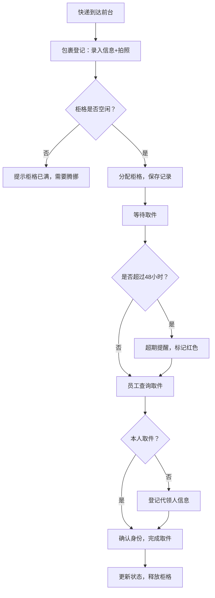

## 1. 产品概述

快递暂存柜管理系统，解决办公室前台快递堆积、取件核对困难的问题。支持包裹登记、智能取件、超期提醒和数据统计，提升快递管理效率。

- 目标用户：办公室前台管理员、公司员工
- 核心价值：规范化快递收发流程，减少错件丢件，降低管理成本

## 2. 核心功能

### 2.1 用户角色

| 角色 | 说明 | 核心权限 |
|------|------|----------|
| 前台管理员 | 负责登记和管理包裹 | 包裹登记、取件确认、柜格管理、查看统计、异常处理 |
| 普通员工 | 取件人/代领人 | 查询包裹、扫码/输入后四位取件、代领登记 |

### 2.2 功能模块

1. **首页/待取包裹列表**：优先显示易碎/冷链/到付件、超期提醒、柜格状态
2. **包裹登记**：录入收件人、手机号后四位、快递公司、单号、柜格、大小、是否到付、照片、易碎/冷链标记
3. **取件操作**：手机号后四位查询、扫码取件、代领登记、异常记录
4. **柜格管理**：柜格状态查看、满柜提示、腾挪提醒
5. **数据统计**：未取包裹、超期排行、快递公司分布、柜格占用率、异常取件记录

### 2.3 页面详情

| 页面名称 | 模块名称 | 功能描述 |
|----------|----------|----------|
| 首页 | 优先级包裹列表 | 高亮显示易碎、冷链、到付件，按优先级排序 |
| 首页 | 超期提醒区 | 红色标记超过48小时未取包裹，支持一键通知 |
| 首页 | 柜格状态总览 | 显示总柜格数/已用/空闲，满柜时醒目提示 |
| 包裹登记 | 表单录入 | 收件人、手机后四位、快递公司、单号、柜格选择、大小、到付/易碎/冷链标记、照片上传 |
| 包裹登记 | 柜格可用性检查 | 选择柜格时自动检查是否占用，满柜提示腾挪 |
| 取件页面 | 查询模块 | 手机后四位输入、扫码识别、包裹列表匹配 |
| 取件页面 | 取件确认 | 显示包裹详情，本人取件/代领切换，代领需输入姓名和手机 |
| 取件页面 | 异常记录 | 取件异常时记录原因（包裹损坏、错件等） |
| 统计页面 | 未取包裹列表 | 所有未取包裹按时间排序 |
| 统计页面 | 超期排行榜 | 按超期时长排序的包裹列表 |
| 统计页面 | 快递公司分布 | 饼图/柱状图展示各快递公司数量 |
| 统计页面 | 柜格占用率 | 实时柜格使用率图表 |
| 统计页面 | 异常取件记录 | 所有异常取件的历史记录列表 |

## 3. 核心流程

前台收到快递 → 扫描/录入包裹信息 → 选择空闲柜格 → 系统自动保存并生成取件码 → 员工通过手机后四位/扫码查询 → 确认取件（本人或代领登记）→ 包裹状态更新为已取 → 超过48小时未取自动触发提醒 → 柜格释放

## 4. 用户界面设计

### 4.1 设计风格

- **主色调**：深海蓝 #1e3a5f 作为主色，传达专业可靠感
- **辅助色**：琥珀橙 #f59e0b 用于优先级标记和提醒，翠绿 #10b981 表示已完成/空闲，赤红 #ef4444 表示异常/超期
- **中性色**：石板灰系列用于背景和文字，确保内容清晰可读
- **按钮风格**：圆角 8px，轻微阴影，悬停时有柔和的颜色过渡和阴影加深
- **字体**：标题使用现代无衬线字体，正文清晰易读
- **布局风格**：卡片式布局，顶部导航栏，左侧可折叠菜单，主体区域采用网格布局
- **图标风格**：线性简洁图标，统一线条粗细

### 4.2 页面设计概览

| 页面名称 | 模块名称 | UI元素 |
|----------|----------|--------|
| 首页 | 优先级包裹卡片 | 渐变边框高亮，右上角优先级标签（易碎/冷链/到付），倒计时显示 |
| 首页 | 柜格状态卡片 | 网格状柜格图示，颜色区分占用/空闲/异常，统计数字大号显示 |
| 包裹登记 | 表单区域 | 分组表单，必填项星号标记，照片上传预览区 |
| 包裹登记 | 柜格选择器 | 可视化柜格布局，点击选择，已占用禁用 |
| 取件页面 | 查询区 | 大号输入框，扫码按钮突出，结果列表卡片化 |
| 取件页面 | 取件确认弹窗 | 包裹详情展示，本人/代领切换按钮，异常反馈入口 |
| 统计页面 | 数据可视化 | 饼图、柱状图、数据卡片，支持时间筛选 |

### 4.3 响应式

桌面端优先设计，适配 1280px 以上屏幕；平板端自动调整网格列数；移动端折叠侧边栏，卡片纵向排列。
