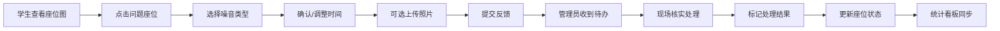

## 1. 产品概述

图书馆自习区噪音反馈系统，解决自习区键盘敲击、电话通话、饮食等噪音问题，通过学生匿名反馈 + 管理员快速响应的模式，提升自习区安静环境管理效率。

- 目标用户：在校学生（反馈者）、图书馆管理员（处理者）
- 核心价值：建立高效的噪音举报与处理闭环，减少管理员无效巡逻，提升自习区整体安静度

## 2. 核心功能

### 2.1 用户角色

| 角色 | 登录方式 | 核心权限 |
|------|---------|---------|
| 学生用户 | 学号登录 | 查看座位图、提交噪音反馈、查看处理进度 |
| 管理员 | 工号登录 | 座位图全览、处理反馈、标记状态、查看统计看板 |

### 2.2 功能模块

1. **座位图主页**：楼层切换、区域筛选、座位安静状态可视化
2. **反馈提交页**：选择座位、选择噪音类型、填写时间、上传照片（可选）
3. **管理员处理面板**：待处理反馈列表、标记处理结果（提醒/换座/清场/误报）
4. **统计看板**：高发区域热力图、处理时长统计、重复人员排行、空闲座位、最安静时段分析
5. **反馈历史**：按座位/时间段查看历史反馈，高频问题高亮显示

### 2.3 页面详情

| 页面名称 | 模块名称 | 功能描述 |
|---------|---------|---------|
| 座位图主页 | 楼层导航 | 1F/2F/3F 楼层切换按钮，点击刷新对应楼层座位图 |
| 座位图主页 | 区域筛选 | A/B/C 区域标签，筛选显示指定区域座位 |
| 座位图主页 | 座位网格 | 按桌号排列的座位网格，颜色标识安静程度（绿=安静/黄=有反馈/红=严重） |
| 座位图主页 | 高亮提示 | 重复反馈座位闪烁动画，热门时间段边框加粗 |
| 反馈提交页 | 座位选择 | 点击座位图选择目标座位，自动填充楼层、区域、桌号 |
| 反馈提交页 | 噪音类型 | 6 种类型单选：通话、键盘声、吃东西、占座、聊天、设备噪音 |
| 反馈提交页 | 时间选择 | 默认当前时间，可手动调整反馈发生时间 |
| 反馈提交页 | 照片上传 | 支持上传现场照片作为佐证，最多 3 张 |
| 管理员面板 | 待处理列表 | 按时间倒序显示未处理反馈，展示座位、类型、提交时间 |
| 管理员面板 | 处理操作 | 一键标记：已提醒、建议换座、已清场、误报 |
| 管理员面板 | 重复标注 | 同一座位 24h 内 ≥3 次反馈自动标红并置顶 |
| 统计看板 | 高发区域 | 柱状图展示各区域反馈数量 TOP5 |
| 统计看板 | 处理时长 | 折线图展示近 7 天平均处理时长 |
| 统计看板 | 重复人员 | 列表展示提交反馈 ≥5 次的用户 |
| 统计看板 | 空闲座位 | 实时显示各楼层空闲座位数 |
| 统计看板 | 最安静时段 | 热力图展示一周内各时段平均安静指数 |

## 3. 核心流程

用户在座位图上发现噪音 → 点击对应座位 → 选择噪音类型 → 确认时间 → 可选上传照片 → 提交反馈 → 管理员收到通知 → 现场核实 → 标记处理结果 → 系统更新座位状态 → 统计看板同步数据

## 4. 用户界面设计

### 4.1 设计风格

- **主色调**：深青色 `#0F766E`（代表安静、沉稳、学术氛围）
- **辅助色**：
  - 安静绿 `#10B981`（正常状态）
  - 警告黄 `#F59E0B`（有 1-2 条反馈）
  - 危险红 `#EF4444`（≥3 条反馈或严重）
  - 信息蓝 `#3B82F6`（操作按钮）
- **中性色**：米白 `#F8FAFC` 背景、深灰 `#1E293B` 文字
- **字体**：
  - 标题：Noto Serif SC（宋体，学术感）
  - 正文：Noto Sans SC（清晰易读）
- **按钮风格**：圆角 8px，轻微投影，hover 上浮 2px 动画
- **布局风格**：卡片式布局，顶部导航 + 侧边筛选 + 主内容区
- **图标**：Lucide 线性图标，简洁现代

### 4.2 页面设计概览

| 页面名称 | 模块名称 | UI 元素 |
|---------|---------|---------|
| 座位图主页 | 座位网格 | 4×6 网格布局，座位卡片带圆角，hover 放大效果，红/黄/绿状态色，高频反馈座位脉冲动画 |
| 座位图主页 | 楼层切换 | 顶部 Tab 式切换，选中带下划线动画 |
| 反馈提交页 | 表单区域 | 卡片式表单，类型选择用图标按钮，时间选择器带日历弹窗，图片上传拖拽区域 |
| 管理员面板 | 列表区域 | 斑马纹表格，待处理项左侧红条标记，操作按钮组 |
| 统计看板 | 图表区 | 大圆角卡片，图表带渐变色填充，关键指标用大号数字卡片展示 |

### 4.3 响应式

- Desktop-first 设计，优先保证 1440px 分辨率体验
- 平板端：侧边筛选收起为图标按钮
- 移动端：座位图改为滚动列表，弹窗改为底部抽屉
- 触摸设备：按钮最小尺寸 48×48px

### 4.4 动效设计

- 页面加载：元素淡入 + 轻微上移，stagger 延迟 50ms
- 座位闪烁：高频反馈座位使用 `@keyframes pulse` 呼吸灯动画
- 提交成功：绿勾动画 + 成功提示从顶部滑入
- 状态切换：颜色渐变过渡 300ms ease-out
