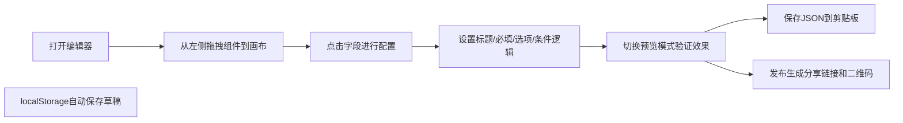

## 1. 产品概述

拖拽式表单生成器后台，类似Tally或金山表单的可视化编辑器。用户通过拖拽组件快速构建表单，支持字段配置、条件逻辑、实时预览，最终生成可分享的表单链接。

- 主要用途：快速创建调查问卷、报名表、反馈表等各类表单
- 目标用户：运营人员、产品经理、行政人员等无需编码的业务人员
- 产品价值：零代码快速构建表单，降低表单开发门槛，提升工作效率

## 2. 核心功能

### 2.1 用户角色

| 角色 | 注册方式 | 核心权限 |
|------|----------|----------|
| 普通用户 | 无需注册，本地使用 | 创建、编辑、预览、保存、发布表单 |

### 2.2 功能模块

1. **编辑器主页**：三栏布局（组件面板、画布、配置面板），拖拽式表单构建
2. **预览模式**：切换到真实表单填写体验，验证表单效果
3. **保存与导出**：JSON序列化导出，一键复制到剪贴板
4. **草稿存储**：localStorage自动保存，刷新不丢失
5. **发布分享**：生成分享链接，二维码展示

### 2.3 页面详情

| 页面名称 | 模块名称 | 功能描述 |
|-----------|-------------|---------------------|
| 编辑器主页 | 左侧组件面板 | 展示9种字段控件，支持拖拽到画布 |
| 编辑器主页 | 中间画布区 | 显示已添加的表单字段，支持拖拽排序、删除、选中 |
| 编辑器主页 | 右侧配置面板 | 编辑选中字段的标题、提示、必填、选项、条件逻辑 |
| 编辑器主页 | 顶部工具栏 | 预览切换、保存JSON、复制、发布按钮 |
| 预览页面 | 表单预览 | 真实表单填写体验，支持条件逻辑联动 |

## 3. 核心流程

## 4. 用户界面设计

### 4.1 设计风格

- **主色调**：深邃蓝色 `#2563eb`，代表专业与信任
- **辅助色**：蓝绿色 `#0ea5e9`，用于交互反馈
- **中性色**：深灰 `#1e293b`、中灰 `#64748b`、浅灰 `#f1f5f9`
- **按钮风格**：圆角8px，扁平化设计，悬停有轻微阴影和颜色变化
- **字体**：标题使用「PingFang SC」粗体，正文使用「PingFang SC」常规
- **布局风格**：三栏卡片式布局，清晰的区域分隔，充足留白
- **图标风格**：使用Lucide图标库，线性风格，统一大小

### 4.2 页面设计概述

| 页面名称 | 模块名称 | UI元素 |
|-----------|-------------|-------------|
| 编辑器主页 | 组件面板 | 卡片式组件列表，图标+文字，拖拽光标，悬停浮起效果 |
| 编辑器主页 | 画布区 | 字段卡片带拖拽手柄，删除按钮，选中高亮边框，悬停灰底 |
| 编辑器主页 | 配置面板 | 分组表单控件，开关组件，动态选项列表，条件逻辑配置器 |
| 编辑器主页 | 顶部工具栏 | 渐变蓝色按钮组，模式切换动画 |
| 预览页面 | 表单预览 | 卡片式表单字段，流畅的显示隐藏动画 |

### 4.3 响应式

- 桌面端优先设计，三栏固定布局
- 小屏幕下自动调整为两栏或单栏
- 触摸设备优化拖拽操作

### 4.4 交互细节

- 拖拽时半透明跟随效果，放置区域高亮提示
- 字段排序时平滑过渡动画
- 配置面板滑入滑出动画
- 按钮点击反馈效果
- 复制成功提示toast
- 二维码弹窗淡入效果
