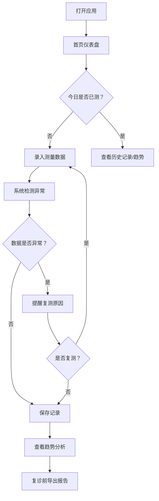

## 1. 产品概述
为老年人设计的血压管理应用，解决血压计设备维护缺失、测量数据不准确、异常情况无人提醒的问题。帮助用户规范血压测量流程，跟踪设备状态，智能提醒异常，为医生复诊提供数据支持。

## 2. 核心功能

### 2.1 用户角色
| 角色 | 注册方式 | 核心权限 |
|------|----------|----------|
| 普通用户 | 无需注册（本地存储） | 管理设备档案、记录血压数据、查看趋势、导出报告 |

### 2.2 功能模块
1. **首页仪表盘**: 今日未测提醒、异常读数统计、设备维护提醒、复诊问题清单
2. **设备档案管理**: 血压计品牌、型号、袖带尺寸、电池类型、购买日期、校准日期、照片管理
3. **测量记录**: 左右臂选择、坐姿记录、测前休息时间、收缩压、舒张压、心率、备注
4. **智能提醒**: 袖带尺寸不合适、校准超期、电量低、连续读数异常时提醒复测
5. **趋势分析**: 按医生复诊日期生成血压趋势图，可视化血压变化
6. **数据导出**: 导出近一个月血压记录，支持 CSV 格式

### 2.3 页面详情
| 页面名称 | 模块名称 | 功能描述 |
|-----------|-------------|---------------------|
| 首页仪表盘 | 概览卡片 | 显示今日是否已测、异常读数数量、设备维护状态、复诊待办事项 |
| 设备档案 | 设备信息表单 | 录入血压计品牌、型号、袖带尺寸、电池类型、购买日期、校准日期，上传设备照片 |
| 设备档案 | 状态提醒 | 自动检测校准超期、电量不足并高亮提醒 |
| 测量记录 | 记录列表 | 展示历史测量记录，支持按日期筛选 |
| 测量记录 | 新增记录表单 | 录入左右臂、坐姿、休息时间、收缩压、舒张压、心率、备注 |
| 测量记录 | 异常检测 | 录入后自动检测数据异常，提醒复测 |
| 趋势分析 | 血压趋势图 | 按复诊日期范围展示收缩压/舒张压/心率趋势线 |
| 趋势分析 | 复诊设置 | 设置下次复诊日期，生成该周期内的趋势报告 |
| 数据导出 | 导出功能 | 选择时间范围导出血压记录为 CSV 文件 |

## 3. 核心流程
用户打开应用 → 首页查看今日状态 → 如需测量：录入测量数据 → 系统自动检测异常 → 异常时提醒复测 → 正常则保存记录 → 查看趋势分析 → 复诊前导出报告

## 4. 用户界面设计

### 4.1 设计风格
- **主色调**: 医疗蓝 (#2563EB)，传递专业、可信赖感
- **辅助色**: 温暖橙 (#F59E0B) 用于提醒状态，健康绿 (#10B981) 用于正常状态，警示红 (#EF4444) 用于异常状态
- **中性色**: 石板灰系列 (#F8FAFC, #F1F5F9, #E2E8F0) 作为背景和边框
- **按钮风格**: 圆角 12px，带有轻微阴影，hover 时上浮效果
- **字体**: 标题使用 Lato 700，正文使用 Lato 400，确保老年人可读性
- **布局风格**: 卡片式布局，留白充足，大按钮易点击
- **图标风格**: lucide-react 线性图标，简洁清晰

### 4.2 页面设计概述
| 页面名称 | 模块名称 | UI 元素 |
|-----------|-------------|-------------|
| 首页仪表盘 | 概览卡片 | 大尺寸数字卡片，彩色状态指示器，清晰的图标 |
| 设备档案 | 信息表单 | 分组字段，照片上传预览，状态标签 |
| 测量记录 | 记录列表 | 时间线布局，数据高亮，异常标记 |
| 测量记录 | 新增表单 | 大输入框，滑动选择器，清晰的标签 |
| 趋势分析 | 趋势图 | 双 Y 轴图表，标注参考线，可交互点 |
| 数据导出 | 导出面板 | 日期选择器，导出按钮，进度提示 |

### 4.3 响应式设计
- Desktop-first 设计，桌面端为 4 列卡片网格
- 平板端自适应为 2 列网格
- 移动端单列布局，底部导航栏
- 所有交互元素最小尺寸 44x44px，适配触屏操作
- 字体大小在移动端最小 16px，避免老年人阅读困难
