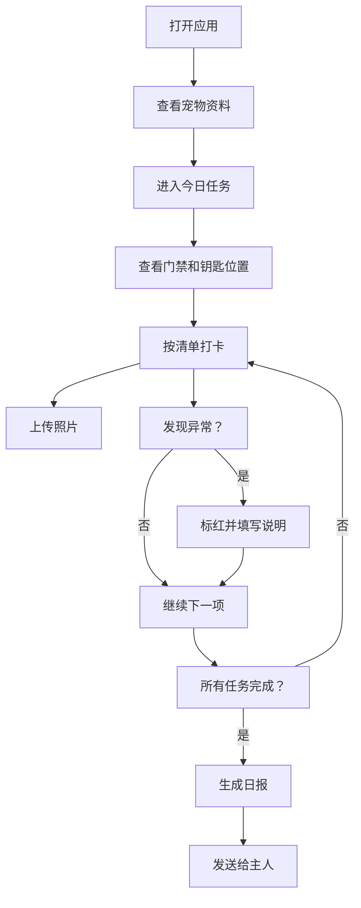

## 1. 产品概述
宠物代喂交接管理系统，解决朋友出差时代喂宠物的信息交接问题，避免忘记药量、猫砂位置和钥匙存放等关键信息。

- 主要用途：管理宠物资料、代喂任务清单、上门打卡和异常上报，交接结束自动生成日报
- 目标用户：宠物主人和代喂人
- 核心价值：信息透明、流程清晰、异常可追溯，让宠物主人放心

## 2. 核心功能

### 2.1 用户角色
| 角色 | 说明 | 核心权限 |
|------|------|----------|
| 代喂人 | 执行上门喂宠任务的人员 | 查看宠物资料、打卡任务、标记异常、生成日报 |
| 宠物主人 | 宠物所有者 | 查看日报、了解宠物状态 |

### 2.2 功能模块
1. **宠物资料页**：展示宠物品种、年龄、性格、食量、忌口、常用医院和照片
2. **任务列表页**：展示所有代喂任务，包含日期、时间、门禁方式、钥匙位置等
3. **打卡详情页**：任务执行清单，支持打卡、上传照片、异常标红
4. **日报页**：交接结束后生成的总结报告，统计剩余物资和下次提醒

### 2.3 页面详情
| 页面名称 | 模块名称 | 功能描述 |
|---------|----------|----------|
| 宠物资料页 | 基本信息卡片 | 展示品种、年龄、性格标签 |
| 宠物资料页 | 饮食健康卡片 | 展示食量、忌口、常用医院 |
| 宠物资料页 | 照片墙 | 展示宠物多张生活照 |
| 任务列表页 | 任务卡片 | 按日期展示任务，显示状态（待执行/进行中/已完成） |
| 任务详情页 | 任务概览 | 日期、上门时间、门禁方式、钥匙位置 |
| 任务详情页 | 打卡清单 | 喂食克数、饮水、铲屎、用药、陪玩，每项可打卡和上传照片 |
| 任务详情页 | 异常标记 | 呕吐、没吃、躲起来、抓伤等异常一键标红并填写说明 |
| 日报页 | 物资统计 | 剩余猫粮、砂量、药量统计展示 |
| 日报页 | 任务总结 | 所有打卡记录和异常情况汇总 |
| 日报页 | 下次提醒 | 下次上门时间和注意事项提醒 |

## 3. 核心流程

### 主要用户流程
代喂人打开应用 → 查看宠物资料了解基本信息 → 进入今日代喂任务 → 查看门禁方式和钥匙位置 → 按清单逐项打卡并上传照片 → 发现异常立即标红上报 → 完成所有任务 → 生成日报发送给主人

## 4. 用户界面设计

### 4.1 设计风格
- **主色调**：温暖橙色 `#FF8A3D`（代表活力与关怀）
- **辅助色**：柔和绿色 `#4ECDC4`（代表健康与安心）、警示红色 `#FF6B6B`（异常标记）
- **中性色**：米白背景 `#FFFAF5`、深棕文字 `#2D2A26`、浅灰边框 `#E8E0D5`
- **按钮风格**：圆润胶囊型按钮，微阴影，hover时有轻微上浮效果
- **字体**：标题使用 `Noto Serif SC` 衬线字体增添温度，正文使用 `Noto Sans SC` 无衬线字体保证可读性
- **布局风格**：卡片式布局，柔和圆角（16px），轻量投影，温暖质感
- **图标风格**：可爱线性图标，搭配emoji增强亲切感

### 4.2 页面设计概述
| 页面名称 | 模块名称 | UI元素 |
|---------|----------|--------|
| 宠物资料页 | 头部 | 宠物大头像、名字、品种标签 |
| 宠物资料页 | 信息卡片 | 图标+文字的网格布局，各项信息清晰展示 |
| 宠物资料页 | 照片墙 | 错落有致的照片网格，hover有放大效果 |
| 任务列表页 | 时间线 | 按日期纵向排列任务卡片，状态徽章醒目 |
| 任务详情页 | 位置信息 | 门禁、钥匙位置用突出卡片展示，配地图图标 |
| 任务详情页 | 打卡清单 | 可勾选的列表项，每项右侧有相机按钮，打卡后变绿 |
| 任务详情页 | 异常区域 | 红色边框的醒目区域，异常按钮点击后展开说明输入框 |
| 日报页 | 统计卡片 | 三个圆形进度图展示猫粮、猫砂、药量剩余 |
| 日报页 | 时间线 | 本次代喂的完整时间线记录 |
| 日报页 | 提醒区域 | 橙色渐变背景的下次提醒卡片 |

### 4.3 响应式
- 桌面端优先设计，最大宽度1200px居中显示
- 平板端：卡片两列布局，字体略微缩小
- 移动端：单列布局，导航改为底部Tab，触控区域不小于44x44px
- 所有交互元素均支持触摸操作

### 4.4 动效设计
- 页面加载：卡片从下往上渐入，错落延迟
- 打卡动画：勾选时出现绿色对勾粒子效果
- 异常标记：红色警示图标脉冲动画
- 日报生成：进度条平滑加载动画
- 卡片hover：轻微上浮 + 阴影加深
