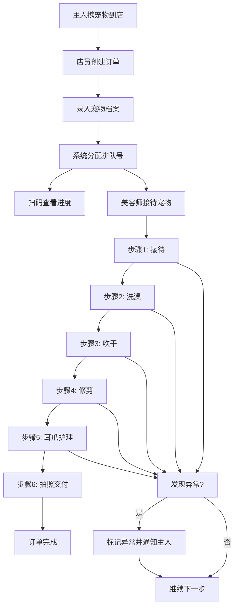

## 1. 产品概述

宠物美容排号管理系统，面向宠物店店员和宠物主人，解决洗剪吹服务排队过程中的信息不透明问题，提供实时流程追踪和可视化看板。

- **目标用户**：宠物店店员（日常操作）、店长（数据分析）、等待中的宠物主人（查看进度）
- **核心价值**：让主人随时了解宠物服务进度，店员高效管理订单流程，店长通过数据优化运营

---

## 2. 核心功能

### 2.1 用户角色

| 角色 | 登录方式 | 核心权限 |
|------|----------|----------|
| 店员 | 店内系统访问 | 接待登记、流程操作、异常上报、照片上传 |
| 店长 | 管理员访问 | 看板查看、员工负载监控、套餐数据分析 |
| 宠物主人 | 扫码查看 | 查看自家宠物服务进度、接收异常通知 |

### 2.2 功能模块

1. **看板主页**：排队列表、预计完成时间、超时订单预警、员工负载、热门服务套餐
2. **宠物档案**：录入/查看宠物信息（名字、品种、体重、毛发长度、过敏项、脾气备注、入店照片）
3. **订单流程追踪**：六步流程（接待→洗澡→吹干→修剪→耳爪护理→拍照交付），每步记录开始时间、负责人、照片
4. **异常处理**：标记皮肤红点、打结严重、指甲出血等异常情况，并触发主人通知

### 2.3 页面详情

| 页面名称 | 模块名称 | 功能描述 |
|-----------|-------------|---------------------|
| 看板主页 | 当前排队列表 | 展示待处理/进行中订单，显示排队号、宠物名、当前步骤、等待时长 |
| 看板主页 | 预计完成时间 | 基于当前步骤和历史数据估算每单完成时间，倒计时显示 |
| 看板主页 | 超时订单预警 | 红色高亮超过预估时间的订单，提醒店员处理 |
| 看板主页 | 员工负载看板 | 每位美容师当前正在处理的订单数量和状态 |
| 看板主页 | 热门服务套餐 | 复购率最高的前5个服务套餐，带数据图表 |
| 订单详情页 | 宠物档案卡片 | 展示宠物完整信息和入店照片 |
| 订单详情页 | 六步进度条 | 可视化流程节点，已完成打勾，进行中高亮，未开始灰显 |
| 订单详情页 | 步骤详情面板 | 点击某步查看开始时间、负责人、上传的照片 |
| 订单详情页 | 异常标记按钮 | 快速标记异常类型，自动生成通知 |
| 新建订单页 | 宠物信息表单 | 录入宠物档案全部字段，支持拍照上传 |
| 新建订单页 | 服务套餐选择 | 选择洗剪吹套餐及附加服务 |

---

## 3. 核心流程

主人带宠物到店 → 店员接待创建订单并录入宠物档案 → 系统分配排队号 → 主人可扫码查看实时进度 → 美容师按步骤执行服务，每步确认开始并上传照片 → 如遇异常（皮肤红点/打结/指甲出血）标记并通知主人 → 完成全部步骤后拍照交付 → 订单完成，数据计入看板统计

---

## 4. 用户界面设计

### 4.1 设计风格

- **主色调**：温暖橙橙色 `#FF8C42`（宠物友好、活力感）
- **辅助色**：奶油米 `#FFF7ED` 背景、深棕 `#3E2723` 文字、薄荷绿 `#4DB6AC` 完成状态、珊瑚红 `#EF5350` 异常/警告
- **按钮风格**：圆角胶囊形，主按钮橙色填充，次按钮描边，悬停有微妙上浮阴影
- **字体**：标题使用圆润有亲和力的字体，正文简洁易读
- **布局风格**：卡片式布局，大量圆角和柔和阴影，营造宠物店温馨氛围
- **图标风格**：Lucide 线性图标，搭配 paw、scissors、bath 等宠物相关 emoji

### 4.2 页面设计概览

| 页面名称 | 模块名称 | UI 元素 |
|-----------|-------------|-------------|
| 看板主页 | 顶部统计栏 | 4个圆角卡片展示今日订单数、进行中、已完成、平均耗时，带图标和渐变色背景 |
| 看板主页 | 排队队列 | 横向时间轴卡片，每卡显示宠物头像、名字、排队号、当前步骤徽标、等待时长 |
| 看板主页 | 员工负载 | 员工头像卡片，进度条显示当前工作负载，彩色标签标注正在处理的订单 |
| 看板主页 | 热门套餐 | 竖向条形图，排名1-5的套餐名称和复购次数条 |
| 订单详情页 | 宠物信息卡 | 左侧大圆宠物照片，右侧姓名标签，下方品种/体重/毛发等信息网格 |
| 订单详情页 | 流程进度条 | 六步竖直线性流程，每步含图标、步骤名、时间戳、负责人、照片缩略图 |
| 订单详情页 | 异常标记区 | 红色边框卡片，异常类型标签、备注输入、通知主人按钮 |
| 新建订单页 | 表单 | 分组表单卡片，每组有图标标题，上传区支持拖拽/点击 |

### 4.3 响应式

桌面端优先设计（1440px 宽度基准），适配平板端两列布局，移动端单列堆叠。触摸区域不小于 44px。

### 4.4 动效设计

- 页面加载：顶部统计卡片错峰淡入滑入（0.1s 间隔）
- 流程步骤：当前步骤脉冲呼吸动画，完成步骤勾选打勾动画
- 排队卡片：悬停轻微上浮 + 阴影加深
- 异常通知：红色闪烁边框 + 滑入抽屉动画
