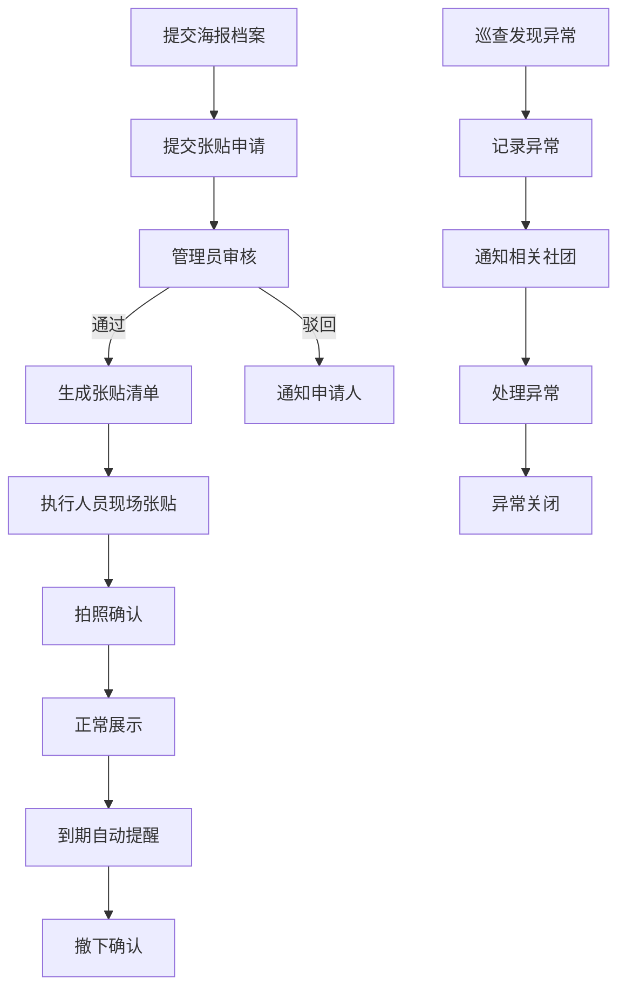

## 1. 产品概述

校园社团活动海报张贴管理系统，解决海报贴错栏位、过期无人清理等问题，实现从申请、审核、张贴到撤下的全流程数字化管理。目标用户为社团成员、管理员和现场执行人员。

## 2. 核心功能

### 2.1 用户角色

| 角色 | 核心权限 |
|------|----------|
| 社团成员 | 提交海报申请、查看申请状态、上传海报图片 |
| 管理员 | 审核申请、生成张贴清单、处理异常、查看统计看板 |
| 执行人员 | 现场张贴确认、拍照上传、记录异常、撤下确认 |

### 2.2 功能模块

1. **系统看板**：数据概览、待审核、待张贴、即将到期、违规海报、区域占用率
2. **海报档案管理**：海报信息录入、编辑、查询、图片管理
3. **张贴申请**：选择公告栏、数量、联系人、置顶需求
4. **审核管理**：审批申请、生成张贴清单、分配执行人员
5. **张贴执行**：现场拍照确认、位置确认
6. **异常管理**：记录破损、覆盖、未审批张贴等异常
7. **到期提醒**：自动提醒撤下、撤下确认

### 2.3 页面详情

| 页面名称 | 模块名称 | 功能描述 |
|-----------|-------------|---------------------|
| 看板首页 | 统计卡片 | 显示待审核、待张贴、即将到期、违规数量统计 |
| 看板首页 | 区域占用率 | 各公告栏区域占用情况可视化图表 |
| 看板首页 | 列表区域 | 待审核、待张贴、即将到期、违规海报列表 |
| 海报档案 | 海报列表 | 所有海报档案的分页列表和筛选 |
| 海报档案 | 海报表单 | 录入活动名称、社团、尺寸、张贴区域、审批编号、日期、图片 |
| 张贴申请 | 申请表单 | 选择公告栏、数量、联系人、是否置顶 |
| 审核管理 | 审核列表 | 待审核申请列表，支持通过/驳回操作 |
| 张贴清单 | 清单详情 | 生成的张贴清单，包含位置、数量、联系人 |
| 张贴执行 | 现场确认 | 拍照上传、位置标记、张贴确认 |
| 异常管理 | 异常记录 | 记录破损、覆盖、未审批等异常情况 |
| 到期提醒 | 提醒列表 | 即将到期和已过期海报列表，支持撤下确认 |

## 3. 核心流程

社团成员提交海报档案 → 提交张贴申请（选择公告栏、数量等）→ 管理员审核 → 生成张贴清单 → 执行人员现场张贴并拍照确认 → 正常展示 → 到期自动提醒 → 执行人员撤下确认。

异常处理流程：巡查发现异常 → 记录异常信息（类型、位置、照片）→ 通知相关社团 → 处理异常 → 异常关闭。

## 4. 用户界面设计

### 4.1 设计风格

- **主色调**：使用校园活力橙 (#FF6B35) 作为主色，搭配深蓝 (#1E3A5F) 作为辅助色
- **中性色**：以暖灰色为基底，营造温馨的校园氛围
- **按钮风格**：圆角设计，悬停时有微妙的缩放和阴影效果
- **字体**：采用现代无衬线字体，标题使用具有设计感的字体增强视觉效果
- **布局风格**：卡片式布局，信息分组清晰，适当留白
- **图标风格**：使用线性图标，保持简洁统一

### 4.2 页面设计概述

| 页面名称 | 模块名称 | UI元素 |
|-----------|-------------|-------------|
| 看板首页 | 统计卡片 | 渐变背景卡片、数字动画、图标动画 |
| 看板首页 | 区域占用率 | 彩色进度条、百分比显示、区域名称标签 |
| 海报档案 | 海报列表 | 卡片网格布局、悬停效果、图片缩略图 |
| 申请表单 | 表单组件 | 分步表单、下拉选择、日期选择器、图片上传预览 |
| 异常管理 | 异常卡片 | 状态标签、异常类型图标、照片预览 |

### 4.3 响应式设计

- 采用桌面优先设计，适配 1280px 及以上屏幕
- 平板端：调整网格列数，优化侧边栏布局
- 移动端：单列布局，底部导航，优化触控区域
- 所有交互元素确保最小 44px 触控区域

### 4.4 动效设计

- 页面加载：元素渐入动画，错落有致的延迟效果
- 卡片悬停：微妙上浮、阴影加深
- 状态变化：平滑过渡动画
- 数据更新：数字滚动动画
- 表单提交：加载状态动画和成功反馈
