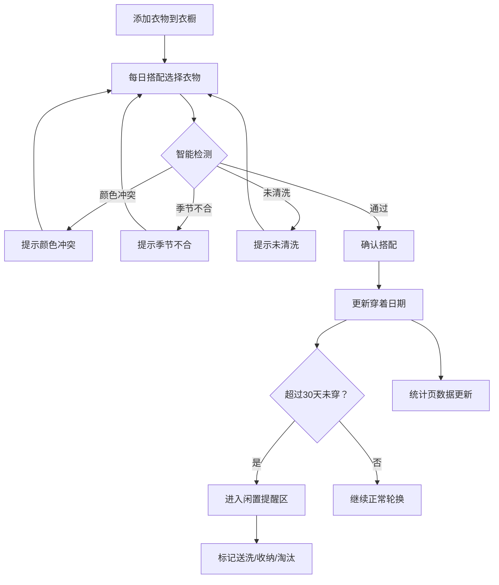

## 1. 产品概述

穿搭轮换——一个帮助用户管理衣橱、智能搭配和追踪穿着习惯的时尚管理工具。解决「衣服多但总穿几件、换季忘穿、颜色搭配不协调」的日常痛点，让每一件衣物都被看见、被合理穿着。

- 目标用户：注重穿搭效率的都市人群，希望减少决策疲劳、避免衣物闲置
- 核心价值：用数据驱动穿衣决策，让衣橱从「混乱堆积」变成「有序轮换」

## 2. 核心功能

### 2.1 用户角色
| 角色 | 注册方式 | 核心权限 |
|------|----------|----------|
| 个人用户 | 无需注册，本地使用 | 管理自己的衣橱、搭配和统计 |

### 2.2 功能模块
1. **衣橱管理页**：衣物卡片列表、添加/编辑衣物、分类筛选、照片上传
2. **每日搭配页**：从上衣/下装/外套/鞋子中选组合、智能提示、记录当日穿搭
3. **闲置提醒区**：长期未穿衣物列表、标记送洗/收纳/淘汰操作
4. **穿搭统计页**：本月穿得最多的颜色、闲置最长的衣服、每周搭配次数

### 2.3 页面详情
| 页面名称 | 模块名称 | 功能描述 |
|----------|----------|----------|
| 衣橱管理 | 衣物卡片列表 | 展示所有衣物的缩略卡片，显示照片、类别、颜色标签、清洗状态，支持按类别/季节/场合筛选 |
| 衣橱管理 | 添加/编辑衣物 | 弹窗表单，录入类别（上衣/下装/外套/鞋子/配饰）、颜色、季节、适合场合、上次穿着日期、清洗状态、上传照片 |
| 衣橱管理 | 删除衣物 | 确认后删除，可标记为淘汰并移入闲置区 |
| 每日搭配 | 选衣组合区 | 四列选择器（上衣/下装/外套/鞋子），点击从对应类别中选取 |
| 每日搭配 | 智能提示 | 颜色冲突警告（红绿撞色等）、季节不合提醒、未清洗提示 |
| 每日搭配 | 穿搭记录 | 确认搭配后记录日期和所选衣物，自动更新「上次穿着日期」 |
| 闲置提醒 | 闲置列表 | 超过30天未穿的衣物自动归入，按闲置天数降序排列 |
| 闲置提醒 | 操作标记 | 可标记为「送洗」「收纳」「淘汰」，标记后更新状态 |
| 穿搭统计 | 颜色频次图 | 本月穿着颜色分布柱状图/环形图 |
| 穿搭统计 | 闲置排行 | 闲置天数最长的前5件衣物列表 |
| 穿搭统计 | 搭配频率 | 每周搭配次数折线图，显示近8周趋势 |

## 3. 核心流程

1. 用户首次打开应用，添加衣橱中的衣物（拍照/选图、填写属性）
2. 每天早晨打开「每日搭配」页，从四个品类中选择衣物组成当日穿搭
3. 系统实时检测颜色冲突、季节不匹配和未清洗衣物并提示
4. 确认搭配后，系统自动更新各衣物的「上次穿着日期」
5. 超过30天未穿的衣物自动进入「闲置提醒区」
6. 用户在闲置区处理衣物（送洗/收纳/淘汰）
7. 统计页展示穿着数据，帮助用户优化衣橱

## 4. 用户界面设计

### 4.1 设计风格
- **主色调**：暖奶油白 (#FDF6EC) 为底色，炭灰 (#2D2D2D) 为文字，赤陶色 (#C4704B) 为强调色
- **辅色调**：沙金 (#D4A574) 用于分类标签，雾蓝 (#8BA5B5) 用于信息提示
- **按钮风格**：圆角胶囊按钮，赤陶色填充 + 白色文字，悬停时加深阴影
- **字体**：Playfair Display（标题），DM Sans（正文）
- **布局风格**：左侧导航 + 右侧内容区，卡片式布局
- **图标**：Lucide Icons 线性图标
- **整体调性**：时尚杂志编辑风格，精致而温暖

### 4.2 页面设计概览
| 页面名称 | 模块名称 | UI 元素 |
|----------|----------|---------|
| 衣橱管理 | 衣物卡片列表 | 瀑布流网格，卡片带圆角阴影，照片+信息叠层，筛选标签栏在顶部 |
| 衣橱管理 | 添加衣物弹窗 | 居中模态框，分步表单，颜色选择器用色块圆点，季节/场合用标签多选 |
| 每日搭配 | 选衣组合区 | 四列等宽布局，每列顶部品类标题，下方横向滚动选择卡片，选中项高亮边框 |
| 每日搭配 | 智能提示 | 右侧浮层，带图标的警告条，分色级（黄色季节/橙色颜色/红色未清洗） |
| 闲置提醒 | 闲置列表 | 列表式布局，左侧衣物缩略图，右侧闲置天数进度条 + 操作按钮组 |
| 穿搭统计 | 统计图表 | 大卡片内嵌图表，环形图展示颜色分布，列表展示闲置排行，折线图展示搭配频率 |

### 4.3 响应式设计
- 桌面端优先（1280px+），左右分栏导航
- 平板端（768px-1279px），顶部标签导航，单列布局
- 移动端（<768px），底部标签导航，纵向堆叠

### 4.4 3D 场景
- 不适用
