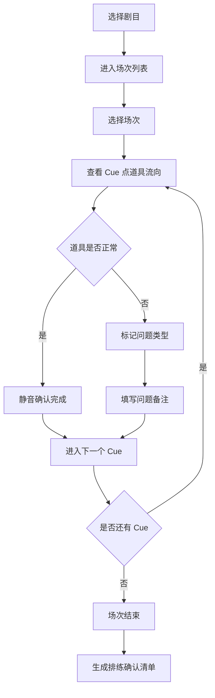

## 1. 产品概述

后台道具交接台是专为剧场演出换景场景设计的道具管理工具，解决暗场换景时道具交接混乱、位置错误导致穿帮的问题。目标用户为舞台监督、道具师及后台工作人员，通过数字化道具流向追踪，确保每场演出道具准确到位。

## 2. 核心功能

### 2.1 用户角色

| 角色 | 注册方式 | 核心权限 |
|------|----------|----------|
| 舞台监督 | 本地配置 | 管理剧目、场次、道具清单，查看问题汇总 |
| 道具师 | 本地配置 | 标记道具状态、确认交接、报告问题 |
| 后台工作人员 | 本地配置 | 查看道具流向、确认拿取/放置 |

### 2.2 功能模块

1. **道具流向列表**：按剧目-场次-Cue 层级展示道具的完整流向
2. **暗场操作台**：大字号高对比度界面，支持静音确认操作
3. **问题标记系统**：标记遗失、损坏、位置错误三种异常状态
4. **排练确认清单**：自动生成下次排练前需重点确认的道具清单

### 2.3 页面详情

| 页面名称 | 模块名称 | 功能描述 |
|----------|----------|----------|
| 主控制台 | 剧目选择器 | 切换不同剧目，显示剧目概览信息 |
| 主控制台 | 场次时间线 | 按时间顺序展示场次，可快速跳转 |
| 道具流向页 | Cue 点列表 | 展示当前场次所有 Cue 点及对应道具 |
| 道具流向页 | 道具卡片 | 显示道具名称、来源、放置位置、接收人 |
| 道具流向页 | 确认按钮 | 大尺寸静音确认按钮，支持勾选标记完成 |
| 问题报告页 | 问题列表 | 展示所有标记的问题道具及状态 |
| 问题报告页 | 标记操作 | 可标记遗失/损坏/位置错误，添加备注 |
| 排练清单页 | 待确认清单 | 自动汇总有问题记录的道具，按优先级排序 |
| 排练清单页 | 确认勾选 | 逐项确认道具状态，标记已核查 |

## 3. 核心流程

用户选择剧目后进入场次列表，点击场次查看该场所有 Cue 点的道具流向。暗场中工作人员根据界面提示，从左侧台口拿取道具放置到指定桌子，完成后点击静音确认。如发现道具遗失、损坏或位置错误，可快速标记问题并填写备注。每次演出结束后，系统自动汇总所有问题道具，生成下次排练前的重点确认清单。

## 4. 用户界面设计

### 4.1 设计风格

- **主色调**：纯黑背景 (#000000) + 荧光绿 (#00FF41) 作为主强调色，确保暗场中高对比度可读性
- **辅助色**：警示红 (#FF1744) 标记问题，琥珀黄 (#FFD600) 标记待确认
- **按钮风格**：大尺寸方形按钮，粗边框，点击有明显视觉反馈
- **字体**：使用等宽无衬线字体 (JetBrains Mono / Courier New)，字号特大，最小字号 18px
- **布局风格**：信息密度低，卡片式布局，大间距，关键信息独占一行
- **图标风格**：简洁线性图标，大尺寸，高对比度

### 4.2 页面设计概述

| 页面名称 | 模块名称 | UI 元素 |
|----------|----------|----------|
| 主控制台 | 剧目选择器 | 大卡片列表，剧目名称大字显示，场次数量角标 |
| 主控制台 | 场次时间线 | 横向时间轴，场次卡片，当前场次高亮 |
| 道具流向页 | Cue 点列表 | 竖向排列，Cue 编号大字体突出，展开/收起动画 |
| 道具流向页 | 道具卡片 | 深色卡片，荧光绿边框高亮，道具名称最大字号 |
| 道具流向页 | 确认按钮 | 底部固定大按钮，点击后变绿色实心 + 对勾图标 |
| 问题报告页 | 问题列表 | 红色边框卡片，问题类型标签，状态切换按钮 |
| 排练清单页 | 待确认清单 | 按优先级分组，黄色待确认状态，勾选后变灰 |

### 4.3 响应性

桌面端优先设计，适配舞台监督的平板/笔记本使用场景。支持触摸屏操作，按钮最小尺寸 64x64px 方便戴手套操作。横向布局为主，充分利用宽屏展示时间线。

### 4.4 动效与交互

- 确认操作：按钮点击有缩放反馈 + 颜色填充动画，无需声音
- Cue 切换：左右滑入动画，模拟换景过程
- 问题标记：红色警示闪烁动画 3 次，吸引注意力
- 暗场模式切换：0.3 秒渐变过渡，保护眼睛
