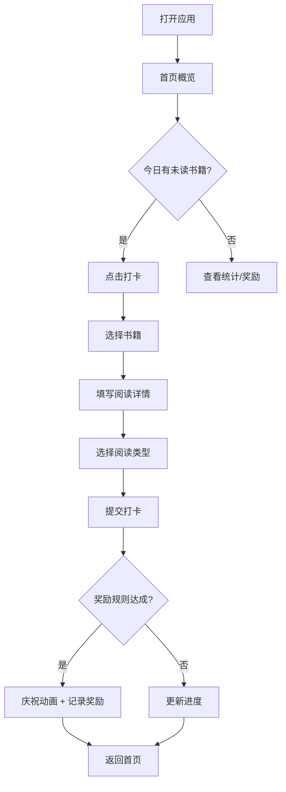

## 1. 产品概述

亲子阅读打卡奖励应用——帮助家长记录孩子每日阅读情况（读了什么、读了多久、是否复述），通过连续打卡奖励机制激励孩子养成阅读习惯。

- 目标用户：3-12岁儿童的家长
- 核心价值：让阅读记录变得简单有趣，用奖励机制激发孩子的阅读动力，同时积累阅读数据帮助家长了解孩子的阅读偏好和进度

## 2. 核心功能

### 2.1 用户角色

| 角色 | 使用方式 | 核心权限 |
|------|---------|---------|
| 家长 | 直接使用 | 管理书籍、设置奖励规则、查看统计 |
| 孩子 | 在家长指导下使用 | 打卡记录阅读 |

### 2.2 功能模块

1. **首页**：今日阅读状态概览，按分组展示书籍（今日未读、连续打卡中、快读完）
2. **书籍管理**：添加/编辑书籍信息，浏览书架
3. **打卡记录**：每日打卡，记录阅读详情
4. **奖励中心**：自定义奖励规则，查看奖励进度
5. **统计页面**：月度阅读统计，偏好分析

### 2.3 页面详情

| 页面名称 | 模块名称 | 功能描述 |
|---------|---------|---------|
| 首页 | 今日未读分组 | 显示今天还未打卡的书籍，快速进入打卡 |
| 首页 | 连续打卡分组 | 显示正在连续阅读的书籍及天数 |
| 首页 | 快读完分组 | 显示阅读进度超过80%的书籍，激励完成 |
| 首页 | 快捷操作栏 | 一键打卡、添加书籍入口 |
| 书籍管理 | 书架列表 | 以卡片形式展示所有书籍，含封面、书名、进度 |
| 书籍管理 | 添加书籍表单 | 填写书名、适合年龄、页数、主题、难度、封面 |
| 书籍管理 | 编辑/删除书籍 | 修改书籍信息或移除书籍 |
| 打卡页面 | 选择书籍 | 从书架中选择今日阅读的书籍 |
| 打卡页面 | 阅读详情记录 | 记录阅读时长、读到哪页、喜欢程度(1-5星)、一句复述 |
| 打卡页面 | 阅读类型 | 区分亲子共读和孩子自己读 |
| 奖励中心 | 奖励规则列表 | 展示已设置的奖励规则及当前进度 |
| 奖励中心 | 添加/编辑奖励规则 | 自定义条件（如连续7天）和奖励内容（如周末活动） |
| 奖励中心 | 达成记录 | 展示已达成的奖励历史 |
| 统计页面 | 月度概览 | 本月读了多少本、总阅读时长 |
| 统计页面 | 连续天数 | 最长连续打卡天数、当前连续天数 |
| 统计页面 | 主题偏好 | 最喜欢的阅读主题分布 |
| 统计页面 | 未完成书籍 | 哪些书卡住没读完，阅读停滞提醒 |

## 3. 核心流程

**每日打卡流程**：家长/孩子打开应用 → 首页看到今日未读书籍 → 点击打卡 → 选择书籍 → 填写阅读时长、读到哪页、喜欢程度、复述内容 → 选择阅读类型（亲子共读/自读）→ 提交打卡 → 系统检查奖励规则是否达成 → 提示奖励进度

**书籍管理流程**：家长点击添加书籍 → 填写书名、适合年龄、页数、主题、难度 → 上传封面 → 保存到书架 → 首页自动更新

**奖励流程**：家长设置奖励规则（如连续打卡7天）→ 每日打卡后系统自动计算进度 → 达成条件时弹出庆祝动画 → 记录到奖励历史

## 4. 用户界面设计

### 4.1 设计风格

- **主色调**：温暖的橘黄色(#F59E0B)作为主色，搭配柔和的米白色(#FFF8F0)背景，营造温馨亲子氛围
- **辅助色**：柔和的薄荷绿(#6EE7B7)用于成功/完成状态，珊瑚粉(#FDA4AF)用于提醒/未完成
- **按钮风格**：圆角大按钮(16px圆角)，带柔和阴影，触摸友好
- **字体**：标题使用圆体风格字体，正文使用易读的无衬线体
- **布局风格**：卡片式布局，底部Tab导航
- **图标风格**：使用lucide-react图标，搭配少量手绘风格装饰元素
- **整体氛围**：温暖、友好、有趣，像一本绘本的延伸

### 4.2 页面设计概览

| 页面名称 | 模块名称 | UI元素 |
|---------|---------|--------|
| 首页 | 今日未读分组 | 横向滚动卡片，书籍封面+书名+快速打卡按钮 |
| 首页 | 连续打卡分组 | 纵向列表，显示书籍名+连续天数徽章 |
| 首页 | 快读完分组 | 进度条卡片，显示剩余页数 |
| 首页 | 顶部问候区 | 当日日期、连续打卡天数、鼓励语 |
| 书籍管理 | 书架网格 | 3列网格，封面图+书名+进度条 |
| 书籍管理 | 添加表单 | 全屏模态框，表单字段清晰分组 |
| 打卡页面 | 打卡表单 | 分步表单，大字体易操作 |
| 打卡页面 | 喜欢程度 | 5颗可点击星星 |
| 打卡页面 | 阅读类型 | 两个大卡片选择（亲子共读/自己读） |
| 奖励中心 | 规则卡片 | 进度环形图+规则描述+当前进度 |
| 统计页面 | 月度数据 | 数字卡片+小型柱状图 |
| 统计页面 | 主题偏好 | 彩色标签云/饼图 |

### 4.3 响应式设计

- 移动优先设计，主要在手机上使用
- 最小宽度320px，最大宽度480px为最佳体验
- 桌面端居中显示，两侧留白
- 触摸优化：按钮最小44px触控区域，滑动操作流畅

### 4.4 动效设计

- 打卡提交成功：星星飘落动画
- 奖励达成：彩带庆祝动画
- 页面切换：柔和滑入
- 卡片交互：按压缩放反馈
