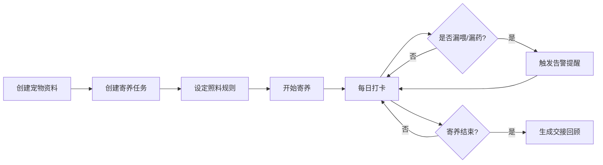

## 1. 产品概述

宠物寄养交接清单系统，帮助宠物主人在临时寄养给朋友时，系统化地记录和管理宠物的日常照料信息。解决口头交代容易遗漏、记不住的痛点。

- 核心目标：让寄养交接零遗漏，照料过程可视化，交接结束有完整回顾
- 目标用户：需要临时寄养宠物的主人、受托照料宠物的朋友
- 产品价值：信息传递准确、过程监督到位、交接结果可追溯

## 2. 核心功能

### 2.1 用户角色

| 角色 | 核心权限 |
|------|----------|
| 宠物主人 | 创建/编辑宠物资料、创建寄养任务、查看打卡记录、生成交接回顾 |
| 受托照料人 | 查看寄养任务详情、每日打卡、记录异常情况 |

### 2.2 功能模块

1. **宠物资料管理**：宠物基本信息录入与展示
2. **寄养任务管理**：寄养任务的创建、查看、状态跟踪
3. **每日打卡系统**：喂食/用药/遛弯打卡、照片上传、异常记录
4. **智能提醒**：漏喂、漏药实时告警
5. **交接回顾**：寄养结束后自动生成回顾报告

### 2.3 页面详情

| 页面名称 | 模块名称 | 功能描述 |
|-----------|-------------|---------------------|
| 首页/任务列表 | 任务概览卡片 | 展示进行中/待开始/已结束的寄养任务，快速入口 |
| 首页/任务列表 | 宠物快捷入口 | 展示已添加的宠物列表，可快速进入详情 |
| 宠物资料页 | 基本信息区 | 展示头像、名字、品种、年龄 |
| 宠物资料页 | 健康信息区 | 展示过敏项、常用粮、疫苗照片 |
| 宠物资料页 | 编辑功能 | 新增/编辑宠物全部信息 |
| 寄养任务详情页 | 任务信息区 | 展示日期、接手人、紧急联系人 |
| 寄养任务详情页 | 照料要求区 | 喂食次数、遛弯要求、用药提醒详细说明 |
| 寄养任务详情页 | 打卡时间轴 | 按日期展示每日打卡记录 |
| 寄养任务详情页 | 提醒面板 | 漏喂漏药红色告警提示 |
| 打卡页 | 今日任务清单 | 列出今日所有待完成的照料任务 |
| 打卡页 | 照片上传 | 支持上传打卡照片 |
| 打卡页 | 备注输入 | 可添加文字备注和异常标记 |
| 交接回顾页 | 异常记录汇总 | 列出寄养期间所有异常事件 |
| 交接回顾页 | 物资统计 | 剩余粮量、消耗统计 |
| 交接回顾页 | 补货清单 | 自动生成下次需要补充的物资 |

## 3. 核心流程

用户创建宠物资料 → 创建寄养任务（关联宠物、设定照料要求）→ 受托方每日打卡（喂食/用药/遛弯）→ 系统实时监控漏项 → 寄养结束自动生成回顾报告

## 4. 用户界面设计

### 4.1 设计风格

- **主色调**：温暖的橙棕色系（#F59E0B 琥珀色），传递温馨关怀的感觉
- **辅助色**：柔和的米白色背景（#FFFAF0），绿色用于正常状态（#10B981），红色用于告警（#EF4444）
- **按钮风格**：圆角胶囊形按钮，带有轻微阴影，hover时有上浮动效
- **字体**：标题使用圆润的显示字体，正文使用清晰易读的无衬线字体
- **布局风格**：卡片式布局，充足的留白，柔和的圆角和阴影
- **图标风格**：使用 Lucide 图标，配合宠物主题 emoji 增加亲切感

### 4.2 页面设计概述

| 页面名称 | 模块名称 | UI 元素 |
|-----------|-------------|-------------|
| 首页/任务列表 | 任务概览卡片 | 横向滚动卡片，展示宠物头像、任务状态标签、日期范围 |
| 宠物资料页 | 基本信息区 | 大圆头像、名字大字、品种/年龄标签式展示 |
| 寄养任务详情页 | 照料要求区 | 图标+文字的列表形式，重要信息高亮 |
| 寄养任务详情页 | 提醒面板 | 红色背景警示卡片，带闪烁动效 |
| 打卡页 | 今日任务清单 | 可勾选的任务列表，完成后变灰并划线 |
| 交接回顾页 | 异常记录汇总 | 时间轴形式，异常点标红 |

### 4.3 响应式

- 桌面端优先，最大宽度 1200px 居中布局
- 移动端自适应，卡片堆叠，侧边栏转底部导航
- 触摸区域不小于 44px，适合手机操作
