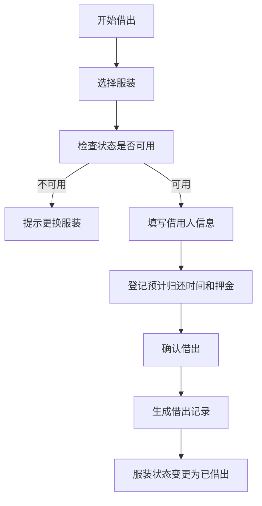
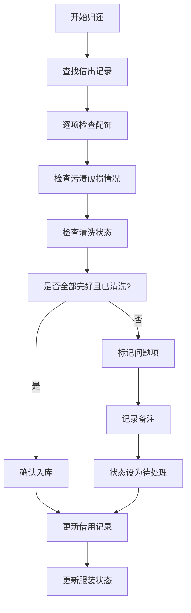

## 1. 产品概述

社团服装借还管理系统，解决演出服借用过程中尺码不符、配饰缺失、清洗状态混乱等问题，实现服装全生命周期数字化管理。

- **核心价值**：让每套演出服的去向、状态、配饰一清二楚，避免排练时才发现缺件的尴尬
- **目标用户**：社团管理员、社长、服装负责人
- **使用场景**：演出服借出登记、归还检查、库存盘点、数据统计

## 2. 核心功能

### 2.1 用户角色

| 角色 | 登录方式 | 核心权限 |
|------|----------|----------|
| 管理员 | 账号登录 | 服装档案管理、借还操作、统计报表、系统设置 |
| 社长 | 账号登录 | 查看本社团借用记录、接收逾期提醒、查看统计 |

### 2.2 功能模块

1. **服装档案管理**：服装列表、新增/编辑/删除服装、批量导入、照片上传
2. **借出登记**：选择服装、填写借用人信息、登记押金、生成借出单
3. **归还检查**：逐项检查（衣服/头饰/腰带/鞋套）、污渍破损记录、清洗状态确认
4. **统计报表**：使用次数排行、缺件率统计、待洗数量、社团借用排行
5. **逾期提醒**：自动检测逾期、通知社长、逾期记录追踪

### 2.3 页面详情

| 页面名称 | 模块名称 | 功能描述 |
|----------|----------|----------|
| 首页仪表盘 | 数据概览 | 服装总数、在借数量、待洗数量、逾期提醒、快捷入口 |
| 服装档案 | 服装列表 | 搜索筛选、卡片/列表视图、批量操作 |
| 服装档案 | 服装详情 | 基本信息、配饰清单、借用历史、状态时间线 |
| 服装档案 | 新增/编辑 | 表单录入、照片上传、配饰项配置 |
| 借出管理 | 借出登记 | 选择服装、借用人信息、押金登记、提交借出 |
| 借出管理 | 借出记录 | 在借列表、历史记录、详情查看 |
| 归还管理 | 归还检查 | 服装选择、逐项检查清单、问题记录、归还确认 |
| 统计报表 | 使用统计 | 使用次数排行、缺件率、可视化图表 |
| 统计报表 | 社团排行 | 各社团借用次数、逾期次数排行 |
| 统计报表 | 待洗管理 | 待清洗服装列表、批量标记已洗 |

## 3. 核心流程

### 3.1 借出流程

管理员在系统中选择可借用的服装，填写借用人（学生姓名、社团、活动名称）、预计归还时间和押金金额，确认后生成借出记录，服装状态变更为"已借出"。

### 3.2 归还流程

归还时需逐项检查服装完整性（衣服、头饰、腰带、鞋套），检查是否有污渍或破损，确认清洗状态。未清洗或缺配饰的服装不能直接入库，需标记待处理。

## 4. 用户界面设计

### 4.1 设计风格

- **设计调性**：现代简约 + 专业管理感，操作清晰高效
- **主色调**：深邃蓝（#1e3a5f）- 专业稳重
- **辅助色**：暖橙（#f59e0b）- 提醒/警告
- **成功色**：翠绿（#10b981）- 正常/已完成
- **警告色**：珊瑚红（#ef4444）- 逾期/缺失
- **字体**：思源黑体 / PingFang SC，清晰易读
- **布局**：左侧导航 + 右侧内容区，卡片式信息展示
- **图标**：Lucide 图标库，线性风格

### 4.2 页面设计概览

| 页面名称 | 模块名称 | UI元素 |
|----------|----------|--------|
| 首页仪表盘 | 数据概览 | 四个数据卡片（服装总数/在借/待洗/逾期）、快捷操作区、最近动态列表 |
| 服装档案 | 服装列表 | 顶部搜索筛选栏、卡片网格布局、状态标签、悬浮操作 |
| 服装档案 | 服装详情 | 左侧照片轮播、右侧信息面板、配饰清单表格、时间线 |
| 借出登记 | 表单 | 分步表单、服装选择器、信息输入区、押金金额输入 |
| 归还检查 | 检查清单 | 逐项勾选卡片、问题记录文本框、状态确认按钮组 |
| 统计报表 | 数据可视化 | 柱状图、饼图、排行表格、数据卡片 |

### 4.3 响应式设计

- 桌面端优先设计（1280px+）
- 平板端（768-1279px）：导航收缩、卡片自适应
- 移动端（<768px）：底部导航栏、单列布局

### 4.4 交互细节

- 卡片悬停有轻微上浮和阴影加深效果
- 状态标签使用不同背景色和图标区分
- 表单提交有加载状态和成功/失败反馈
- 归还检查清单有进度条显示完成度
- 逾期提醒有脉冲动画引起注意
