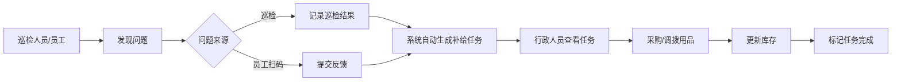

# 会议室白板笔补给系统 - 产品需求文档

## 1. 产品概述
本系统用于管理企业会议室白板笔及擦板用品的库存、巡检和补给流程，解决开会时白板笔无墨、用品缺失的痛点。
- 目标用户：行政管理人员、巡检人员、普通员工
- 核心价值：数字化管理用品库存，自动预警低库存，提升补给效率，降低会议中断风险

## 2. 核心功能

### 2.1 用户角色
| 角色 | 说明 | 核心权限 |
|------|------|----------|
| 行政管理员 | 负责用品采购和补给 | 全部功能：会议室管理、库存管理、巡检、补给任务、统计报表 |
| 巡检人员 | 负责日常巡检工作 | 执行巡检、查看补给任务、反馈问题 |
| 普通员工 | 使用会议室的员工 | 扫码反馈用品缺失/无墨问题 |

### 2.2 功能模块
1. **会议室档案管理**：会议室列表、新增/编辑会议室（楼层、容量、白板数量、责任人、照片）
2. **用品库存管理**：库存总览、各会议室用品详情（黑/红/蓝白板笔、板擦、清洁液、磁钉）、记录数量、开封日期、存放位置
3. **巡检功能**：巡检任务列表、执行巡检（试写白板笔、检查板擦脏污、清洁液余量）、巡检记录
4. **补给任务管理**：自动生成低库存补给任务、任务状态跟踪、手动创建任务
5. **员工扫码反馈**：扫码页面、提交用品缺失/无墨反馈、反馈记录查看
6. **统计报表**：各会议室消耗统计、补给时效分析、长期缺货告警、采购建议数量

### 2.3 页面详情
| 页面名称 | 模块名称 | 功能描述 |
|---------|---------|----------|
| 仪表盘首页 | 数据概览 | 显示会议室总数、用品总库存、待处理补给任务数、今日巡检数、最近反馈 |
| 会议室管理 | 会议室列表 | 卡片式展示所有会议室，支持搜索筛选 |
| 会议室管理 | 会议室表单 | 新增/编辑会议室信息：楼层、容量、白板数量、责任人、照片 |
| 库存管理 | 库存总览 | 所有用品库存汇总展示，低库存红色告警 |
| 库存管理 | 会议室库存详情 | 单个会议室各类用品的数量、开封日期、存放位置 |
| 巡检中心 | 巡检任务 | 待执行/已完成巡检任务列表 |
| 巡检中心 | 执行巡检 | 逐项检查白板笔书写、板擦脏污、清洁液余量，记录问题 |
| 补给任务 | 任务列表 | 待处理/进行中/已完成补给任务，支持状态筛选 |
| 补给任务 | 任务详情 | 查看任务详情，标记处理状态，补充用品 |
| 员工反馈 | 扫码反馈页 | 选择用品类型，描述问题，提交反馈 |
| 统计报表 | 消耗统计 | 按会议室/时间维度统计用品消耗情况，柱状图展示 |
| 统计报表 | 补给时效 | 补给任务平均处理时长趋势图 |
| 统计报表 | 采购建议 | 根据消耗速率自动计算建议采购数量 |

## 3. 核心流程

### 3.1 巡检与补给流程
行政管理员创建巡检计划 → 巡检人员执行巡检 → 发现低库存/问题 → 系统自动生成补给任务 → 行政人员处理补给 → 完成任务并更新库存

### 3.2 员工反馈流程
员工扫描会议室二维码 → 选择反馈类型（白板笔无墨/用品缺失） → 提交反馈 → 系统生成补给任务 → 行政人员处理

## 4. 用户界面设计

### 4.1 设计风格
- **主色调**：深青色 #0F766E（专业、稳重）+ 橙色 #F97316（警示、活力）
- **辅助色**：中性灰 slate 系列用于背景和文字
- **按钮风格**：圆角按钮，悬停时微上浮阴影效果
- **字体**：中文使用 Noto Sans SC，数字使用 JetBrains Mono
- **布局风格**：左侧导航栏 + 顶部标题栏 + 主内容区卡片式布局
- **图标风格**：lucide-react 线性图标

### 4.2 页面设计概览
| 页面名称 | 模块名称 | UI元素 |
|---------|---------|--------|
| 仪表盘 | 数据概览 | 4个统计卡片 + 最近活动列表 + 待办任务 |
| 会议室管理 | 列表 | 搜索栏 + 网格卡片（显示照片缩略图、楼层、容量） |
| 库存管理 | 总览 | 用品类型标签 + 库存数量卡片 + 低库存告警列表 |
| 巡检中心 | 执行巡检 | 分步检查表单 + 白板笔颜色试写区 + 板擦/清洁液评分 |
| 统计报表 | 图表 | 柱状图（消耗）+ 折线图（时效）+ 数据表格（采购建议） |

### 4.3 响应式设计
- Desktop-first 设计，主内容区最大宽度 1440px
- 平板端：导航栏收起为汉堡菜单
- 手机端：单列布局，卡片堆叠展示
- 扫码反馈页面针对手机端优化，大按钮操作

## 5. 业务规则

### 5.1 低库存阈值
- 白板笔（黑/红/蓝）：单会议室数量 ≤ 2 支触发告警
- 板擦：单会议室数量 = 0 触发告警
- 清洁液：余量 ≤ 20% 触发告警
- 磁钉：单会议室数量 ≤ 5 个触发告警

### 5.2 巡检检查项
- 白板笔试写：每支笔试画横线，记录是否流畅出墨
- 板擦脏污：干净/一般/需更换 三档评分
- 清洁液余量：满/75%/50%/25%/空 五档记录
