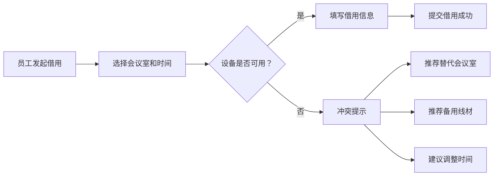

## 1. 产品概述

投影转接头借用管理系统，解决会议室投影转接头经常被借走、去向不明的问题。员工可以快速查找、借用和归还转接头，管理员可以管理设备档案和查看统计数据。

- 主要目的：规范化投影转接头的借用流程，提高设备利用率和管理效率
- 目标用户：公司员工（借用者）和行政/IT管理员（设备管理者）
- 产品价值：减少设备丢失，快速定位可用转接头，优化会议室资源配置

## 2. 核心功能

### 2.1 用户角色

| 角色 | 说明 | 核心权限 |
|------|------|----------|
| 普通员工 | 公司所有员工 | 浏览设备、发起借用、归还确认 |
| 管理员 | 行政/IT人员 | 设备档案管理、查看统计、故障处理 |

### 2.2 功能模块

1. **首页仪表盘**：当前借出统计、逾期未还、故障线材、高频缺口接口类型
2. **设备档案**：接口类型、编号、适配设备、所在会议室、状态、照片
3. **借用登记**：选择会议室、会议时间、借用人、归还时间、用途
4. **归还确认**：确认线材外观、是否能投屏、是否缺收纳袋
5. **冲突提示**：会议开始前转接头被占用时，提示可替代会议室或备用线

### 2.3 页面详情

| 页面名称 | 模块名称 | 功能描述 |
|---------|----------|----------|
| 首页仪表盘 | 统计卡片 | 显示当前借出数、逾期未还数、故障线材数、高频缺口类型 |
| 首页仪表盘 | 借用记录列表 | 展示最近的借用记录和状态 |
| 设备档案 | 设备列表 | 按会议室/类型筛选，展示所有转接头设备 |
| 设备档案 | 设备详情 | 查看设备详细信息、借用历史、照片 |
| 设备档案 | 设备管理 | 新增/编辑/删除设备，标记故障 |
| 借用登记 | 借用表单 | 选择会议室、时间、借用人、用途 |
| 借用登记 | 可用设备检查 | 实时检查所选时间段内可用的转接头 |
| 借用登记 | 冲突提示 | 设备被占用时显示替代方案 |
| 归还确认 | 归还表单 | 确认外观、投屏功能、收纳袋状态 |
| 归还确认 | 归还记录 | 查看历史归还记录和评价 |

## 3. 核心流程

### 3.1 借用流程

员工选择会议室和会议时间 → 系统检查该时间段可用转接头 → 若可用则填写借用人信息和用途提交 → 生成借用记录，设备状态变更为"借出中"

### 3.2 归还流程

员工找到待归还的借用记录 → 填写归还确认（外观、投屏功能、收纳袋）→ 提交归还 → 设备状态恢复为"可用"，记录归还检查结果

### 3.3 冲突处理流程

员工提交借用申请 → 检测到设备全部被占用 → 系统推荐：1) 附近其他会议室的可用转接头 2) 备用转接头库存 3) 建议调整会议时间

## 4. 用户界面设计

### 4.1 设计风格

- **主色调**：深青色 (#0D9488)，代表科技感和专业
- **辅助色**：琥珀色 (#F59E0B) 用于警告，红色 (#EF4444) 用于错误/逾期，绿色 (#10B981) 用于成功/可用
- **中性色**：深灰 (#1F2937) 为主文字，浅灰 (#F3F4F6) 为背景
- **按钮风格**：圆角 8px，有悬停阴影效果，主按钮使用渐变
- **字体**：系统默认无衬线字体，标题加粗，正文常规
- **布局风格**：卡片式布局，顶部导航，左侧菜单（大屏）/底部标签（移动端）
- **图标风格**：线性图标 (lucide-react)，简洁现代

### 4.2 页面设计概览

| 页面名称 | 模块名称 | UI元素 |
|---------|----------|--------|
| 首页仪表盘 | 统计卡片 | 4个大卡片带图标和数字，颜色区分状态，悬停微动效 |
| 首页仪表盘 | 借用列表 | 表格样式，状态标签用颜色区分，逾期行高亮 |
| 设备档案 | 设备列表 | 网格卡片布局，显示照片缩略图、状态标签、基本信息 |
| 设备档案 | 设备详情 | 左侧大图，右侧信息列表，底部借用历史时间线 |
| 借用登记 | 借用表单 | 分步表单，日期时间选择器，会议室下拉选择 |
| 借用登记 | 冲突提示 | 警告样式弹窗，列出替代方案，可一键切换 |
| 归还确认 | 归还表单 | 三列勾选框，状态图标，备注输入框 |

### 4.3 响应式

- 桌面端：左侧导航菜单 + 主内容区，多列布局
- 平板端：顶部导航栏，网格自适应列数
- 移动端：底部标签栏，单列卡片布局，表单全宽

### 4.4 动效与交互

- 页面切换：淡入淡出过渡
- 卡片悬停：轻微上浮 + 阴影加深
- 按钮点击：缩放反馈
- 状态变更：数字滚动动画
- 加载状态：骨架屏 + 脉冲动画
