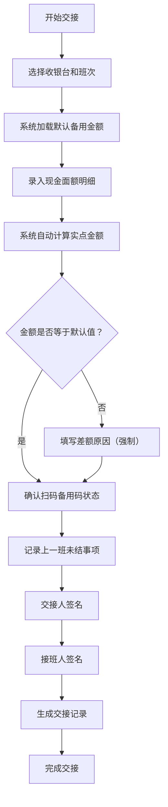

## 1. 产品概述

小店早晚班收银备用金交接管理系统，解决收银台备用金交接时金额不清、责任不明的痛点。面向小店店长、收银员等角色，实现备用金数字化交接、异常记录追踪和数据统计分析。

- 核心价值：让每一笔备用金交接有迹可循，减少扯皮，提升管理效率
- 目标用户：小型零售店铺（便利店、水果店、奶茶店等）的店长和早晚班收银员

## 2. 核心功能

### 2.1 用户角色

| 角色 | 核心权限 |
|------|----------|
| 店长 | 管理收银台档案、查看所有交接记录、查看统计报表、处理异常差额 |
| 收银员 | 执行交接操作、查看本人交接历史、登记临时借出/补零/存入 |

### 2.2 功能模块

1. **收银台档案**：收银台编号、班次配置、默认备用金额、负责人及照片管理
2. **交接班记录**：现金面额明细录入、扫码备用码状态、上一班未结事项、交接人与接班人签名
3. **资金异动记录**：临时借出登记、补零登记、银行存入登记
4. **统计分析**：各班次差额次数统计、常缺面额分析、未处理差额追踪、本月交接准时率

### 2.3 页面详情

| 页面名称 | 模块名称 | 功能描述 |
|-----------|-------------|---------------------|
| 首页仪表盘 | 数据概览卡片 | 今日交接次数、未处理差额、本周准时率、常用收银台快捷入口 |
| 首页仪表盘 | 最近交接列表 | 显示最近5条交接记录，异常标红高亮 |
| 收银台档案 | 档案列表 | 表格展示所有收银台，支持增删改查 |
| 收银台档案 | 档案表单 | 录入编号、班次、默认金额、负责人、上传照片 |
| 交接记录 | 交接列表 | 按时间/收银台/班次筛选，状态标签显示 |
| 交接记录 | 新建交接 | 多步骤表单：选择收银台→录入现金面额→扫码状态→未结事项→签名确认 |
| 交接记录 | 交接详情 | 完整展示交接信息，差额原因标注，异常高亮 |
| 资金异动 | 异动列表 | 借出/补零/存入三类记录统一展示，支持筛选 |
| 资金异动 | 新建异动 | 选择类型、金额、关联交接、备注说明 |
| 统计分析 | 差额统计 | 按班次统计差额次数和金额，柱状图展示 |
| 统计分析 | 面额分析 | 常缺/多出面额排行，饼图展示 |
| 统计分析 | 准时率 | 本月每日交接准时率折线图 |

## 3. 核心流程

用户打开系统后，在首页查看今日交接情况。收银员点击"新建交接"进入交接流程：选择收银台和班次，系统自动带入默认备用金额；接着逐张录入各面额现金数量，系统自动计算总额；若总额与默认值有差额，标红并强制填写原因；然后确认扫码备用码状态，记录上一班未结事项；最后交接人和接班人分别电子签名，完成交接。店长可在统计分析页面查看各类数据报表。

## 4. 用户界面设计

### 4.1 设计风格

- **主色调**：深青绿色 `#0F766E`（代表信任、专业），辅助色暖琥珀 `#D97706`（用于差额警告），危险色砖红 `#DC2626`（用于超标差额）
- **背景色系**：暖米白 `#FAF9F6` 为主，搭配浅灰卡片，整体干净利落
- **按钮风格**：圆角8px，主按钮实色填充，次要按钮描边，悬停有微上浮和阴影加深效果
- **字体**：标题使用 Noto Serif SC（宋体风格，稳重有质感），正文使用 Noto Sans SC（清晰易读）
- **布局风格**：左侧导航栏 + 顶部面包屑 + 主内容卡片式布局，表单分区清晰
- **图标**：Lucide React 线性图标，统一 20px 尺寸

### 4.2 页面设计概览

| 页面名称 | 模块名称 | UI 元素 |
|-----------|-------------|-------------|
| 首页仪表盘 | 数据概览卡片 | 4个大数字卡片，带渐变边框，数字动效递增 |
| 首页仪表盘 | 最近交接列表 | 斑马纹表格，异常行红色背景闪烁提醒 |
| 收银台档案 | 档案列表 | 表格 + 头像缩略图，操作按钮悬停显示 |
| 交接记录 | 新建交接 | 步骤指示器 + 分区表单，差额区域动态标红 |
| 交接记录 | 交接详情 | 信息卡片堆叠，签名区域手写风格展示 |
| 统计分析 | 图表区域 | 渐变色柱状图/饼图/折线图，悬浮显示数据提示 |

### 4.3 响应式

桌面端优先设计（1280px 起），平板端（768px）导航折叠为抽屉，手机端（375px）卡片单列堆叠，表格支持横向滚动。所有触控目标不小于 44px。

